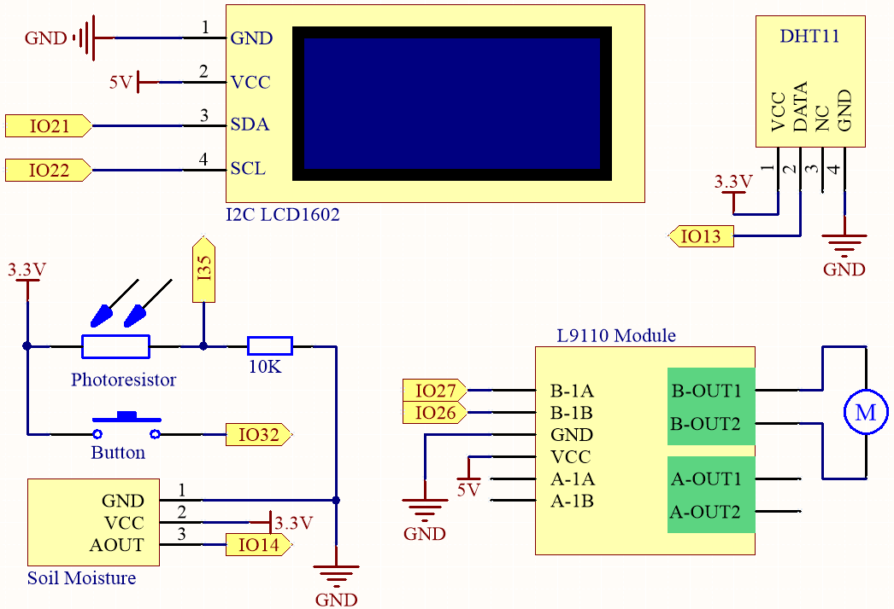
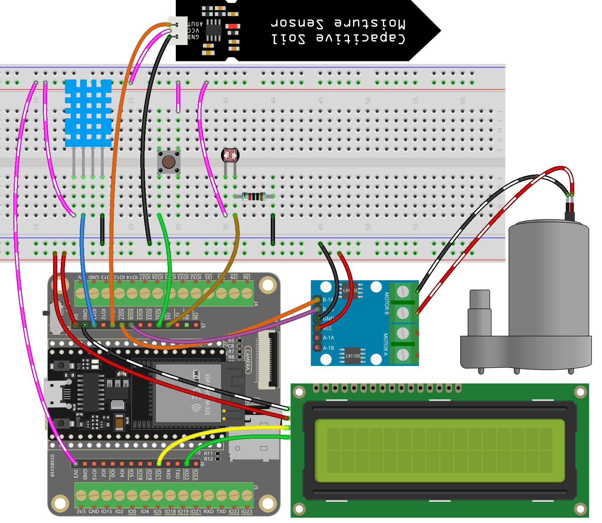

5.6 Plant Monitor
===============================

Welcome to the Plant Monitor project! 

In this project, we will be using an ESP32 board to create a system that helps us take care of our plants. With this system, we can monitor the temperature, humidity, soil moisture, and light levels of our plants, and ensure that they are getting the care and attention they need to thrive.

**Schematic**

The system uses a DHT11 sensor to measure the temperature and humidity levels of the surrounding environment. 
Meanwhile, a soil moisture module is used to measure the moisture level of the soil and a photoresistor is used to 
measure the light level. The readings from these sensors are displayed on an LCD screen, and a water pump can be controlled 
using a button to water the plant when needed.

IO32 has an internal pull-down resistor of 1K, and by default, it is at a low logic level. When the button is pressed, it establishes a connection to VCC (high voltage), resulting in a high logic level on IO32.

**Wiring**

* :ref:`cpn_esp32_extension`
* :ref:`cpn_breadboard`
* :ref:`cpn_wires`
* :ref:`cpn_dht11`
* :ref:`cpn_lcd`
* :ref:`cpn_pump`
* :ref:`cpn_l9110`
* :ref:`cpn_button`
* :ref:`cpn_photoresistor`
* :ref:`cpn_resistor`
* :ref:`cpn_soil_moisture`

**Code**

.. note::

    * You can open the file ``5.6_plant_monitor.ino`` under the path of ``esp32-ultimate-kit-main\c\codes\5.6_plant_monitor``. 
    * Or copy this code into **Arduino IDE**.
    * The ``LiquidCrystal_I2C`` and  ``dht`` libraries are used here, refer to :ref:`install_libraries_ar` for a tutorial to install.

.. raw:: html

    <iframe src=https://create.arduino.cc/editor/sunfounder01/52f54c4d-ad8c-49c4-816a-2a55a247d425/preview?embed style="height:510px;width:100%;margin:10px 0" frameborder=0></iframe>
    

* After uploading the code, the I2C LCD1602 alternately displays temperature and humidity, as well as soil moisture and light intensity analog values, with a 2-second interval.
* The water pump is controlled using a button press. To water the plants, hold down the button, and release it to stop watering.

.. note:: 

    If the code and wiring are correct, but the LCD still fails to display any content, you can adjust the potentiometer on the back to increase the contrast.
