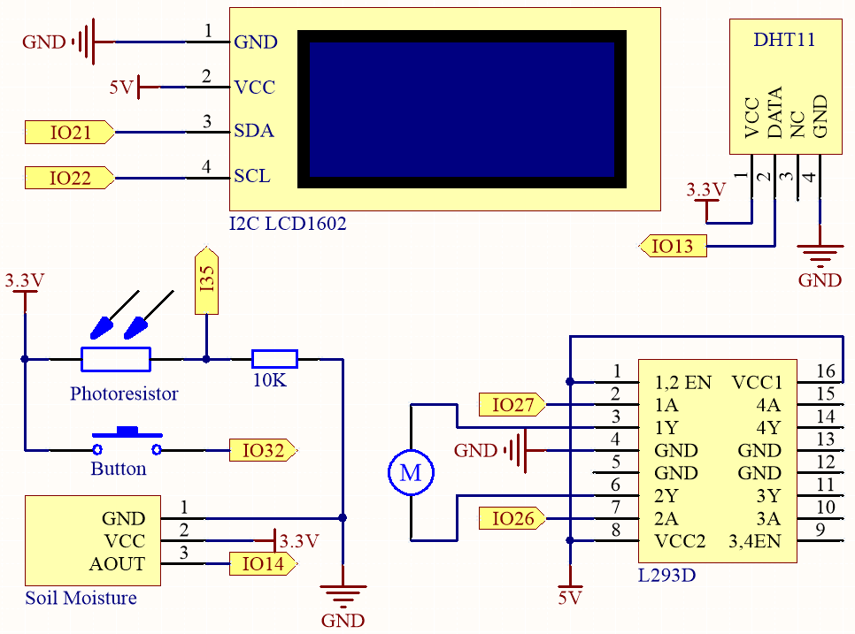
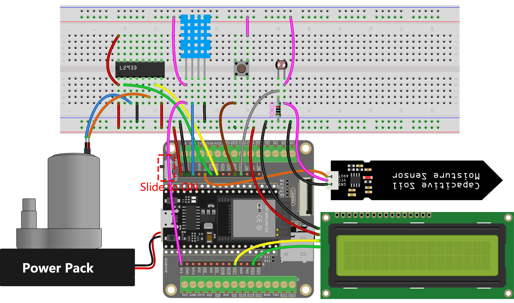

.. note::

    Bonjour, bienvenue dans la communauté des passionnés de SunFounder Raspberry Pi & Arduino & ESP32 sur Facebook ! Plongez plus profondément dans Raspberry Pi, Arduino et ESP32 avec d'autres passionnés.

    **Pourquoi nous rejoindre ?**

    - **Support d'experts** : Résolvez les problèmes post-vente et les défis techniques grâce à l'aide de notre communauté et de notre équipe.
    - **Apprendre et partager** : Échangez des conseils et des tutoriels pour améliorer vos compétences.
    - **Aperçus exclusifs** : Bénéficiez d'un accès anticipé aux annonces de nouveaux produits et aux avant-premières.
    - **Réductions spéciales** : Profitez de réductions exclusives sur nos derniers produits.
    - **Promotions festives et cadeaux** : Participez à des concours et promotions de vacances.

    👉 Prêt à explorer et créer avec nous ? Cliquez sur [|link_sf_facebook|] et rejoignez-nous dès aujourd'hui !

.. _ar_plant_monitor:

6.6 Moniteur de plantes
===============================

Bienvenue dans le projet de Moniteur de Plantes !

Dans ce projet, nous utiliserons une carte ESP32 pour créer un système qui nous aide à prendre soin de nos plantes. Avec ce système, nous pouvons surveiller la température, l'humidité, l'humidité du sol et les niveaux de lumière de nos plantes, et nous assurer qu'elles reçoivent les soins et l'attention dont elles ont besoin pour prospérer.

**Composants requis**

Pour ce projet, nous avons besoin des composants suivants. 

Il est certainement pratique d'acheter un kit complet, voici le lien : 

.. list-table::
    :widths: 20 20 20
    :header-rows: 1

    *   - Nom	
        - ARTICLES DANS CE KIT
        - LIEN
    *   - Kit de démarrage ESP32
        - 320+
        - |link_esp32_starter_kit|

Vous pouvez également les acheter séparément à partir des liens ci-dessous.

.. list-table::
    :widths: 30 20
    :header-rows: 1

    *   - INTRODUCTION DES COMPOSANTS
        - LIEN D'ACHAT

    *   - :ref:`cpn_esp32_wroom_32e`
        - |link_esp32_wroom_32e_buy|
    *   - :ref:`cpn_esp32_camera_extension`
        - |link_esp32_extension_board|
    *   - :ref:`cpn_breadboard`
        - |link_breadboard_buy|
    *   - :ref:`cpn_wires`
        - |link_wires_buy|
    *   - :ref:`cpn_dht11`
        - |link_dht11_buy|
    *   - :ref:`cpn_lcd`
        - |link_i2clcd1602_buy|
    *   - :ref:`cpn_pump`
        - \-
    *   - :ref:`cpn_l293d`
        - \-
    *   - :ref:`cpn_button`
        - |link_button_buy|
    *   - :ref:`cpn_photoresistor`
        - |link_photoresistor_buy|
    *   - :ref:`cpn_resistor`
        - |link_resistor_buy|
    *   - :ref:`cpn_soil_moisture`
        - |link_soil_moisture_buy|

**Schéma**

Le système utilise un capteur DHT11 pour mesurer les niveaux de température et d'humidité de l'environnement. 
Pendant ce temps, un module d'humidité du sol est utilisé pour mesurer le niveau d'humidité du sol et une photorésistance est utilisée pour 
mesurer le niveau de lumière. Les relevés de ces capteurs sont affichés sur un écran LCD, et une pompe à eau peut être contrôlée 
à l'aide d'un bouton pour arroser la plante lorsque cela est nécessaire.

IO32 dispose d'une résistance de tirage vers le bas de 1K, et par défaut, il est à un niveau logique bas. Lorsque le bouton est pressé, il établit une connexion à VCC (haute tension), ce qui entraîne un niveau logique haut sur IO32.

**Câblage**

.. note::

    Il est recommandé ici d'insérer le Power Pack puis de faire glisser l'interrupteur sur la carte d'extension en position ON pour activer l'alimentation électrique.

**Code**

.. note::

    * Vous pouvez ouvrir le fichier ``6.6_plant_monitor.ino`` sous le chemin ``esp32-starter-kit-main\c\codes\6.6_plant_monitor``. 
    * Après avoir sélectionné la carte (ESP32 Dev Module) et le port approprié, cliquez sur le bouton **Téléverser**.
    * :ref:`unknown_com_port`
    * Les bibliothèques ``LiquidCrystal_I2C`` et  ``DHT sensor library`` sont utilisées ici, vous pouvez les installer à partir du **Gestionnaire de Bibliothèques**.

.. raw:: html

    <iframe src=https://create.arduino.cc/editor/sunfounder01/52f54c4d-ad8c-49c4-816a-2a55a247d425/preview?embed style="height:510px;width:100%;margin:10px 0" frameborder=0></iframe>
    

* Après avoir téléversé le code, le LCD I2C1602 affiche alternativement la température et l'humidité, ainsi que les valeurs analogiques de l'humidité du sol et de l'intensité lumineuse, avec un intervalle de 2 secondes.
* La pompe à eau est contrôlée en appuyant sur un bouton. Pour arroser les plantes, maintenez le bouton enfoncé, et relâchez-le pour arrêter l'arrosage.

.. note:: 

    Si le code et le câblage sont corrects, mais que le LCD n'affiche toujours aucun contenu, vous pouvez ajuster le potentiomètre à l'arrière pour augmenter le contraste.
