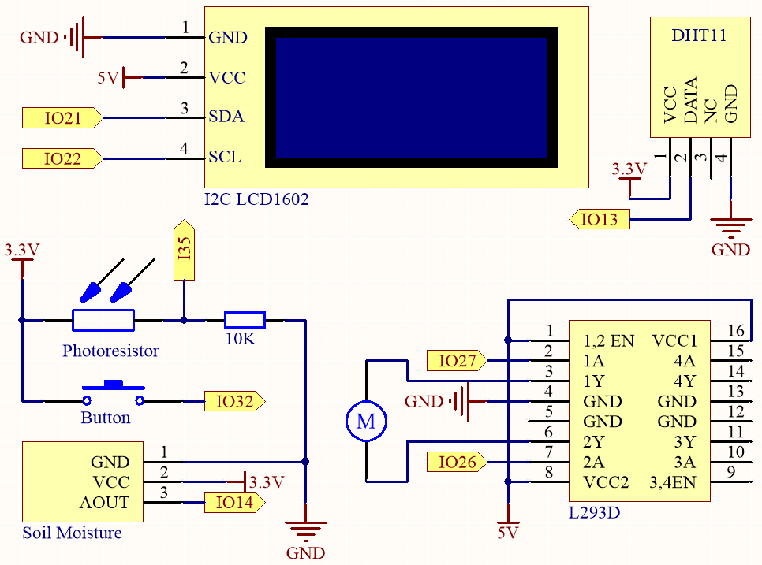

.. _ar_plant_monitor:

6.6 Monitor de Plantas
===============================

¡Bienvenidos al proyecto Monitor de Plantas!

En este proyecto, utilizaremos una placa ESP32 para crear un sistema que nos ayude a cuidar de nuestras plantas. Con este sistema, podemos monitorear la temperatura, humedad, humedad del suelo y niveles de luz de nuestras plantas, asegurando que reciban el cuidado y la atención necesarios para prosperar.

**Componentes Necesarios**

En este proyecto, necesitaremos los siguientes componentes.

Es definitivamente conveniente comprar todo el kit, aquí está el enlace:

.. list-table::
    :widths: 20 20 20
    :header-rows: 1

    * - Nombre
      - ARTÍCULOS EN ESTE KIT
      - ENLACE
    * - Kit de Inicio ESP32
      - 320+
      - |link_esp32_starter_kit|

También puedes comprarlos por separado en los siguientes enlaces.

.. list-table::
    :widths: 30 20
    :header-rows: 1

    * - INTRODUCCIÓN DE COMPONENTES
      - ENLACE DE COMPRA

    * - :ref:`cpn_esp32_wroom_32e`
      - |link_esp32_wroom_32e_buy|
    * - :ref:`cpn_esp32_camera_extension`
      - \-
    * - :ref:`cpn_breadboard`
      - |link_breadboard_buy|
    * - :ref:`cpn_wires`
      - |link_wires_buy|
    * - :ref:`cpn_dht11`
      - |link_dht11_buy|
    * - :ref:`cpn_lcd`
      - |link_i2clcd1602_buy|
    * - :ref:`cpn_pump`
      - \-
    * - :ref:`cpn_l293d`
      - \-
    * - :ref:`cpn_button`
      - |link_button_buy|
    * - :ref:`cpn_photoresistor`
      - |link_photoresistor_buy|
    * - :ref:`cpn_resistor`
      - |link_resistor_buy|
    * - :ref:`cpn_soil_moisture`
      - |link_soil_moisture_buy|

**Esquemático**

El sistema utiliza un sensor DHT11 para medir los niveles de temperatura y humedad del ambiente circundante. 
Mientras tanto, un módulo de humedad del suelo se utiliza para medir el nivel de humedad del suelo y un fotoresistor se utiliza para 
medir el nivel de luz. Las lecturas de estos sensores se muestran en una pantalla LCD, y una bomba de agua puede ser controlada 
usando un botón para regar la planta cuando sea necesario.

IO32 tiene una resistencia de pull-down interna de 1K, y por defecto, está a un nivel lógico bajo. Cuando se presiona el botón, se establece una conexión a VCC (alto voltaje), resultando en un nivel lógico alto en IO32.

**Cableado**

.. note::

    Aquí se recomienda insertar la batería y luego deslizar el interruptor en la placa de expansión a la posición ON para activar el suministro de la batería.

.. image:: ../../img/wiring/6.8_plant_monitor_l293d_bb.png
    :width: 800

**Código**

.. note::

    * Puedes abrir el archivo ``6.6_plant_monitor.ino`` en la ruta ``esp32-starter-kit-main\c\codes\6.6_plant_monitor``. 
    * Después de seleccionar la placa (ESP32 Dev Module) y el puerto apropiado, haz clic en el botón **Subir**.
    * :ref:`unknown_com_port`
    * Las bibliotecas ``LiquidCrystal_I2C`` y ``DHT sensor library`` se utilizan aquí, puedes instalarlas desde el **Administrador de Bibliotecas**.

.. raw:: html

    <iframe src=https://create.arduino.cc/editor/sunfounder01/52f54c4d-ad8c-49c4-816a-2a55a247d425/preview?embed style="height:510px;width:100%;margin:10px 0" frameborder=0></iframe>
    

* Después de subir el código, el I2C LCD1602 muestra alternativamente la temperatura y la humedad, así como los valores analógicos de humedad del suelo e intensidad de la luz, con un intervalo de 2 segundos.
* La bomba de agua se controla mediante la presión de un botón. Para regar las plantas, mantén presionado el botón y suéltalo para detener el riego.

.. note:: 

    Si el código y el cableado son correctos, pero el LCD aún no muestra ningún contenido, puedes ajustar el potenciómetro en la parte posterior para aumentar el contraste.
