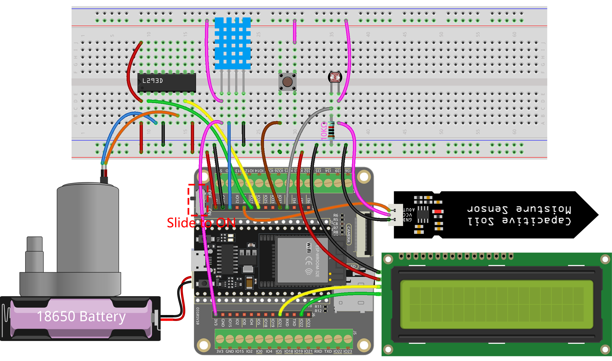

.. _ar_plant_monitor:

6.6 植物モニタリングシステム
===============================

植物モニタリングシステムプロジェクトへようこそ！

このプロジェクトでは、ESP32ボードを使用して植物のケアを支援するシステムを作成します。このシステムにより、植物の温度、湿度、土壌の水分、光のレベルを監視し、植物が健やかに育つために必要なケアと注意を確実に提供できます。

**必要な部品**

このプロジェクトには以下のコンポーネントが必要です。

キット一式を購入すると便利です。こちらがリンクです：

.. list-table::
    :widths: 20 20 20
    :header-rows: 1

    *   - 名前
        - このキットのアイテム
        - リンク
    *   - ESP32 Starter Kit
        - 320+
        - |link_esp32_starter_kit|

以下のリンクから個別に購入することもできます。

.. list-table::
    :widths: 30 20
    :header-rows: 1

    *   - コンポーネントの紹介
        - 購入リンク

    *   - :ref:`cpn_esp32_wroom_32e`
        - |link_esp32_wroom_32e_buy|
    *   - :ref:`cpn_esp32_camera_extension`
        - \-
    *   - :ref:`cpn_breadboard`
        - |link_breadboard_buy|
    *   - :ref:`cpn_wires`
        - |link_wires_buy|
    *   - :ref:`cpn_dht11`
        - |link_dht11_buy|
    *   - :ref:`cpn_lcd`
        - |link_i2clcd1602_buy|
    *   - :ref:`cpn_pump`
        - \-
    *   - :ref:`cpn_l293d`
        - \-
    *   - :ref:`cpn_button`
        - |link_button_buy|
    *   - :ref:`cpn_photoresistor`
        - |link_photoresistor_buy|
    *   - :ref:`cpn_resistor`
        - |link_resistor_buy|
    *   - :ref:`cpn_soil_moisture`
        - |link_soil_moisture_buy|

**回路図**

.. image:: ../../img/circuit/circuit_6.8_plant_monitor_l293d.png

このシステムでは、DHT11センサーを使用して周囲環境の温度と湿度を測定します。また、土壌水分モジュールは土の水分レベルを、フォトレジスターは光のレベルを測定するために使用されます。これらのセンサーからの読み取り値はLCD画面に表示され、ボタンを使って必要に応じて水やりをするための水ポンプを制御できます。

IO32は内部に1Kのプルダウン抵抗を持ち、デフォルトでは低論理レベルです。ボタンが押されるとVCC（高電圧）への接続が確立し、IO32に高論理レベルが現れます。

**配線図**

.. note::

    ここでは、まずバッテリーを挿入し、その後拡張ボード上のスイッチをON位置にスライドしてバッテリー供給を活性化することをお勧めします。

**コード**

.. note::

    * ファイル ``6.6_plant_monitor.ino`` を ``esp32-starter-kit-main\c\codes\6.6_plant_monitor`` のパスの下で開けます。
    * ボード（ESP32 Dev Module）と適切なポートを選択した後、 **アップロード** ボタンをクリックします。
    * :ref:`unknown_com_port`
    * ここでは ``LiquidCrystal_I2C`` と ``DHT sensor library`` ライブラリを使用します。これらは **Library Manager** からインストールできます。

.. raw:: html

    <iframe src=https://create.arduino.cc/editor/sunfounder01/52f54c4d-ad8c-49c4-816a-2a55a247d425/preview?embed style="height:510px;width:100%;margin:10px 0" frameborder=0></iframe>
    

* コードをアップロードした後、I2C LCD1602は温度と湿度、土壌の水分および光強度のアナログ値を2秒間隔で交互に表示します。
* 水ポンプはボタンプレスを使用して制御されます。植物に水をやるためには、ボタンを押し続けて、止めるためには手を離します。

.. note:: 

    コードと配線が正しくてもLCDに何も表示されない場合は、背面のポテンショメータを調整してコントラストを高めることができます。

