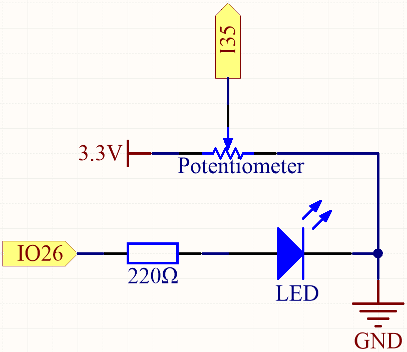
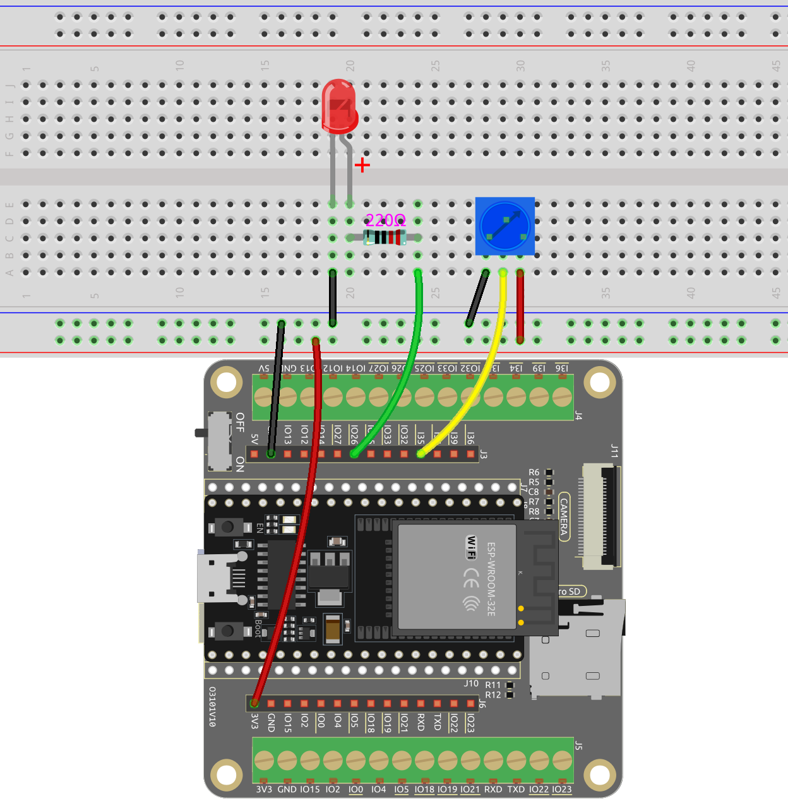

.. _ar_potentiometer:

5.8 Turn the Knob
===================

A potentiometer is a three-terminal device that is commonly used to adjust the resistance in a circuit. It features a knob or a sliding lever that can be used to vary the resistance value of the potentiometer. In this project, we will utilize it to control the brightness of an LED, similar to a desk lamp in our daily life. By adjusting the position of the potentiometer, we can change the resistance in the circuit, thereby regulating the current flowing through the LED and adjusting its brightness accordingly. This allows us to create a customizable and adjustable lighting experience, similar to that of a desk lamp.

**Available Pins**

* **Available Pins**

    Here is a list of available pins on the ESP32 board for this project.

    .. list-table::
        :widths: 5 15

        *   - Available Pins
            - IO14, IO25, I35, I34, I39, I36

* **Strapping Pins**

    The following pins are strapping pins, which affect the startup process of the ESP32 during power on or reset. However, once the ESP32 is booted up successfully, they can be used as regular pins.

    .. list-table::
        :widths: 5 15

        *   - Strapping Pins
            - IO0, IO12

**Schematic**

When you rotate the potentiometer, the value of I35 will change. By programming, you can use the value of I35 to control the brightness of the LED. Therefore, as you rotate the potentiometer, the brightness of the LED will also change accordingly.

**Wiring**

* :ref:`cpn_esp32_wroom_32e`
* :ref:`cpn_esp32_camera_extension`
* :ref:`cpn_breadboard`
* :ref:`cpn_wires`
* :ref:`cpn_resistor`
* :ref:`cpn_led`
* :ref:`cpn_pot`

**Code**

.. note::

   * You can open the file ``5.8_pot.ino`` under the path of ``esp32-starter-kit-main\c\codes\5.8_pot``. 
   * After selecting the board (ESP32 Dev Module) and the appropriate port, click the **Upload** button.
   
.. raw:: html
     
    <iframe src=https://create.arduino.cc/editor/sunfounder01/aadce2e7-fd5d-4608-a557-f1e4d07ba795/preview?embed style="height:510px;width:100%;margin:10px 0" frameborder=0></iframe>

After the code is uploaded successfully, rotate the potentiometer and you will see the brightness of the LED change accordingly. At the same time you can see the analog and voltage values of the potentiometer in the serial monitor.

**How it works?**

#. Define constants for pin connections and PWM settings.

    .. code-block:: arduino

        const int potPin = 14; // Potentiometer connected to GPIO14
        const int ledPin = 26; // LED connected to GPIO26

        // PWM settings
        const int freq = 5000; // PWM frequency
        const int resolution = 12; // PWM resolution (bits)
        const int channel = 0; // PWM channel

    Here the PWM resolution is set to 12 bits and the range is 0-4095.

#. Configure the system in the ``setup()`` function.

    .. code-block:: arduino

        void setup() {
            Serial.begin(115200);

            // Configure PWM
            ledcSetup(channel, freq, resolution);
            ledcAttachPin(ledPin, channel);
        }

    * In the ``setup()`` function, the Serial communication is started at a baud rate of 115200. 
    * The ``ledcSetup()`` function is called to set up the PWM channel with the specified frequency and resolution, and the ``ledcAttachPin()`` function is called to associate the specified LED pin with the PWM channel.

#. Main loop (executed repeatedly) in the loop() function.

    .. code-block:: arduino

        void loop() {

            int potValue = analogRead(potPin); // read the value of the potentiometer
            uint32_t voltage_mV = analogReadMilliVolts(potPin); // Read the voltage in millivolts
            
            ledcWrite(channel, potValue);
            
            Serial.print("Potentiometer Value: ");
            Serial.print(potValue);
            Serial.print(", Voltage: ");
            Serial.print(voltage_mV / 1000.0); // Convert millivolts to volts
            Serial.println(" V");
            
            delay(100);
        }

    * ``uint32_t analogReadMilliVolts(uint8_t pin);``: This function is used to get ADC value for a given pin/ADC channel in millivolts.

        * ``pin`` GPIO pin to read analog value.

    The potentiometer value is directly used as the PWM duty cycle for controlling the LED brightness via the ``ledcWrite()`` function, as the range of values is also from 0 to 4095.

