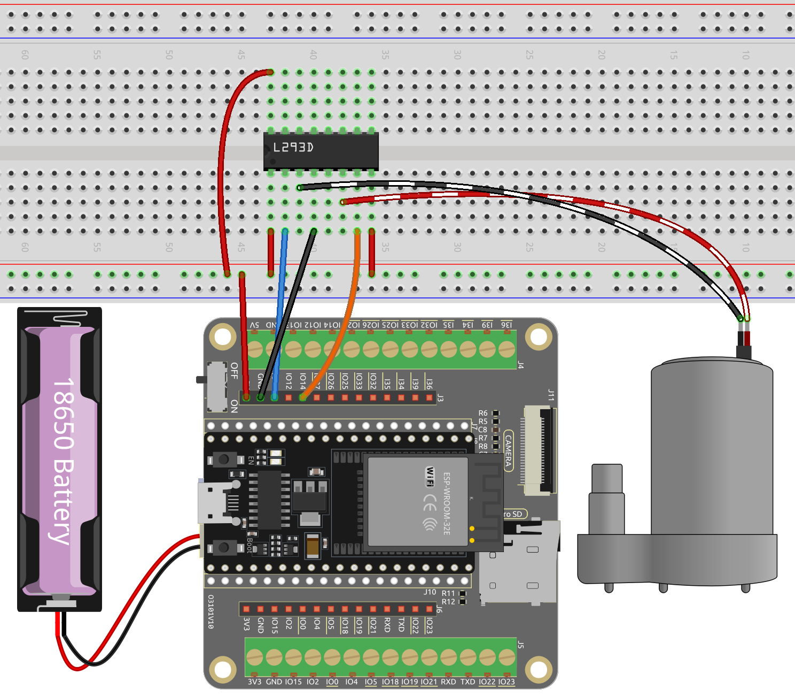

.. note::

    Bonjour, bienvenue dans la communauté des passionnés de SunFounder Raspberry Pi & Arduino & ESP32 sur Facebook ! Plongez plus profondément dans Raspberry Pi, Arduino et ESP32 avec d'autres passionnés.

    **Pourquoi nous rejoindre ?**

    - **Support d'experts** : Résolvez les problèmes post-vente et les défis techniques grâce à l'aide de notre communauté et de notre équipe.
    - **Apprendre et partager** : Échangez des conseils et des tutoriels pour améliorer vos compétences.
    - **Aperçus exclusifs** : Bénéficiez d'un accès anticipé aux annonces de nouveaux produits et aux avant-premières.
    - **Réductions spéciales** : Profitez de réductions exclusives sur nos derniers produits.
    - **Promotions festives et cadeaux** : Participez à des concours et promotions de vacances.

    👉 Prêt à explorer et créer avec nous ? Cliquez sur [|link_sf_facebook|] et rejoignez-nous dès aujourd'hui !

.. _ar_pump:

4.2 Pompage
===================
Dans ce projet fascinant, nous allons explorer le contrôle d'une pompe à eau en utilisant le L293D.

Dans le domaine du contrôle des pompes à eau, les choses sont un peu plus simples comparé au contrôle d'autres moteurs. La beauté de ce projet réside dans sa simplicité - il n'est pas nécessaire de se soucier de la direction de rotation. Notre objectif principal est d'activer la pompe à eau et de la maintenir en fonctionnement.

**Composants requis**

Pour ce projet, nous avons besoin des composants suivants.

Il est certainement pratique d'acheter un kit complet, voici le lien :

.. list-table::
    :widths: 20 20 20
    :header-rows: 1

    *   - Nom	
        - ARTICLES DANS CE KIT
        - LIEN
    *   - Kit de démarrage ESP32
        - 320+
        - |link_esp32_starter_kit|

Vous pouvez également les acheter séparément à partir des liens ci-dessous.

.. list-table::
    :widths: 30 20
    :header-rows: 1

    *   - INTRODUCTION DES COMPOSANTS
        - LIEN D'ACHAT

    *   - :ref:`cpn_esp32_wroom_32e`
        - |link_esp32_wroom_32e_buy|
    *   - :ref:`cpn_esp32_camera_extension`
        - |link_esp32_extension_board|
    *   - :ref:`cpn_breadboard`
        - |link_breadboard_buy|
    *   - :ref:`cpn_wires`
        - |link_wires_buy|
    *   - :ref:`cpn_pump`
        - \-
    *   - :ref:`cpn_l293d`
        - \-

**Pins disponibles**

Voici une liste des pins disponibles sur la carte ESP32 pour ce projet.

.. list-table::
    :widths: 5 20 

    * - Pins disponibles
      - IO13, IO14, IO27, IO26, IO25, IO33, IO32, IO15, IO2, IO0, IO4, IO5, IO18, IO19, IO21, IO22, IO23

**Schéma**

.. image:: ../../img/circuit/circuit_4.1_motor_l293d.png

**Câblage**

.. note::

    Il est recommandé ici d'insérer la batterie puis de faire glisser l'interrupteur sur la carte d'extension en position ON pour activer l'alimentation par batterie.

**Code**

.. note::

  * Vous pouvez ouvrir le fichier ``4.2_pump.ino`` sous le chemin ``esp32-starter-kit-main\c\codes\4.2_pump``. 
  * Après avoir sélectionné la carte (ESP32 Dev Module) et le port approprié, cliquez sur le bouton **Téléverser**.
  * :ref:`unknown_com_port`
   
.. raw:: html

  <iframe src=https://create.arduino.cc/editor/sunfounder01/a56216f9-eba8-4fdc-8bbb-91337095e543/preview?embed style="height:510px;width:100%;margin:10px 0" frameborder=0></iframe>

Connectez le tuyau à la pompe et placez-le à l'intérieur du récipient rempli d'eau. Une fois le code téléversé avec succès, vous observerez que l'eau du récipient se vide progressivement. Pendant cette expérience, veuillez vous assurer que le circuit électrique est éloigné de l'eau pour éviter les courts-circuits !

