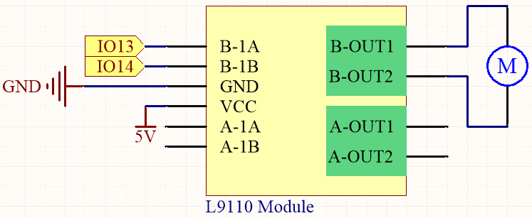

.. _ar_pump:

4.2 Pumping
===================
In this intriguing project, we will delve into controlling a water pump using the L9110 motor driver module. Known for its compactness and effectiveness, the L9110 module is a common choice in robotics and mechatronics projects for controlling DC motors.

In the realm of water pump control, things are a bit simpler compared to controlling other motors. The beauty of this project lies in its simplicity - there's no need to worry about the direction of rotation. Our primary goal is to successfully activate the water pump and keep it running.

**Available Pins**

Here is a list of available pins on the ESP32 board for this project.

.. list-table::
    :widths: 5 20 

    * - Available Pins
      - IO13, IO14, IO27, IO26, IO25, IO33, IO32, IO15, IO2, IO0, IO4, IO5, IO18, IO19, IO21, IO22, IO23

.. note::

  * **IO12** needs to be connected to the L9110 module after ESP32 starts up normally because the input pins of the L9110 module have a 10K pull-down resistor, which can prevent ESP32 from booting correctly.

**Schematic**

Here is the truth table of pump:

.. list-table:: 
    :widths: 25 25 50
    :header-rows: 1

    * - B-1A
      - B-1B
      - The state of pump
    * - 1
      - 0
      - Work
    * - 0
      - 1
      - Work
    * - 0
      - 0
      - Stop
    * - 1
      - 1
      - Stop

**Wiring**

.. image:: ../../img/wiring/4.2_pump_bb.png

* :ref:`cpn_esp32_wroom_32e`
* :ref:`cpn_esp32_camera_extension`
* :ref:`cpn_wires`
* :ref:`cpn_pump`
* :ref:`cpn_l9110`

**Code**

.. note::

  * You can open the file ``4.2_pump.ino`` under the path of ``esp32-ultimate-kit-main\c\codes\4.2_pump``. 
 * After selecting the board (ESP32 Dev Module) and the appropriate port, click the **Upload** button.
   
.. raw:: html

  <iframe src=https://create.arduino.cc/editor/sunfounder01/a56216f9-eba8-4fdc-8bbb-91337095e543/preview?embed style="height:510px;width:100%;margin:10px 0" frameborder=0></iframe>

Connect the tubing to the pump and place it inside the water-filled container. Once the code has been successfully uploaded, you will observe the water in the container gradually being drained. During this experiment, please ensure that the electrical circuit is kept away from water to prevent short-circuiting!
