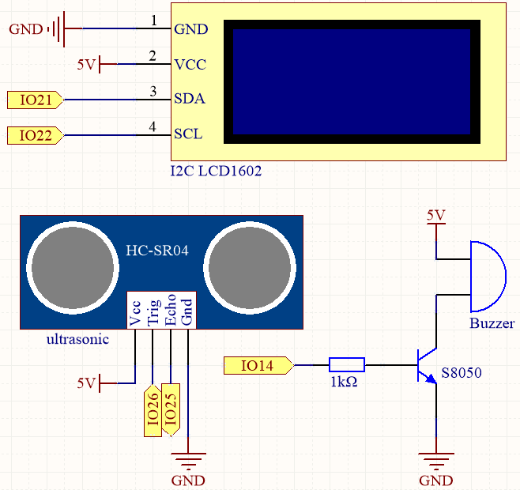
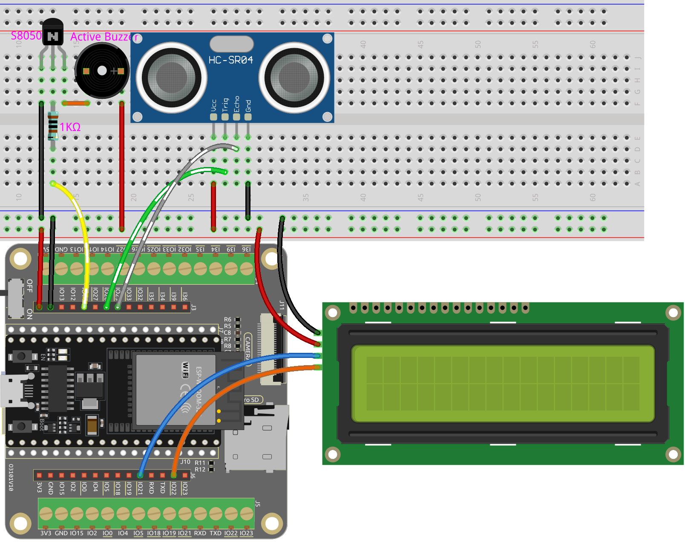

.. _ar_reversing_aid:

6.3 Ayuda para Reversa
========================
Imagina esto: estás en tu coche, a punto de estacionarte en reversa en un lugar estrecho. Con nuestro proyecto, tendrás un módulo ultrasónico montado en la parte trasera de tu vehículo, actuando como un ojo digital. Al poner la marcha en reversa, el módulo cobra vida, emitiendo pulsos ultrasónicos que rebotan en los obstáculos detrás de ti.

La magia ocurre cuando estos pulsos regresan al módulo. Calcula rápidamente la distancia entre tu coche y los objetos, transformando estos datos en retroalimentación visual en tiempo real mostrada en una vibrante pantalla LCD. Presenciarás indicadores dinámicos y codificados por colores que describen la proximidad de los obstáculos, asegurando que tengas una comprensión cristalina del entorno circundante.

Pero no nos detuvimos ahí. Para sumergirte aún más en esta experiencia de conducción, incorporamos un zumbador vivaz. A medida que tu coche se acerca a un obstáculo, el ritmo del zumbador se intensifica, creando una sinfonía auditiva de advertencias. Es como tener una orquesta personal guiándote a través de las complejidades del estacionamiento en reversa.

Este innovador proyecto combina tecnología de vanguardia con una interfaz de usuario interactiva, haciendo que tu experiencia al reversar sea segura y libre de estrés. Con el módulo ultrasónico, la pantalla LCD y el zumbador vivaz trabajando armoniosamente, te sentirás empoderado y seguro mientras maniobras en espacios estrechos, dejándote libre para enfocarte en el placer de conducir.

**Componentes Requeridos**

En este proyecto, necesitamos los siguientes componentes.

Es definitivamente conveniente comprar un kit completo, aquí está el enlace:

.. list-table::
    :widths: 20 20 20
    :header-rows: 1

    *   - Nombre
        - ELEMENTOS EN ESTE KIT
        - ENLACE
    *   - Kit de Inicio ESP32
        - 320+
        - |link_esp32_starter_kit|

También puedes comprarlos por separado en los siguientes enlaces.

.. list-table::
    :widths: 30 20
    :header-rows: 1

    *   - INTRODUCCIÓN DE COMPONENTES
        - ENLACE DE COMPRA

    *   - :ref:`cpn_esp32_wroom_32e`
        - |link_esp32_wroom_32e_buy|
    *   - :ref:`cpn_esp32_camera_extension`
        - \-
    *   - :ref:`cpn_breadboard`
        - |link_breadboard_buy|
    *   - :ref:`cpn_wires`
        - |link_wires_buy|
    *   - :ref:`cpn_resistor`
        - |link_resistor_buy|
    *   - :ref:`cpn_ultrasonic`
        - |link_ultrasonic_buy|
    *   - :ref:`cpn_buzzer`
        - \-
    *   - :ref:`cpn_transistor`
        - |link_transistor_buy|
    *   - :ref:`cpn_lcd`
        - |link_i2clcd1602_buy|

**Esquema**

El sensor ultrasónico en el proyecto emite ondas sonoras de alta frecuencia y mide el tiempo que tardan en rebotar después de golpear un objeto. Al analizar estos datos, se puede calcular la distancia entre el sensor y el objeto. Para proporcionar una advertencia cuando el objeto esté demasiado cerca, se utiliza un zumbador para producir una señal audible. Además, la distancia medida se muestra en una pantalla LCD para una fácil visualización.

**Cableado**

**Código**

.. note::

    * Puedes abrir el archivo ``6.3_reversing_aid.ino`` directamente bajo la ruta de ``esp32-starter-kit-main\c\codes\6.3_reversing_aid``.
    * Después de seleccionar la placa (ESP32 Dev Module) y el puerto adecuado, haz clic en el botón **Subir**.
    * :ref:`unknown_com_port`
    * La biblioteca ``LiquidCrystal I2C`` se utiliza aquí, puedes instalarla desde el **Administrador de Bibliotecas**.

.. raw:: html

    <iframe src=https://create.arduino.cc/editor/sunfounder01/c06deba0-36fd-4f17-8290-c7a39202e089/preview?embed style="height:510px;width:100%;margin:10px 0" frameborder=0></iframe>

Después de que el código se haya subido con éxito, la distancia detectada actual se mostrará en la LCD. Luego, el zumbador cambiará la frecuencia de sonido según las diferentes distancias.

.. note::

    Si el código y el cableado son correctos, pero la LCD aún no muestra ningún contenido, puedes ajustar el potenciómetro en la parte posterior para aumentar el contraste.

**¿Cómo funciona?**

Este código nos ayuda a crear un dispositivo simple de medición de distancia que puede medir la distancia entre objetos y proporcionar retroalimentación a través de una pantalla LCD y un zumbador.

La función ``loop()`` contiene la lógica principal del programa y se ejecuta continuamente. Echemos un vistazo más de cerca a la función ``loop()``.

#. Bucle para leer la distancia y actualizar parámetros

    En el ``loop``, el código primero lee la distancia medida por el módulo ultrasónico y actualiza el parámetro del intervalo basado en la distancia.

    .. code-block:: arduino

        // Update the distance
        distance = readDistance();

        // Update intervals based on distance
        if (distance <= 10) {
            intervals = 300;
        } else if (distance <= 20) {
            intervals = 500;
        } else if (distance <= 50) {
            intervals = 1000;
        } else {
            intervals = 2000;
        }

#. Verificar si es momento de pitar

    El código calcula la diferencia entre el tiempo actual y el tiempo anterior del pitido, y si la diferencia es mayor o igual al tiempo del intervalo, activa el zumbador y actualiza el tiempo anterior del pitido.

    .. code-block:: arduino

        unsigned long currentMillis = millis();
        if (currentMillis - previousMillis >= intervals) {
            Serial.println("Beeping!");
            beep();
            previousMillis = currentMillis;
        }

#. Actualizar la pantalla LCD

    El código limpia la pantalla LCD y luego muestra "Dis:" y la distancia actual en centímetros en la primera línea.

    .. code-block:: arduino

        lcd.clear();
        lcd.setCursor(0, 0);
        lcd.print("Dis: ");
        lcd.print(distance);
        lcd.print(" cm");

        delay(100);

