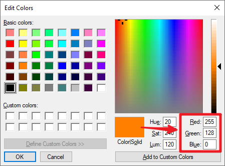

.. _ar_rgb:

2.3 Colorful Light
==============================================

In this project, we will delve into the fascinating world of additive color mixing using an RGB LED.

RGB LED combines three primary colors, namely Red, Green, and Blue, into a single package. These three LEDs share a common cathode pin, while each anode pin controls the intensity of the corresponding color.

By varying the electrical signal intensity applied to each anode, we can create a wide range of colors. For example, mixing high-intensity red and green light will result in yellow light, while combining blue and green light will produce cyan.

Through this project, we will explore the principles of additive color mixing and unleash our creativity by manipulating the RGB LED to display captivating and vibrant colors.

**Available Pins**

Here is a list of available pins on the ESP32 board for this project.

.. list-table::
    :widths: 5 20 

    * - Available Pins
      - IO13, IO12, IO14, IO27, IO26, IO25, IO33, IO32, IO15, IO2, IO0, IO4, IO5, IO18, IO19, IO21, IO22, IO23

**Schematic**

.. image:: ../../img/circuit/circuit_2.3_rgb.png

The PWM pins pin27, pin26 and pin25 control the Red, Green and Blue pins of the RGB LED respectively, and connect the common cathode pin to GND. This allows the RGB LED to display a specific color by superimposing light on these pins with different PWM values.

**Wiring**

.. image:: ../../components/img/rgb_pin.jpg
    :width: 200
    :align: center

The RGB LED has 4 pins: the long pin is the common cathode pin, which is usually connected to GND; the left pin next to the longest pin is Red; and the two pins on the right are Green and Blue.

.. image:: ../../img/wiring/2.3_color_light_bb.png

* :ref:`cpn_esp32_wroom_32e`
* :ref:`cpn_esp32_camera_extension`
* :ref:`cpn_breadboard`
* :ref:`cpn_wires`
* :ref:`cpn_resistor`
* :ref:`cpn_rgb`

**Code**

Here, we can choose our favorite color in drawing software (such as paint) and display it with RGB LED.

.. note::

    * You can open the file ``2.3_rgb_led.ino`` under the path of ``esp32-starter-kit-main\c\codes\2.3_rgb_led``. 
    * After selecting the board (ESP32 Dev Module) and the appropriate port, click the **Upload** button.
    * :ref:`unknown_com_port`

.. raw:: html
    
    <iframe src=https://create.arduino.cc/editor/sunfounder01/49a579a1-ae9b-4e23-b6cd-c20e5695191b/preview?embed style="height:510px;width:100%;margin:10px 0" frameborder=0></iframe>
    

Write the RGB value into ``color_set()``, you will be able to see the RGB light up the colors you want.

**How it works?**

#. Define the GPIO pins, the PWM channels and the frequency (in Hz) and resolution (in bits).

    .. code-block:: arduino

        // Define RGB LED pins
        const int redPin = 27;
        const int greenPin = 26;
        const int bluePin = 25;

        // Define PWM channels
        const int redChannel = 0;
        const int greenChannel = 1;
        const int blueChannel = 2;

        // Define PWM frequency and resolution
        const int freq = 5000;
        const int resolution = 8;

#. The ``setup()`` function initializes the PWM channels with the specified frequency and resolution, and then attaches the LED pins to their corresponding PWM channels.

    .. code-block:: arduino

        void setup() {
            // Set up PWM channels
            ledcSetup(redChannel, freq, resolution);
            ledcSetup(greenChannel, freq, resolution);
            ledcSetup(blueChannel, freq, resolution);
            
            // Attach pins to corresponding PWM channels
            ledcAttachPin(redPin, redChannel);
            ledcAttachPin(greenPin, greenChannel);
            ledcAttachPin(bluePin, blueChannel);
        }
    
    Here we use the |link_ledc| (LED control) peripheral which is primarly designed to control the intensity of LEDs, although it can also be used to generate PWM signals for other purposes.

    * ``uint32_t ledcSetup(uint8_t channel, uint32_t freq, uint8_t resolution_bits);``: This function is used to setup the LEDC channel frequency and resolution. It will return ``frequency`` configured for LEDC channel. If 0 is returned, error occurs and ledc channel was not configured.
            
        * ``channel`` select LEDC channel to config.
        * ``freq`` select frequency of pwm.
        * ``resolution_bits`` select resolution for ledc channel. Range is 1-14 bits (1-20 bits for ESP32).

    * ``void ledcAttachPin(uint8_t pin, uint8_t chan);``: This function is used to attach the pin to the LEDC channel.

        * ``pin`` select GPIO pin.
        * ``chan`` select LEDC channel.

#. The ``loop()`` function cycles through various colors (red, green, blue, yellow, purple, and cyan) with one-second intervals between each color change.

    .. code-block:: arduino

        void loop() {
            setColor(255, 0, 0); // Red
            delay(1000);
            setColor(0, 255, 0); // Green
            delay(1000);
            setColor(0, 0, 255); // Blue
            delay(1000);
            setColor(255, 255, 0); // Yellow
            delay(1000);
            setColor(80, 0, 80); // Purple
            delay(1000);
            setColor(0, 255, 255); // Cyan
            delay(1000);
        }

#. The ``setColor()`` function sets the desired color by writing the appropriate duty cycle values to each PWM channel. The function takes in three integer arguments for red, green, and blue color values.

    .. code-block:: arduino

        void setColor(int red, int green, int blue) {
            // For common-anode RGB LEDs, use 255 minus the color value
            ledcWrite(redChannel, red);
            ledcWrite(greenChannel, green);
            ledcWrite(blueChannel, blue);
        }
    
    * ``void ledcWrite(uint8_t chan, uint32_t duty);``: This function is used to set duty for the LEDC channel.
        
        * ``chan`` select the LEDC channel for writing duty.
        * ``duty`` select duty to be set for selected channel.

