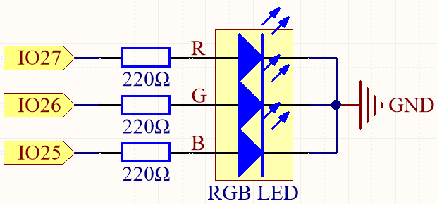

.. _ar_rgb:

2.3 Bunte Beleuchtung
==============================================

In diesem Projekt tauchen wir in die faszinierende Welt der additiven Farbmischung mit Hilfe einer RGB-LED ein.

Die RGB-LED kombiniert drei Primärfarben, nämlich Rot, Grün und Blau, in einem einzigen Gehäuse. Diese drei LEDs teilen sich einen gemeinsamen Kathoden-Pin, während jeder Anoden-Pin die Intensität der entsprechenden Farbe steuert.

Durch Variation der elektrischen Signalstärke, die auf jede Anode angewendet wird, können wir eine Vielzahl von Farben erzeugen. Zum Beispiel führt die Mischung von hochintensivem rotem und grünem Licht zu gelbem Licht, während die Kombination von blauem und grünem Licht Cyan erzeugt.

Durch dieses Projekt werden wir die Prinzipien der additiven Farbmischung erforschen und unsere Kreativität entfesseln, indem wir die RGB-LED manipulieren, um faszinierende und lebendige Farben darzustellen.

**Benötigte Komponenten**

In diesem Projekt benötigen wir folgende Komponenten.

Es ist definitiv praktisch, ein ganzes Kit zu kaufen. Hier ist der Link:

.. list-table::
    :widths: 20 20 20
    :header-rows: 1

    *   - Name	
        - ARTIKEL IN DIESEM KIT
        - LINK
    *   - ESP32 Starter Kit
        - 320+
        - |link_esp32_starter_kit|

Sie können sie auch einzeln über die unten stehenden Links kaufen.

.. list-table::
    :widths: 30 20
    :header-rows: 1

    *   - KOMPONENTENVORSTELLUNG
        - KAUF-LINK

    *   - :ref:`cpn_esp32_wroom_32e`
        - |link_esp32_wroom_32e_buy|
    *   - :ref:`cpn_esp32_camera_extension`
        - \-
    *   - :ref:`cpn_breadboard`
        - |link_breadboard_buy|
    *   - :ref:`cpn_wires`
        - |link_wires_buy|
    *   - :ref:`cpn_resistor`
        - |link_resistor_buy|
    *   - :ref:`cpn_rgb`
        - |link_rgb_led_buy|

**Verfügbare Pins**

Hier ist eine Liste der verfügbaren Pins auf dem ESP32-Board für dieses Projekt.

.. list-table::
    :widths: 5 20 

    * - Verfügbare Pins
      - IO13, IO12, IO14, IO27, IO26, IO25, IO33, IO32, IO15, IO2, IO0, IO4, IO5, IO18, IO19, IO21, IO22, IO23

**Schaltplan**

Die PWM-Pins Pin27, Pin26 und Pin25 steuern die Rot-, Grün- und Blau-Pins der RGB-LED und verbinden den gemeinsamen Kathoden-Pin mit GND. Dadurch kann die RGB-LED eine bestimmte Farbe anzeigen, indem sie Licht mit unterschiedlichen PWM-Werten auf diese Pins überlagert.

**Verdrahtung**

.. image:: ../../components/img/rgb_pin.jpg
    :width: 200
    :align: center

Die RGB-LED hat 4 Pins: der lange Pin ist der gemeinsame Kathoden-Pin, der normalerweise mit GND verbunden ist; der linke Pin neben dem längsten Pin ist Rot; und die beiden Pins rechts sind Grün und Blau.

.. image:: ../../img/wiring/2.3_color_light_bb.png

**Code**

Hier können wir unsere Lieblingsfarbe in einer Zeichensoftware (wie z.B. Paint) auswählen und sie mit der RGB-LED anzeigen.

.. note::

    * Sie können die Datei ``2.3_rgb_led.ino`` im Pfad ``esp32-starter-kit-main\c\codes\2.3_rgb_led`` öffnen.
    * Nachdem Sie das Board (ESP32 Dev Module) und den entsprechenden Port ausgewählt haben, klicken Sie auf die **Upload**-Schaltfläche.
    * :ref:`unknown_com_port`
   
.. raw:: html

    <iframe src=https://create.arduino.cc/editor/sunfounder01/49a579a1-ae9b-4e23-b6cd-c20e5695191b/preview?embed style="height:510px;width:100%;margin:10px 0" frameborder=0></iframe>

.. image:: img/edit_colors.png

Schreiben Sie den RGB-Wert in ``color_set()`` und Sie werden sehen, wie die RGB-LED die gewünschten Farben aufleuchten lässt.

**Wie funktioniert das?**

#. Definiere die GPIO-Pins, die PWM-Kanäle sowie die Frequenz (in Hz) und Auflösung (in Bits).

    .. code-block:: arduino

        // Define RGB LED pins
        const int redPin = 27;
        const int greenPin = 26;
        const int bluePin = 25;

        // Define PWM channels
        const int redChannel = 0;
        const int greenChannel = 1;
        const int blueChannel = 2;

        // Define PWM frequency and resolution
        const int freq = 5000;
        const int resolution = 8;

#. Die Funktion ``setup()`` initialisiert die PWM-Kanäle mit der angegebenen Frequenz und Auflösung und weist dann den LED-Pins ihre entsprechenden PWM-Kanäle zu.

    .. code-block:: arduino

        void setup() {
            // Set up PWM channels
            ledcSetup(redChannel, freq, resolution);
            ledcSetup(greenChannel, freq, resolution);
            ledcSetup(blueChannel, freq, resolution);
            
            // Attach pins to corresponding PWM channels
            ledcAttachPin(redPin, redChannel);
            ledcAttachPin(greenPin, greenChannel);
            ledcAttachPin(bluePin, blueChannel);
        }
    
    Hier verwenden wir die |link_ledc| (LED-Steuerung), die hauptsächlich zur Steuerung der Intensität von LEDs entwickelt wurde, aber auch verwendet werden kann, um PWM-Signale für andere Zwecke zu erzeugen.

    * ``uint32_t ledcSetup(uint8_t channel, uint32_t freq, uint8_t resolution_bits);``: Diese Funktion wird verwendet, um die Frequenz und Auflösung des LEDC-Kanals einzustellen. Sie gibt die konfigurierte ``Frequenz`` für den LEDC-Kanal zurück. Wenn 0 zurückgegeben wird, ist ein Fehler aufgetreten und der LEDC-Kanal wurde nicht konfiguriert.
            
        * ``channel`` wählt den LEDC-Kanal zur Konfiguration aus.
        * ``freq`` wählt die PWM-Frequenz aus.
        * ``resolution_bits`` wählt die Auflösung für den LEDC-Kanal aus. Der Bereich beträgt 1-14 Bits (1-20 Bits für ESP32).

    * ``void ledcAttachPin(uint8_t pin, uint8_t chan);``: Diese Funktion wird verwendet, um den Pin dem LEDC-Kanal zuzuordnen.

        * ``pin`` wählt den GPIO-Pin aus.
        * ``chan`` wählt den LEDC-Kanal aus.

#. Die Funktion ``loop()`` wechselt mit einer Sekunde Verzögerung zwischen verschiedenen Farben (Rot, Grün, Blau, Gelb, Lila und Cyan).

    .. code-block:: arduino

        void loop() {
            setColor(255, 0, 0); // Red
            delay(1000);
            setColor(0, 255, 0); // Green
            delay(1000);
            setColor(0, 0, 255); // Blue
            delay(1000);
            setColor(255, 255, 0); // Yellow
            delay(1000);
            setColor(80, 0, 80); // Purple
            delay(1000);
            setColor(0, 255, 255); // Cyan
            delay(1000);
        }

#. Die Funktion ``setColor()`` setzt die gewünschte Farbe, indem sie die entsprechenden Tastverhältniswerte für jeden PWM-Kanal schreibt. Die Funktion erhält drei Ganzzahlargumente für die Rot-, Grün- und Blau-Farbintensität.

    .. code-block:: arduino

        void setColor(int red, int green, int blue) {
             // For common-anode RGB LEDs, use 255 minus the color value
            ledcWrite(redChannel, red);
            ledcWrite(greenChannel, green);
            ledcWrite(blueChannel, blue);
        }
    
    * ``void ledcWrite(uint8_t chan, uint32_t duty);``: Diese Funktion wird verwendet, um das Tastverhältnis für den LEDC-Kanal festzulegen.
        
        * ``chan`` wählt den LEDC-Kanal zum Schreiben des Tastverhältnisses aus.
        * ``duty`` wählt das Tastverhältnis, das für den ausgewählten Kanal festgelegt werden soll.