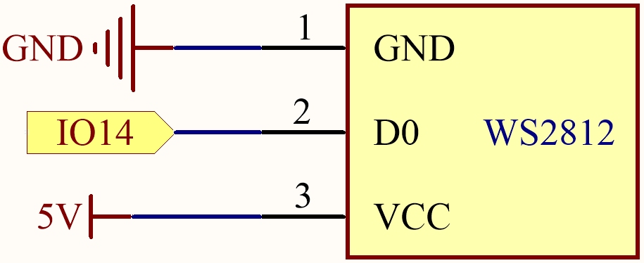

.. _ar_rgb_strip:

2.7 RGB-LED-Streifen
======================

In diesem Projekt tauchen wir ein in die faszinierende Welt der Steuerung von WS2812-LED-Streifen und erwecken eine lebendige Farbenvielfalt zum Leben. Mit der Fähigkeit, jede LED auf dem Streifen einzeln zu steuern, können wir fesselnde Lichteffekte kreieren, die die Sinne bezaubern.

Darüber hinaus haben wir eine spannende Erweiterung zu diesem Projekt hinzugefügt, in der wir das Reich der Zufälligkeit erkunden. Durch die Einführung zufälliger Farben und die Implementierung eines fließenden Lichteffekts können wir ein hypnotisierendes visuelles Erlebnis schaffen, das fasziniert und verzaubert.

**Benötigte Komponenten**

Für dieses Projekt benötigen wir die folgenden Komponenten.

Es ist definitiv praktisch, ein ganzes Kit zu kaufen, hier ist der Link:

.. list-table::
    :widths: 20 20 20
    :header-rows: 1

    *   - Name
        - ARTIKEL IN DIESEM KIT
        - LINK
    *   - ESP32 Starter Kit
        - 320+
        - |link_esp32_starter_kit|

Sie können sie auch separat über die untenstehenden Links kaufen.

.. list-table::
    :widths: 30 20
    :header-rows: 1

    *   - KOMPONENTENVORSTELLUNG
        - KAUF-LINK

    *   - :ref:`cpn_esp32_wroom_32e`
        - |link_esp32_wroom_32e_buy|
    *   - :ref:`cpn_esp32_camera_extension`
        - \-
    *   - :ref:`cpn_wires`
        - |link_wires_buy|
    *   - :ref:`cpn_ws2812`
        - |link_ws2812_buy|

**Schaltplan**

**Verfügbare Pins**

Hier ist eine Liste der verfügbaren Pins auf dem ESP32-Board für dieses Projekt.

.. list-table::
    :widths: 5 20 

    * - Verfügbare Pins
      - IO13, IO12, IO14, IO27, IO26, IO25, IO32, IO15, IO2, IO0, IO4, IO5, IO18, IO19, IO21, IO22, IO23

.. note::

    IO33 ist für dieses Projekt nicht verfügbar.

    Der WS2812-LED-Streifen ist eine Art von LED-Streifen, der ein präzises Pulsweitenmodulationssignal (PWM) benötigt. Das PWM-Signal hat genaue Anforderungen in Bezug auf Zeit und Spannung. Zum Beispiel entspricht ein "0"-Bit für den WS2812 einem High-Level-Impuls von etwa 0,4 Mikrosekunden, während ein "1"-Bit einem High-Level-Impuls von etwa 0,8 Mikrosekunden entspricht. Das bedeutet, dass der Streifen hochfrequente Spannungsänderungen empfangen muss.

    Jedoch wird mit einem 4,7K-Pull-Up-Widerstand und einem 100nf-Pull-Down-Kondensator an IO33 ein einfacher Tiefpassfilter erstellt. Diese Art von Schaltung „glättet“ hochfrequente Signale, da der Kondensator einige Zeit zum Aufladen und Entladen benötigt, wenn er Spannungsänderungen erhält. Wenn sich das Signal zu schnell ändert (d.h. hochfrequent ist), kann der Kondensator nicht mithalten. Dies führt dazu, dass das Ausgangssignal verschwommen und für den Streifen unkenntlich wird.

**Verdrahtung**

.. image:: ../../img/wiring/2.7_rgb_strip_bb.png
    :width: 800

**Code**

.. note::

    * Sie können die Datei ``2.7_rgb_strip.ino`` unter dem Pfad ``esp32-starter-kit-main\c\codes\2.7_rgb_strip`` öffnen. Oder kopieren Sie diesen Code in die **Arduino IDE**.
    * Nachdem Sie das Board (ESP32 Dev Module) und den entsprechenden Port ausgewählt haben, klicken Sie auf den **Upload**-Knopf.
    * :ref:`unknown_com_port`
    * Hier wird die ``Adafruit NeoPixel``-Bibliothek verwendet, die Sie über den **Library Manager** installieren können.

        .. image:: img/rgb_strip_lib.png

.. raw:: html
    
    <iframe src=https://create.arduino.cc/editor/sunfounder01/bccd25f6-4e3e-45e2-b9f5-76a1b0866794/preview?embed style="height:510px;width:100%;margin:10px 0" frameborder=0></iframe>

Nachdem der Code erfolgreich hochgeladen wurde, werden die LEDs auf dem Streifen nacheinander mit einer gelben Farbe aufleuchten und dann ausgehen, wodurch ein einfacher Verfolgungseffekt entsteht.

**Wie funktioniert das?**

#. Die Adafruit NeoPixel-Bibliothek einbinden: Diese Zeile importiert die Adafruit NeoPixel-Bibliothek, damit das Sketch ihre Funktionen und Klassen zur Steuerung des LED-Streifens nutzen kann.

    .. code-block:: arduino

        #include <Adafruit_NeoPixel.h> // Include the Adafruit NeoPixel library

#. Konstanten für den LED-Streifen definieren.

    .. code-block:: arduino

        #define LED_PIN 13 // NeoPixel LED strip
        #define NUM_LEDS 8 // Number of LEDs

#. Eine Instanz der Adafruit_NeoPixel-Klasse erstellen.

    .. code-block:: arduino

       // Create an instance of the Adafruit_NeoPixel class
        Adafruit_NeoPixel strip = Adafruit_NeoPixel(NUM_LEDS, LED_PIN, NEO_GRB + NEO_KHZ800);

    Diese Zeile erstellt eine Instanz der Klasse ``Adafruit_NeoPixel`` namens ``strip`` und konfiguriert sie mit der Anzahl der LEDs, dem mit dem LED-Streifen verbundenen Pin und den Signalparametern (GRB-Farbreihenfolge und 800 kHz Datenrate).

    * ``Adafruit_NeoPixel (uint16_t n, int16_t p = 6, neoPixelType t = NEO_GRB + NEO_KHZ800)``

    NeoPixel-Konstruktor, wenn Länge, Pin und Pixeltyp zur Kompilierzeit bekannt sind. Gibt ein Adafruit_NeoPixel-Objekt zurück. Vor der Verwendung die Funktion ``begin()`` aufrufen.

        * ``n``: Anzahl der NeoPixels im Strang.
        * ``p``: Arduino-Pinnummer, die das NeoPixel-Datensignal steuert.
        * ``t``: Pixeltyp - Kombinieren Sie ``NEO_*`` Konstanten definiert in ``Adafruit_NeoPixel.h``, zum Beispiel ``NEO_GRB+NEO_KHZ800`` für NeoPixels, die einen 800 KHz (statt 400 KHz) Datenstrom erwarten mit Farbbytes in grün, rot, blau Reihenfolge pro Pixel.

#. Den WS2812 RGB-Streifen initialisieren und die Anfangsfarbe des Streifens auf Schwarz (aus) setzen.

    .. code-block:: arduino

        void setup() {
            strip.begin(); // Initialize the NeoPixel strip
            strip.show(); // Set initial color to black
        }

    * ``void begin (void)``: Konfigurieren des NeoPixel-Pins für den Ausgang.
    * ``void show (void)``: Übertragen von Pixeldaten im RAM zu NeoPixels.

#. In der Funktion ``loop()`` werden die LEDs auf dem Streifen nacheinander mit einer gelben Farbe eingeschaltet und dann ausgeschaltet, um einen einfachen Verfolgungseffekt zu erzeugen.

    .. code-block:: arduino

        void loop() {
            // Turn on LEDs one by one
            for (int i = 0; i < NUM_LEDS; i++) {
                strip.setPixelColor(i, 100, 45, 0); // Set the color of the i-th LED to red
                strip.show(); // Update the LED strip with the new colors
                delay(100); // Wait for 100 milliseconds
            }
            
            // Turn off LEDs one by one
            for (int i = 0; i < NUM_LEDS; i++) {
                strip.setPixelColor(i, 0, 0, 0); // Set the color of the i-th LED to black (turn it off)
                strip.show(); // Update the LED strip with the new colors
                delay(100); // Wait for 100 milliseconds
            }
        }

    * ``void setPixelColor (uint16_t n, uint8_t r, uint8_t g, uint8_t b)``

    Setzt die Farbe eines Pixels mit separaten Rot-, Grün- und Blaukomponenten. Bei Verwendung von RGBW-Pixeln wird Weiß auf 0 gesetzt.

        * ``n``: Pixelindex, beginnend bei 0.
        * ``r``: Rot-Helligkeit, 0 = minimal (aus), 255 = maximal.
        * ``g``: Grün-Helligkeit, 0 = minimal (aus), 255 = maximal.
        * ``b``: Blau-Helligkeit, 0 = minimal (aus), 255 = maximal.
