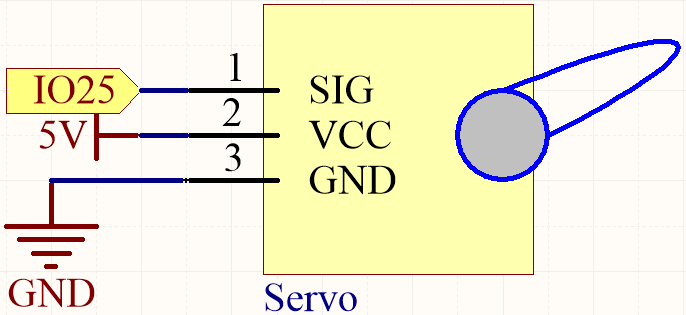
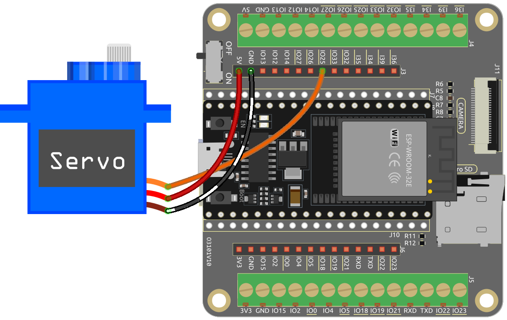

.. note::

    Ciao, benvenuto nella Community di SunFounder Raspberry Pi & Arduino & ESP32 Enthusiasts su Facebook! Approfondisci le tue conoscenze su Raspberry Pi, Arduino ed ESP32 insieme ad altri appassionati.

    **Perché unirti a noi?**

    - **Supporto Esperto**: Risolvi i problemi post-vendita e le sfide tecniche con l'aiuto della nostra community e del nostro team.
    - **Impara e Condividi**: Scambia consigli e tutorial per migliorare le tue competenze.
    - **Anteprime Esclusive**: Ottieni accesso anticipato ai nuovi annunci di prodotti e alle anteprime.
    - **Sconti Speciali**: Approfitta di sconti esclusivi sui nostri prodotti più recenti.
    - **Promozioni Festive e Giveaway**: Partecipa a giveaway e promozioni festive.

    👉 Pronto a esplorare e creare con noi? Clicca su [|link_sf_facebook|] e unisciti oggi!

.. _ar_servo:

4.3 Servo in Movimento
=========================
Un Servo è un tipo di dispositivo basato sulla posizione, noto per la sua capacità di mantenere angoli specifici e offrire una rotazione precisa. Questa caratteristica lo rende estremamente desiderabile per i sistemi di controllo che richiedono regolazioni costanti dell'angolo. Non sorprende quindi che i Servi siano ampiamente utilizzati in giocattoli telecomandati di fascia alta, dai modelli di aerei alle repliche di sottomarini, fino ai robot telecomandati più sofisticati.

In questa avvincente avventura, ci sfideremo a manipolare il Servo in un modo unico: facendolo oscillare! Questo progetto offre una brillante opportunità per approfondire le dinamiche dei Servi, affinare le tue competenze nei sistemi di controllo precisi e acquisire una comprensione più profonda del loro funzionamento.

Sei pronto a far ballare il Servo al ritmo delle tue note? Iniziamo questo entusiasmante viaggio!

**Componenti Necessari**

In questo progetto, avremo bisogno dei seguenti componenti.

È sicuramente conveniente acquistare un kit completo, ecco il link:

.. list-table::
    :widths: 20 20 20
    :header-rows: 1

    *   - Nome	
        - ELEMENTI IN QUESTO KIT
        - LINK
    *   - ESP32 Starter Kit
        - 320+
        - |link_esp32_starter_kit|

Puoi anche acquistarli separatamente dai link sottostanti.

.. list-table::
    :widths: 30 20
    :header-rows: 1

    *   - INTRODUZIONE AI COMPONENTI
        - LINK PER L'ACQUISTO

    *   - :ref:`cpn_esp32_wroom_32e`
        - |link_esp32_wroom_32e_buy|
    *   - :ref:`cpn_esp32_camera_extension`
        - |link_esp32_extension_board|
    *   - :ref:`cpn_wires`
        - |link_wires_buy|
    *   - :ref:`cpn_servo`
        - |link_servo_buy|

**Piedinatura Disponibile**

Ecco un elenco dei piedini disponibili sulla scheda ESP32 per questo progetto.

.. list-table::
    :widths: 5 20 

    * - Piedini Disponibili
      - IO13, IO12, IO14, IO27, IO26, IO25, IO33, IO32, IO15, IO2, IO0, IO4, IO5, IO18, IO19, IO21, IO22, IO23

**Schema Elettrico**

**Collegamenti**

* Il filo arancione è il segnale e va collegato a IO25.
* Il filo rosso è il VCC e va collegato a 5V.
* Il filo marrone è il GND e va collegato a GND.

**Codice**

.. note::

    * Apri il file ``4.3_servo.ino`` nel percorso ``esp32-starter-kit-main\c\codes\4.3_servo``. Oppure copia questo codice nell'**Arduino IDE**.
    * Dopo aver selezionato la scheda (ESP32 Dev Module) e la porta appropriata, fai clic sul pulsante **Upload**.
    * :ref:`unknown_com_port`
    * Qui viene utilizzata la libreria ``ESP32Servo``, che puoi installare dal **Library Manager**.

        .. image:: img/servo_lib.png

.. raw:: html

    <iframe src=https://create.arduino.cc/editor/sunfounder01/34c7969e-fee3-413c-9fe7-9d38ca6fb906/preview?embed style="height:510px;width:100%;margin:10px 0" frameborder=0></iframe>

Una volta caricato il codice, vedrai il braccio del servo ruotare nell'intervallo 0°~180°.

**Come funziona?**

#. Includi la libreria |link_esp32servo|: Questa riga importa la libreria ESP32Servo, necessaria per controllare il servomotore.

    .. code-block:: arduino

        #include <ESP32Servo.h>

#. Definisci il servo e il piedino a cui è collegato: Questa sezione dichiara un oggetto Servo (``myServo``) e un intero costante (``servoPin``) per rappresentare il piedino a cui è collegato il servomotore (piedino 25).

    .. code-block:: arduino

        // Definisci il servo e il piedino a cui è collegato
        Servo myServo;
        const int servoPin = 25;

#. Definisci la larghezza minima e massima degli impulsi per il servo: Questa sezione imposta la larghezza minima e massima degli impulsi per il servomotore (0,5 ms e 2,5 ms, rispettivamente).

    .. code-block:: arduino

        // Definisci la larghezza minima e massima degli impulsi per il servo
        const int minPulseWidth = 500; // 0,5 ms
        const int maxPulseWidth = 2500; // 2,5 ms

#. La funzione ``setup`` inizializza il servomotore collegandolo al piedino specificato e impostando il range della larghezza degli impulsi. Imposta anche la frequenza PWM per il servo a 50Hz, standard per i servomotori.

    .. code-block:: arduino

        void setup() {
            // Collega il servo al piedino specificato e imposta il range della larghezza degli impulsi
            myServo.attach(servoPin, minPulseWidth, maxPulseWidth);

            // Imposta la frequenza PWM per il servo
            myServo.setPeriodHertz(50); // Servo standard a 50Hz
        }
    
    * ``attach (int pin, int min, int max)``: Questa funzione collega il servomotore al piedino GPIO specificato e imposta la larghezza minima e massima degli impulsi per il servo.

        * ``pin``: Il numero del piedino GPIO a cui è collegato il servo. 
        * ``min`` e ``max``: la larghezza minima e massima degli impulsi, rispettivamente, in microsecondi. Questi valori definiscono il range di movimento del servomotore.

    * ``setPeriodHertz(int hertz)``: Questa funzione imposta la frequenza PWM per il servomotore in hertz.

        * ``hertz``: La frequenza PWM desiderata in hertz. La frequenza PWM predefinita per i servi è 50Hz, che è adatta per la maggior parte delle applicazioni.

#. La funzione ``loop`` è la parte principale del codice che viene eseguita continuamente. Ruota il servomotore da 0 a 180 gradi, poi torna a 0 gradi. Questo viene fatto mappando l'angolo alla corrispondente larghezza dell'impulso e aggiornando il servomotore con il nuovo valore della larghezza dell'impulso.

    .. code-block:: arduino

        void loop() {
            // Ruota il servo da 0 a 180 gradi
            for (int angle = 0; angle <= 180; angle++) {
                int pulseWidth = map(angle, 0, 180, minPulseWidth, maxPulseWidth);
                myServo.writeMicroseconds(pulseWidth);
                delay(15);
            }
    
            // Ruota il servo da 180 a 0 gradi
            for (int angle = 180; angle >= 0; angle--) {
                int pulseWidth = map(angle, 0, 180, minPulseWidth, maxPulseWidth);
                myServo.writeMicroseconds(pulseWidth);
                delay(15);
            }
        }

    * ``writeMicroseconds(int value)``: Questa funzione imposta la larghezza dell'impulso del servomotore in microsecondi. 
    
        * ``value``: La larghezza dell'impulso desiderata in microsecondi. 
        
        La funzione ``writeMicroseconds(int value)`` prende un valore intero come argomento, che rappresenta la larghezza dell'impulso desiderata in microsecondi. Questo valore dovrebbe normalmente rientrare nel range specificato dalle larghezze degli impulsi minime e massime (``minPulseWidth`` e ``maxPulseWidth``) definite in precedenza nel codice. La funzione imposta quindi la larghezza dell'impulso per il servomotore, facendolo muovere nella posizione corrispondente.
        
