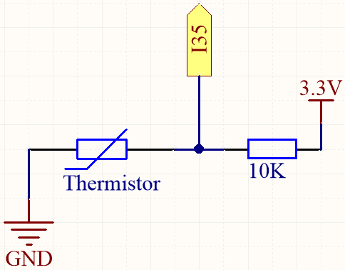
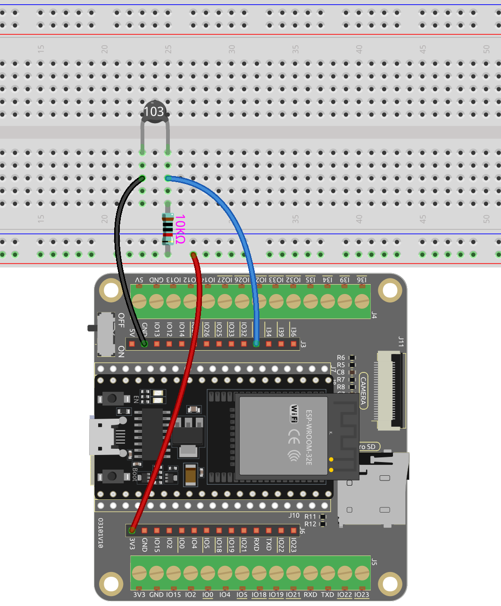

.. _ar_thermistor:

5.10 Thermometer
===========================

A thermistor is a temperature sensor that exhibits a strong dependence on temperature, and it can be classified into two types: Negative Temperature Coefficient (NTC) and Positive Temperature Coefficient (PTC). The resistance of an NTC thermistor decreases with increasing temperature, while the resistance of a PTC thermistor increases with increasing temperature.

In this project, we will be using an NTC thermistor. By connecting the NTC thermistor to an analog input pin of the ESP32 microcontroller, we can measure its resistance, which is directly proportional to the temperature.

By incorporating the NTC thermistor and performing the necessary calculations, we can accurately measure the temperature and display it on the I2C LCD1602 module. This project enables real-time temperature monitoring and provides a visual interface for temperature display.

**Available Pins**

* **Available Pins**

    Here is a list of available pins on the ESP32 board for this project.

    .. list-table::
        :widths: 5 15

        *   - Available Pins
            - IO14, IO25, I35, I34, I39, I36

* **Strapping Pins**

    The following pins are strapping pins, which affect the startup process of the ESP32 during power on or reset. However, once the ESP32 is booted up successfully, they can be used as regular pins.

    .. list-table::
        :widths: 5 15

        *   - Strapping Pins
            - IO0, IO12

**Schematic**

When the temperature rises, the resistance of the thermistor decreases, causing the value read on I35 to decrease. Additionally, by using a formula, you can convert the analog value into temperature and then print it out.

**Wiring**

.. note::
    * The thermistor is black and marked 103.
    * The color ring of the 10K ohm resistor is red, black, black, red and brown.

* :ref:`cpn_esp32_wroom_32e`
* :ref:`cpn_esp32_camera_extension`
* :ref:`cpn_breadboard`
* :ref:`cpn_wires`
* :ref:`cpn_resistor`
* :ref:`cpn_thermistor`

**Code**

.. note::

    * Open the ``5.10_thermistor.ino`` file under the path of ``esp32-ultimate-kit-main\c\codes\5.10_thermistor``.
    * After selecting the board (ESP32 Dev Module) and the appropriate port, click the **Upload** button.

.. raw:: html

    <iframe src=https://create.arduino.cc/editor/sunfounder01/d0407e3b-cd1e-4f5e-a7b6-391da394339b/preview?embed style="height:510px;width:100%;margin:10px 0" frameborder=0></iframe>

After the code is successfully uploaded, the Serial Monitor will print out the Celsius and Fahrenheit temperatures.

**How it works?**

Each thermistor has a normal resistance. Here it is 10k ohm, which is measured under 25 degree Celsius. 

When the temperature gets higher, the resistance of the thermistor decreases. Then the voltage data is converted to digital quantities by the A/D adapter. 

The temperature in Celsius or Fahrenheit is output via programming. 

Here is the relation between the resistance and temperature: 

    **RT =RN expB(1/TK - 1/TN)** 

    * **RT** is the resistance of the NTC thermistor when the temperature is **TK**. 
    * **RN** is the resistance of the NTC thermistor under the rated temperature TN. Here, the numerical value of RN is 10k. 
    * **TK** is a Kelvin temperature and the unit is K. Here, the numerical value of **TK** is ``373.15 + degree Celsius``. 
    * **TN** is a rated Kelvin temperature; the unit is K too. Here, the numerical value of TN is ``373.15+25``.
    * And **B(beta)**, the material constant of NTC thermistor, is also called heat sensitivity index with a numerical value ``4950``. 
    * **exp** is the abbreviation of exponential, and the base number ``e`` is a natural number and equals 2.7 approximately. 

    Convert this formula ``TK=1/(ln(RT/RN)/B+1/TN)`` to get Kelvin temperature that minus 273.15 equals degree Celsius. 

    This relation is an empirical formula. It is accurate only when the temperature and resistance are within the effective range.

**Learn More**

You can also display the calculated Celsius and Fahrenheit temperatures on the I2C LCD1602.

.. note::

    * You can open the file ``5.10_thermistor_lcd.ino`` under the path of ``euler-kit/arduino/5.10_thermistor_lcd``. 
    * After selecting the board (ESP32 Dev Module) and the appropriate port, click the **Upload** button.
    * The ``LiquidCrystal I2C`` library is used here, you can install it from the **Library Manager**.

.. raw:: html

    <iframe src=https://create.arduino.cc/editor/sunfounder01/93344677-8c5d-41d7-a833-f6365495d344/preview?embed style="height:510px;width:100%;margin:10px 0" frameborder=0></iframe>

