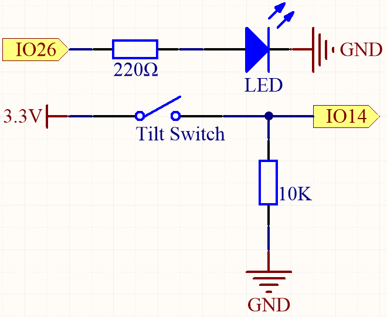
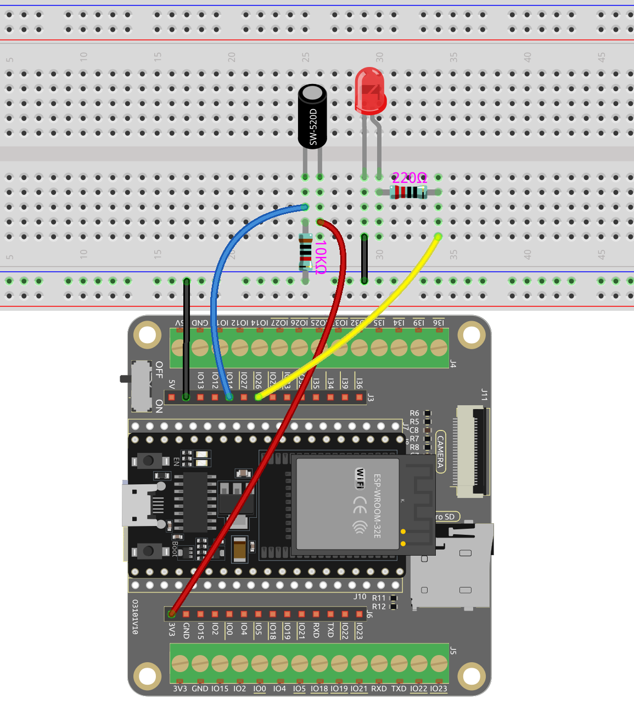

.. note::

    こんにちは、SunFounderのRaspberry Pi & Arduino & ESP32愛好家コミュニティへようこそ！Facebook上でRaspberry Pi、Arduino、ESP32についてもっと深く掘り下げ、他の愛好家と交流しましょう。

    **参加する理由は？**

    - **エキスパートサポート**：コミュニティやチームの助けを借りて、販売後の問題や技術的な課題を解決します。
    - **学び＆共有**：ヒントやチュートリアルを交換してスキルを向上させましょう。
    - **独占的なプレビュー**：新製品の発表や先行プレビューに早期アクセスしましょう。
    - **特別割引**：最新製品の独占割引をお楽しみください。
    - **祭りのプロモーションとギフト**：ギフトや祝日のプロモーションに参加しましょう。

    👉 私たちと一緒に探索し、創造する準備はできていますか？[|link_sf_facebook|]をクリックして今すぐ参加しましょう！

.. _ar_tilt:

5.2 傾けて操作！
==========================

傾斜スイッチはシンプルで効果的な2ピンデバイスで、その中心に金属球が含まれています。スイッチが垂直の位置にあるときは、2本のピンが電気的に接続されており、電流が流れます。しかし、スイッチが傾いたり特定の角度で傾けられたりすると、金属球が移動しピン間の電気的接続を断ちます。

このプロジェクトでは、傾斜スイッチを使用してLEDの照明を制御します。スイッチを傾動動作を引き起こすように配置することで、スイッチの向きに基づいてLEDをオン/オフ切り替えることができます。

**必要なコンポーネント**

このプロジェクトには、以下のコンポーネントが必要です。

全キットを購入すると非常に便利です。こちらがリンクです：

.. list-table::
    :widths: 20 20 20
    :header-rows: 1

    *   - 名称
        - このキットに含まれるアイテム
        - リンク
    *   - ESP32 スターターキット
        - 320+
        - |link_esp32_starter_kit|

以下のリンクから個別に購入することもできます。

.. list-table::
    :widths: 30 20
    :header-rows: 1

    *   - コンポーネント紹介
        - 購入リンク

    *   - :ref:`cpn_esp32_wroom_32e`
        - |link_esp32_wroom_32e_buy|
    *   - :ref:`cpn_esp32_camera_extension`
        - \-
    *   - :ref:`cpn_breadboard`
        - |link_breadboard_buy|
    *   - :ref:`cpn_wires`
        - |link_wires_buy|
    *   - :ref:`cpn_resistor`
        - |link_resistor_buy|
    *   - :ref:`cpn_led`
        - |link_led_buy|
    *   - :ref:`cpn_tilt`
        - \-

**利用可能なピン**

* **利用可能なピン**

    このプロジェクトのためにESP32ボードで利用可能なピンのリストです。

    .. list-table::
        :widths: 5 20

        *   - 入力用
            - IO14, IO25, I35, I34, I39, I36, IO18, IO19, IO21, IO22, IO23
        *   - 出力用
            - IO13, IO12, IO14, IO27, IO26, IO25, IO33, IO32, IO15, IO2, IO0, IO4, IO5, IO18, IO19, IO21, IO22, IO23
    
* **条件付き利用ピン（入力）**

    以下のピンには内蔵のプルアップまたはプルダウン抵抗があり、 **入力ピンとして使用する場合** 外部の抵抗は必要ありません。

    .. list-table::
        :widths: 5 15
        :header-rows: 1

        *   - 条件付き利用ピン
            - 説明
        *   - IO13, IO15, IO2, IO4
            - 47Kの抵抗でプルアップして高い値がデフォルトになります。
        *   - IO27, IO26, IO33
            - 4.7Kの抵抗でプルアップして高い値がデフォルトになります。
        *   - IO32
            - 1Kの抵抗でプルダウンして低い値がデフォルトになります。

* **ストラッピングピン（入力）**

    ストラッピングピンは、デバイス起動時（電源オンリセット時）に特定のブートモードを決定するために使用される特別なセットのピンです。

    
    .. list-table::
        :widths: 5 15

        *   - ストラッピングピン
            - IO5, IO0, IO2, IO12, IO15 
    

    

    一般的に、 **入力ピンとして使用することは推奨されません**。これらのピンを使用する場合は、ブートプロセスへの影響を考慮してください。詳細は、:ref:`esp32_strapping` セクションを参照してください。

**回路図**

傾斜スイッチが垂直な位置にある場合、IO14が高く設定され、その結果LEDが点灯します。反対に、傾斜スイッチが傾いている場合、IO14は低く設定され、LEDが消えます。

10K抵抗の目的は、傾斜スイッチが傾いている位置にあるときにIO14が安定した低状態を維持することです。

**配線図**

**コード**

.. note::

    * ``esp32-starter-kit-main\c\codes\5.2_tilt_switch`` のパスの下にあるファイル ``5.2_tilt_switch.ino`` を開くことができます。
    * ボード（ESP32 Dev Module）と適切なポートを選択した後、 **アップロード** ボタンをクリックします。
    * :ref:`unknown_com_port`

.. raw:: html

    <iframe src=https://create.arduino.cc/editor/sunfounder01/5ed2406f-185c-407c-ac29-42036f174a5d/preview?embed style="height:510px;width:100%;margin:10px 0" frameborder=0></iframe>
    

コードのアップロードが成功した後、スイッチが垂直な位置にあるときにLEDが点灯し、傾いたときには消灯します。
