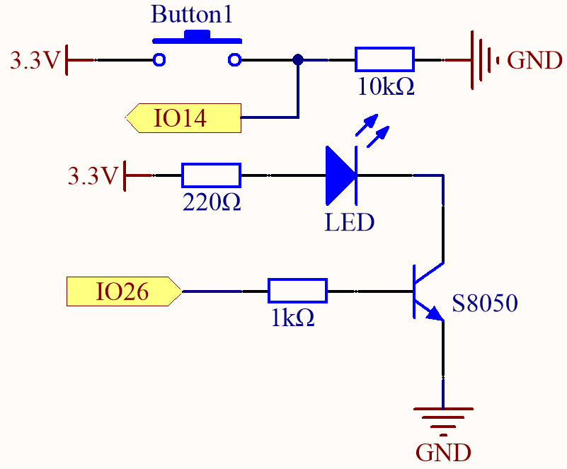
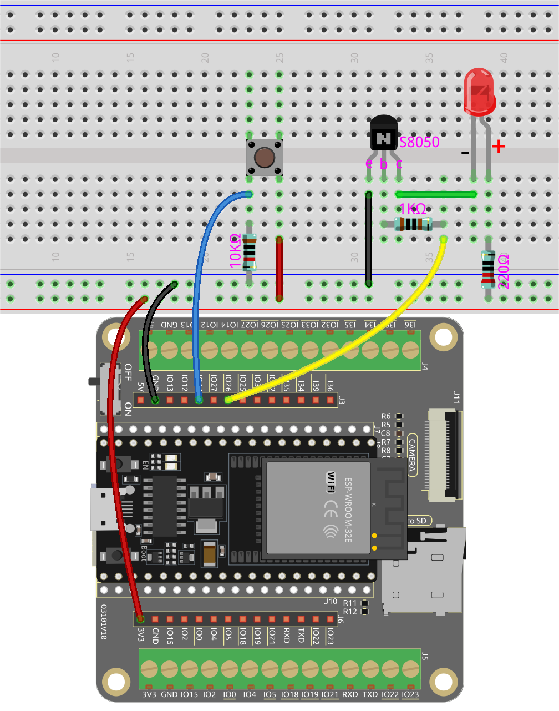
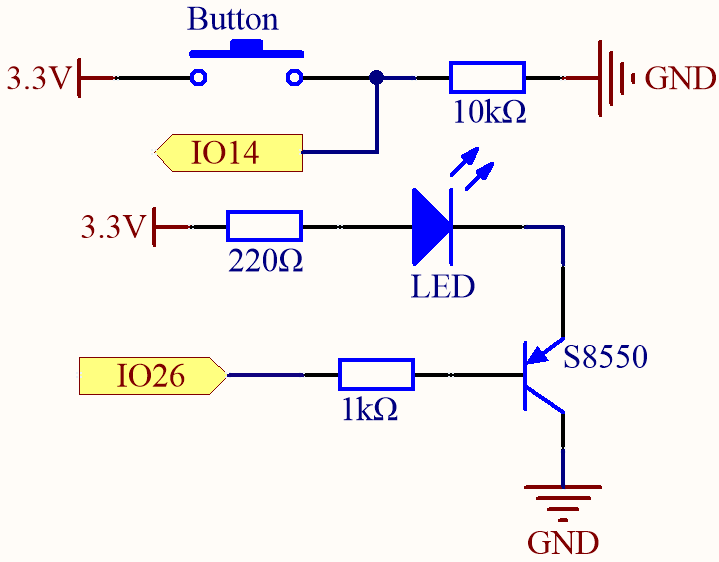
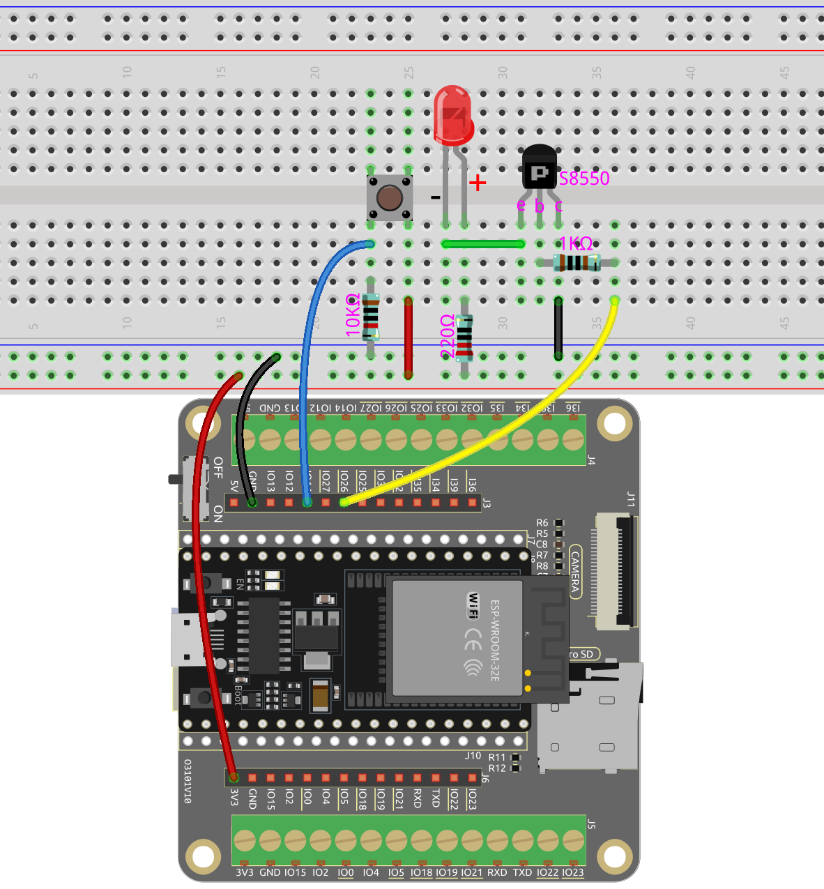

.. note::

    Bonjour, bienvenue dans la communauté des passionnés de SunFounder Raspberry Pi & Arduino & ESP32 sur Facebook ! Plongez plus profondément dans le monde de Raspberry Pi, Arduino et ESP32 avec d'autres passionnés.

    **Pourquoi nous rejoindre ?**

    - **Support d'experts** : Résolvez les problèmes après-vente et les défis techniques avec l'aide de notre communauté et de notre équipe.
    - **Apprendre et partager** : Échangez des conseils et des tutoriels pour améliorer vos compétences.
    - **Aperçus exclusifs** : Bénéficiez d'un accès anticipé aux annonces de nouveaux produits et aux avant-premières.
    - **Réductions spéciales** : Profitez de réductions exclusives sur nos derniers produits.
    - **Promotions festives et cadeaux** : Participez à des concours et promotions de vacances.

    👉 Prêt à explorer et créer avec nous ? Cliquez sur [|link_sf_facebook|] et rejoignez-nous dès aujourd'hui !

.. _ar_transistor:

5.6 Deux types de transistors
==========================================
Ce kit est équipé de deux types de transistors, S8550 et S8050, le premier est PNP et le second est NPN. Ils se ressemblent beaucoup et il faut vérifier attentivement leurs étiquettes.
Lorsqu'un signal de niveau haut traverse un transistor NPN, il est activé. Mais un transistor PNP nécessite un signal de niveau bas pour fonctionner. Les deux types de transistors sont fréquemment utilisés pour des interrupteurs sans contact, comme dans cet exercice.

Utilisons une LED et un bouton pour comprendre comment utiliser un transistor !

**Composants requis**

Pour ce projet, nous avons besoin des composants suivants.

Il est certainement pratique d'acheter un kit complet, voici le lien :

.. list-table::
    :widths: 20 20 20
    :header-rows: 1

    *   - Nom	
        - ARTICLES DANS CE KIT
        - LIEN
    *   - Kit de démarrage ESP32
        - 320+
        - |link_esp32_starter_kit|

Vous pouvez également les acheter séparément à partir des liens ci-dessous.

.. list-table::
    :widths: 30 20
    :header-rows: 1

    *   - INTRODUCTION DES COMPOSANTS
        - LIEN D'ACHAT

    *   - :ref:`cpn_esp32_wroom_32e`
        - |link_esp32_wroom_32e_buy|
    *   - :ref:`cpn_esp32_camera_extension`
        - |link_esp32_extension_board|
    *   - :ref:`cpn_breadboard`
        - |link_breadboard_buy|
    *   - :ref:`cpn_wires`
        - |link_wires_buy|
    *   - :ref:`cpn_resistor`
        - |link_resistor_buy|
    *   - :ref:`cpn_led`
        - |link_led_buy|
    *   - :ref:`cpn_button`
        - |link_button_buy|
    *   - :ref:`cpn_transistor`
        - |link_transistor_buy|

**Pins disponibles**

* **Pins disponibles**

    Voici une liste des broches disponibles sur la carte ESP32 pour ce projet.

    .. list-table::
        :widths: 5 20

        *   - Pour l'entrée
            - IO14, IO25, I35, I34, I39, I36, IO18, IO19, IO21, IO22, IO23
        *   - Pour la sortie
            - IO13, IO12, IO14, IO27, IO26, IO25, IO33, IO32, IO15, IO2, IO0, IO4, IO5, IO18, IO19, IO21, IO22, IO23

* **Pins à usage conditionnel (entrée)**

    Les broches suivantes ont des résistances de tirage intégrées, donc des résistances externes ne sont pas nécessaires lorsqu'elles sont **utilisées comme broches d'entrée** :

    .. list-table::
        :widths: 5 15
        :header-rows: 1

        *   - Pins à usage conditionnel
            - Description
        *   - IO13, IO15, IO2, IO4
            - Tirée vers le haut avec une résistance de 47K par défaut à haute valeur.
        *   - IO27, IO26, IO33
            - Tirée vers le haut avec une résistance de 4.7K par défaut à haute valeur.
        *   - IO32
            - Tirée vers le bas avec une résistance de 1K par défaut à basse valeur.

* **Pins de configuration (entrée)**

    Les broches de configuration sont un ensemble spécial de broches utilisées pour déterminer des modes de démarrage spécifiques lors de la mise sous tension de l'appareil (c'est-à-dire le redémarrage).

    .. list-table::
        :widths: 5 15

        *   - Pins de configuration
            - IO5, IO0, IO2, IO12, IO15 

    En général, il est **non recommandé de les utiliser comme broches d'entrée**. Si vous souhaitez utiliser ces broches, tenez compte de l'impact potentiel sur le processus de démarrage. Pour plus de détails, veuillez vous référer à la section :ref:`esp32_strapping`.

**Connexion du transistor NPN (S8050)**

Dans ce circuit, lorsque le bouton est enfoncé, IO14 est haut.

En programmant IO26 pour qu'il génère une sortie **haute**, après une résistance de limitation de courant de 1k (pour protéger le transistor), le S8050 (transistor NPN) est autorisé à conduire, permettant ainsi à la LED de s'allumer.

**Connexion du transistor PNP (S8550)**

Dans ce circuit, IO14 est bas par défaut et passe à haut lorsque le bouton est enfoncé.

En programmant IO26 pour qu'il génère une sortie **basse**, après une résistance de limitation de courant de 1k (pour protéger le transistor), le S8550 (transistor PNP) est autorisé à conduire, permettant ainsi à la LED de s'allumer.

La seule différence que vous remarquerez entre ce circuit et le précédent est que dans le circuit précédent, la cathode de la LED est connectée au **collecteur** du **S8050 (transistor NPN)**, tandis que dans celui-ci, elle est connectée à l'**émetteur** du **S8550 (transistor PNP)**.

**Code**

.. note::

    * Vous pouvez ouvrir le fichier ``5.6_transistor.ino`` sous le chemin ``esp32-starter-kit-main\c\codes\5.6_transistor``. 
    * Après avoir sélectionné la carte (ESP32 Dev Module) et le port approprié, cliquez sur le bouton **Téléverser**.
    * :ref:`unknown_com_port`
   
.. raw:: html

    <iframe src=https://create.arduino.cc/editor/sunfounder01/3ab778b4-642d-4a5d-8b71-05bc089389e5/preview?embed style="height:510px;width:100%;margin:10px 0" frameborder=0></iframe>

Les deux types de transistors peuvent être contrôlés en utilisant le même code. 
Lorsque nous appuyons sur le bouton, l'ESP32 enverra un signal de niveau haut au transistor ; 
lorsque nous le relâchons, il enverra un signal de niveau bas.

* Le circuit utilisant le S8050 (transistor NPN) s'allumera lorsque le bouton est enfoncé, indiquant qu'il est en état de conduction de niveau haut ;
* Le circuit utilisant le S8550 (transistor PNP) s'allumera lorsque le bouton est relâché, indiquant qu'il est en état de conduction de niveau bas.
