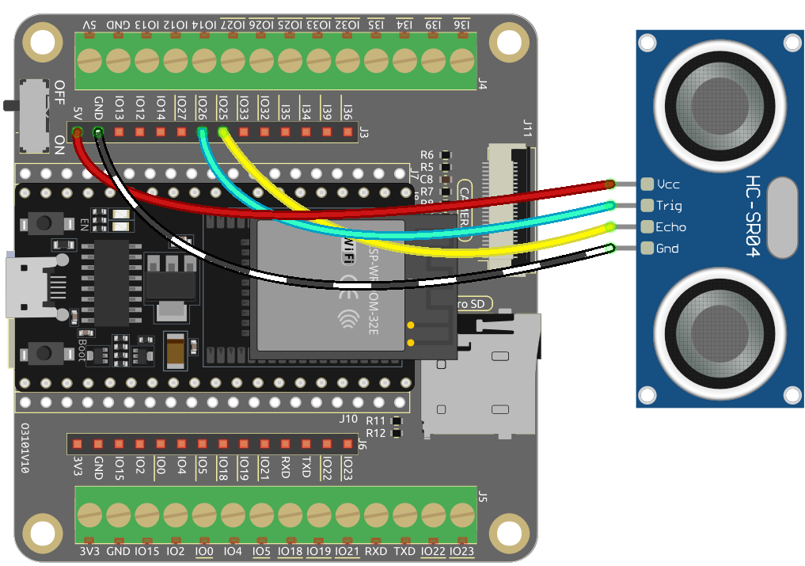

.. note::

    Hallo und willkommen in der SunFounder Raspberry Pi & Arduino & ESP32 Enthusiasten-Gemeinschaft auf Facebook! Tauchen Sie tiefer ein in die Welt von Raspberry Pi, Arduino und ESP32 mit anderen Enthusiasten.

    **Warum beitreten?**

    - **Expertenunterstützung**: Lösen Sie Nachverkaufsprobleme und technische Herausforderungen mit Hilfe unserer Gemeinschaft und unseres Teams.
    - **Lernen & Teilen**: Tauschen Sie Tipps und Anleitungen aus, um Ihre Fähigkeiten zu verbessern.
    - **Exklusive Vorschauen**: Erhalten Sie frühzeitigen Zugang zu neuen Produktankündigungen und exklusiven Einblicken.
    - **Spezialrabatte**: Genießen Sie exklusive Rabatte auf unsere neuesten Produkte.
    - **Festliche Aktionen und Gewinnspiele**: Nehmen Sie an Gewinnspielen und Feiertagsaktionen teil.

    👉 Sind Sie bereit, mit uns zu erkunden und zu erschaffen? Klicken Sie auf [|link_sf_facebook|] und treten Sie heute bei!

.. _ar_ultrasonic:

5.12 Entfernung messen
======================================
Das Ultraschallmodul wird zur Entfernungsmessung oder Objekterkennung verwendet. In diesem Projekt programmieren wir das Modul, um Hindernisentfernungen zu ermitteln. Indem wir Ultraschallimpulse senden und die Zeit messen, die sie zum Zurückprallen benötigen, können wir Entfernungen berechnen. Dies ermöglicht es uns, distanzbasierte Aktionen oder Hindernisvermeidungsverhalten zu implementieren.

**Benötigte Komponenten**

Für dieses Projekt benötigen wir die folgenden Komponenten.

Es ist definitiv praktisch, ein ganzes Kit zu kaufen, hier ist der Link:

.. list-table::
    :widths: 20 20 20
    :header-rows: 1

    *   - Name	
        - ARTIKEL IN DIESEM KIT
        - LINK
    *   - ESP32 Starter Kit
        - 320+
        - |link_esp32_starter_kit|

Sie können sie auch einzeln über die untenstehenden Links kaufen.

.. list-table::
    :widths: 30 20
    :header-rows: 1

    *   - KOMPONENTENVORSTELLUNG
        - KAUF-LINK

    *   - :ref:`cpn_esp32_wroom_32e`
        - |link_esp32_wroom_32e_buy|
    *   - :ref:`cpn_esp32_camera_extension`
        - |link_esp32_extension_board|
    *   - :ref:`cpn_wires`
        - |link_wires_buy|
    *   - :ref:`cpn_ultrasonic`
        - |link_ultrasonic_buy|

**Verfügbare Pins**

* **Verfügbare Pins**

    Hier ist eine Liste der verfügbaren Pins auf dem ESP32-Board für dieses Projekt.

    .. list-table::
        :widths: 5 20

        *   - Für Eingang
            - IO13, IO14, IO27, IO26, IO25, IO33, IO32, I35, I34, I39, I36
        *   - Für Ausgang
            - IO13, IO12, IO14, IO27, IO26, IO25, IO33, IO32, IO15, IO2, IO0, IO4, IO5, IO18, IO19, IO21, IO22, IO23

**Schaltplan**

.. image:: ../../img/circuit/circuit_5.12_ultrasonic.png

Der ESP32 sendet alle 10 Sekunden einen Satz von Rechteckwellensignalen an den Trig-Pin des Ultraschallsensors. Dies veranlasst den Ultraschallsensor, ein 40kHz Ultraschallsignal nach außen zu senden. Wenn sich ein Hindernis vorne befindet, werden die Ultraschallwellen zurückreflektiert.

Durch die Aufzeichnung der Zeit, die vom Senden bis zum Empfangen des Signals vergeht, diese durch 2 teilen und mit der Schallgeschwindigkeit multiplizieren, können Sie die Entfernung zum Hindernis bestimmen.

**Verdrahtung**

**Code**

.. note::

    * Öffnen Sie die Datei ``5.12_ultrasonic.ino`` unter dem Pfad ``esp32-starter-kit-main\c\codes\5.12_ultrasonic``.
    * Nachdem Sie das Board (ESP32 Dev Module) und den passenden Port ausgewählt haben, klicken Sie auf den **Upload**-Button.
    * :ref:`unknown_com_port`
    
.. raw:: html
    
    <iframe src=https://create.arduino.cc/editor/sunfounder01/28ded128-62a8-4b2b-b21a-450f03323cd8/preview?embed style="height:510px;width:100%;margin:10px 0" frameborder=0></iframe>

Denken Sie daran, die serielle Kommunikationsgeschwindigkeit auf 115200 einzustellen.

Nachdem der Code erfolgreich hochgeladen wurde, gibt der serielle Monitor die Entfernung zwischen dem Ultraschallsensor und dem Hindernis vorne aus.

**Wie funktioniert das?**

Über die Anwendung des Ultraschallsensors können wir direkt die Unterfunktion überprüfen.

.. code-block:: arduino

    float readSensorData(){// ...}

* Der ``trigPin`` des Ultraschallmoduls sendet alle 2us ein 10us-Rechteckwellensignal.

    .. code-block:: arduino

        // Trigger a low signal before sending a high signal
        digitalWrite(trigPin, LOW); 
        delayMicroseconds(2);
        // Send a 10-microsecond high signal to the trigPin
        digitalWrite(trigPin, HIGH); 
        delayMicroseconds(10);
        // Return to low signal
        digitalWrite(trigPin, LOW);

* Der ``echoPin`` empfängt ein Hochpegeleingangssignal, wenn sich ein Hindernis im Bereich befindet, und verwendet die Funktion ``pulseIn()``, um die Zeit vom Senden bis zum Empfangen aufzuzeichnen.

    .. code-block:: arduino

        unsigned long microsecond = pulseIn(echoPin, HIGH);

* Die Schallgeschwindigkeit beträgt 340 Meter pro Sekunde, was 29 Mikrosekunden pro Zentimeter entspricht. Indem wir die Zeit messen, die eine Rechteckwelle benötigt, um zu einem Hindernis zu gelangen und zurückzukehren, können wir die zurückgelegte Entfernung berechnen, indem wir die Gesamtzeit durch 2 teilen. Dies ergibt die Entfernung des Hindernisses von der Schallquelle.

    .. code-block:: arduino

        float distance = microsecond / 29.00 / 2;  

Beachten Sie, dass der Ultraschallsensor das Programm während der Arbeit anhält, was bei der Erstellung komplexer Projekte zu Verzögerungen führen kann.

