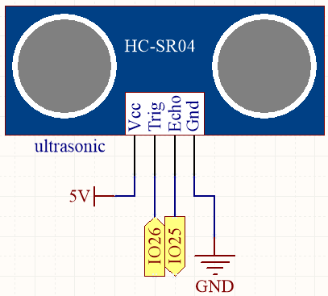

.. note::

    こんにちは、SunFounderのRaspberry Pi & Arduino & ESP32愛好家コミュニティへようこそ！Facebook上でRaspberry Pi、Arduino、ESP32についてもっと深く掘り下げ、他の愛好家と交流しましょう。

    **参加する理由は？**

    - **エキスパートサポート**：コミュニティやチームの助けを借りて、販売後の問題や技術的な課題を解決します。
    - **学び＆共有**：ヒントやチュートリアルを交換してスキルを向上させましょう。
    - **独占的なプレビュー**：新製品の発表や先行プレビューに早期アクセスしましょう。
    - **特別割引**：最新製品の独占割引をお楽しみください。
    - **祭りのプロモーションとギフト**：ギフトや祝日のプロモーションに参加しましょう。

    👉 私たちと一緒に探索し、創造する準備はできていますか？[|link_sf_facebook|]をクリックして今すぐ参加しましょう！

.. _ar_ultrasonic:

5.12 距離の測定
======================================
超音波モジュールは、距離測定や物体検出に使用されます。このプロジェクトでは、障害物までの距離を測定するためにモジュールをプログラムします。超音波パルスを送信し、それが反射して戻ってくるまでの時間を測定することで、距離を算出できます。これにより、距離に基づいた行動や障害物回避行動を実装することが可能になります。

**必要な部品**

このプロジェクトには以下のコンポーネントが必要です。

全キットを購入することは確かに便利です。こちらがリンクです:

.. list-table::
    :widths: 20 20 20
    :header-rows: 1

    *   - 名前
        - このキットのアイテム
        - リンク
    *   - ESP32 Starter Kit
        - 320+
        - |link_esp32_starter_kit|

以下のリンクから個別に購入することもできます。

.. list-table::
    :widths: 30 20
    :header-rows: 1

    *   - コンポーネントの紹介
        - 購入リンク

    *   - :ref:`cpn_esp32_wroom_32e`
        - |link_esp32_wroom_32e_buy|
    *   - :ref:`cpn_esp32_camera_extension`
        - \-
    *   - :ref:`cpn_wires`
        - |link_wires_buy|
    *   - :ref:`cpn_ultrasonic`
        - |link_ultrasonic_buy|

**利用可能なピン**

こちらは、このプロジェクトのためにESP32ボードで利用可能なピンのリストです。

.. list-table::
    :widths: 5 20

    *   - 入力用
        - IO13, IO14, IO27, IO26, IO25, IO33, IO32, I35, I34, I39, I36, IO4, IO18, IO19, IO21, IO22, IO23
    *   - 出力用
        - IO13, IO12, IO14, IO27, IO26, IO25, IO33, IO32, IO15, IO2, IO0, IO4, IO5, IO18, IO19, IO21, IO22, IO23

**回路図**

ESP32は10秒ごとに超音波センサーのTrigピンに一連の方形波信号を送信します。これにより、超音波センサーから40kHzの超音波信号が外向きに放出されます。前方に障害物がある場合、超音波波は反射して戻ります。

信号を送信してから受信するまでの時間を記録し、2で割って光速を掛けることにより、障害物までの距離を特定できます。

**配線図**

.. image:: ../../img/wiring/5.12_ultrasonic_bb.png

**コード**

.. note::

    * ``esp32-starter-kit-main\c\codes\5.12_ultrasonic`` のパスの下にある ``5.12_ultrasonic.ino`` ファイルを開いてください。
    * ボード（ESP32 Dev Module）と適切なポートを選択した後、 **Upload** ボタンをクリックします。
    * :ref:`unknown_com_port`
    
.. raw:: html
    
    <iframe src=https://create.arduino.cc/editor/sunfounder01/28ded128-62a8-4b2b-b21a-450f03323cd8/preview?embed style="height:510px;width:100%;margin:10px 0" frameborder=0></iframe>

コードが正常にアップロードされると、シリアルモニターは超音波センサーと前方の障害物との間の距離を出力します。

**どのように動作するのか？**

超音波センサーの応用については、サブファンクションを直接チェックしてください。

.. code-block:: arduino

    float readSensorData(){// ...}

* 超音波モジュールの ``trigPin`` は、2usごとに10usの方形波信号を発信します。

    .. code-block:: arduino

        // Trigger a low signal before sending a high signal
        digitalWrite(trigPin, LOW); 
        delayMicroseconds(2);
        // Send a 10-microsecond high signal to the trigPin
        digitalWrite(trigPin, HIGH); 
        delayMicroseconds(10);
        // Return to low signal
        digitalWrite(trigPin, LOW);

* 障害物が範囲内にある場合、 ``echoPin`` は高レベルの信号を受信し、送信から受信までの時間を ``pulseIn()`` 関数で記録します。

    .. code-block:: arduino

        unsigned long microsecond = pulseIn(echoPin, HIGH);

* 音速は秒速340メートルで、これはセンチメートルあたり29マイクロ秒に相当します。障害物までの方形波の往復の時間を測定し、その合計時間を2で割ることで、音波源から障害物までの距離を計算できます。

    .. code-block:: arduino

        float distance = microsecond / 29.00 / 2;  

超音波センサーは動作している間プログラムを一時停止するため、複雑なプロジェクトを書いているときにいくらかの遅延を引き起こす可能性があります。

