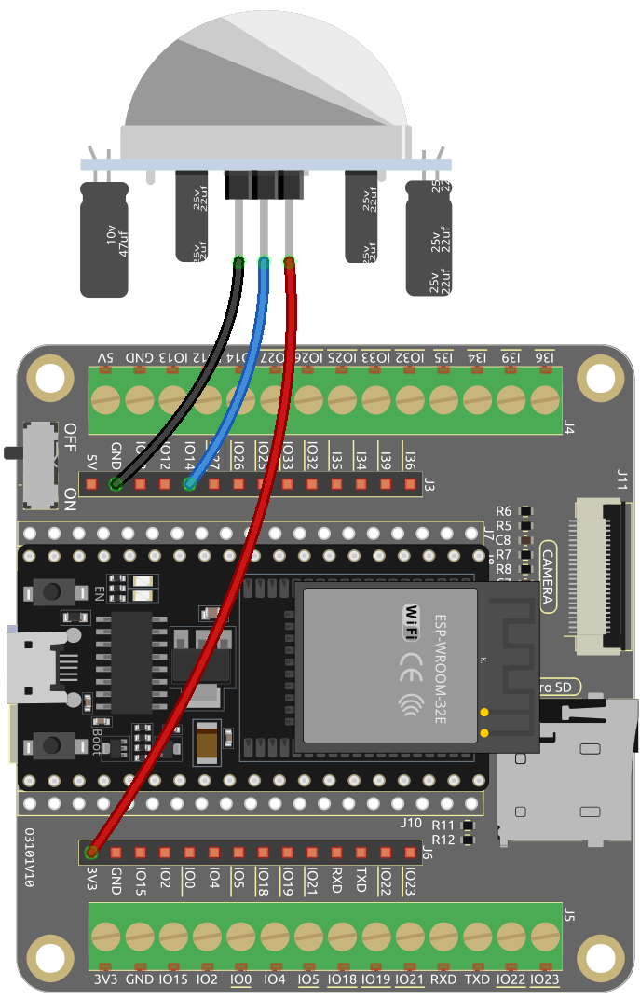

.. note::

    Hello, welcome to the SunFounder Raspberry Pi & Arduino & ESP32 Enthusiasts Community on Facebook! Dive deeper into Raspberry Pi, Arduino, and ESP32 with fellow enthusiasts.

    **Why Join?**

    - **Expert Support**: Solve post-sale issues and technical challenges with help from our community and team.
    - **Learn & Share**: Exchange tips and tutorials to enhance your skills.
    - **Exclusive Previews**: Get early access to new product announcements and sneak peeks.
    - **Special Discounts**: Enjoy exclusive discounts on our newest products.
    - **Festive Promotions and Giveaways**: Take part in giveaways and holiday promotions.

    👉 Ready to explore and create with us? Click [|link_sf_facebook|] and join today!

.. _iot_intrusion_alert_system:

8.9 Blynk-based Intrusion Notification System
=============================================

This project demonstrate a simple home intrusion detection system using a PIR motion sensor (HC-SR501).
When the system is set to "Away" mode through the Blynk app, the PIR sensor monitors for motion.
Any detected movement triggers a notification on the Blynk app, alerting the user of potential intrusion.

**Required Components**

In this project, we need the following components. 

It's definitely convenient to buy a whole kit, here's the link: 

.. list-table::
    :widths: 20 20 20
    :header-rows: 1

    *   - Name	
        - ITEMS IN THIS KIT
        - LINK
    *   - ESP32 Starter Kit
        - 320+
        - |link_esp32_starter_kit|

You can also buy them separately from the links below.

.. list-table::
    :widths: 30 20
    :header-rows: 1

    *   - COMPONENT INTRODUCTION
        - PURCHASE LINK

    *   - :ref:`cpn_esp32_wroom_32e`
        - |link_esp32_wroom_32e_buy|
    *   - :ref:`cpn_esp32_camera_extension`
        - \-
    *   - :ref:`cpn_wires`
        - |link_wires_buy|
    *   - :ref:`cpn_pir`
        - |link_pir_buy|

1. Circuit Assembly
--------------------

2. Blynk Configuration
----------------------

**2.1 Initializing Blynk**

1. Go to the |link_blynk| page and select **Sign Up FREE** or **Enterprise Solution**.

    .. image:: img/09_blynk_access.png
        :width: 600
        :align: center

2. Enter your email to start the registration process.

    .. image:: img/09_blynk_sign_in.png
        :align: center

3. Check your email for a prompt, and click on the **Create Password** link in the email to set your password.

    .. image:: img/09_blynk_password.png
        :align: center

4. After confirmation, a **Blynk Tour** will begin where you can quickly learn about some of Blynk's key features.

    .. image:: img/09_blynk_tour.png
        :width: 600
        :align: center

5. After completing the Blynk Tour, a window will pop up where you can choose to Explore Blueprints or click Quick Start to quickly connect your device. However, in this case, we will select "Have a look around first".

    .. image:: img/09_blynk_skip.png
        :align: center

**2.2 Template Creation**

1. Start by creating a template in Blynk. Follow the steps to set up the **Intrusion Alert System** template.

    .. image:: img/09_create_template_1_shadow.png
        :width: 600
        :align: center

2. Name your template, choose **ESP32** as the Hardware, select **WiFi** as the **Connection Type**, and then click **Done**.

   .. image:: img/09_create_template_2_shadow.png
        :width: 600
        :align: center

3. Enter the template, where you'll be prompted with next steps. Click **Configure template** to upload a cover image, enhance the description, and more. Follow the remaining three steps to complete the setup.

    .. image:: img/09_blynk_temp_steps.png
        :width: 600
        :align: center

**2.3 Set Up Datastreams**

1. Open the newly created template and go to the datastream setup page.

   .. image:: img/09_blynk_new_datastream.png
        :width: 600
        :align: center

2. Click **New Datastream**, and in the popup, select **Virtual Pin**.

   .. image:: img/09_blynk_datastream_virtual.png
        :width: 600
        :align: center

3. Name the **Virtual Pin V0** as **AwayMode** and set the **DATA TYPE** to **Integer**, with **MIN** and **MAX** values as **0** and **1**.

   .. image:: img/09_create_template_shadow.png
        :width: 600
        :align: center

4. Similarly, create another **Virtual Pin** named **Current Status** and set the **DATA TYPE** to **String**.

   .. image:: img/09_datastream_1_shadow.png
        :width: 600
        :align: center

**2.4 Set up the Web Dashboard**

1. Drag and drop both the **Switch widget** and the **Label widget** onto the **Web Dashboard**.

   .. image:: img/09_web_dashboard_1_shadow.png
        :width: 600
        :align: center

2. Hover over a widget to see three icons. Use the **Settings** icon to configure the widget's properties.

   .. image:: img/09_blynk_dashboard_set.png
        :width: 600
        :align: center

3. Configure the **Switch widget** to link with the **AwayMode(V0)** datastream, setting the **ONLABEL** and **OFFLABEL** to display **"away home"** and **"at home"**, respectively.

   .. image:: img/09_web_dashboard_2_shadow.png
        :width: 600
        :align: center

4. In the **Label widget** settings, link it to the **Current Status(V1)** datastream.

   .. image:: img/09_web_dashboard_3_shadow.png
        :width: 600
        :align: center

**2.5 Setting Up an Event**

1. Click **Events & Notifications** and then **Create Event**.

   .. image:: img/09_blynk_event_add.png
        :width: 600
        :align: center
    
2. Name the event and specify its code. Choose **Warning** for **TYPE** and provide a short description for the notification email. Adjust notification frequency as desired.

   .. note::
   
      Ensure the **EVENT CODE** is set as ``intrusion_detected``. Any changes here require corresponding code adjustments.

   .. image:: img/09_event_1_shadow.png
        :width: 600
        :align: center

3. Go to the **Notifications** section to enable notifications and configure email settings.

   .. image:: img/09_event_2_shadow.png
        :width: 600
        :align: center

4. Under **Settings**, define how frequently an event triggers notifications and set intervals according to your preference. Remember to click **Create** to save your settings.

   .. image:: img/09_event_3_shadow.png
        :width: 600
        :align: center

**2.6 Saving the Template**

1. Remember to save your changes to the template.

   .. image:: img/09_save_template_shadow.png
        :width: 600
        :align: center

**2.7 Making a Device**

1. It's time to create a new device from the template.

   .. image:: img/09_blynk_device_new.png
        :width: 600
        :align: center

2. Select **From template** to begin.

   .. image:: img/09_blynk_device_template.png
        :width: 600
        :align: center

3. Choose the **Intrusion Alert System** template and click **Create**.

   .. image:: img/09_blynk_device_template2.png
        :width: 600
        :align: center

4. Note down the **Template ID**, **Device Name**, and **AuthToken** for your ESP32 integration.

   .. image:: img/09_blynk_device_code.png
        :width: 600
        :align: center

3. Code Execution
-----------------------------
#. Before running the code, make sure to install the ``Blynk`` library from the **Library Manager** on the Arduino IDE.

    .. image:: img/09_blynk_add_library.png
        :width: 700
        :align: center

#. Open the ``iot_9_intrusion_alert_system.ino`` file, which is located in the ``esp32-starter-kit-main\c\codes\iot_9_intrusion_alert_system`` directory. You can also copy its content into the Arduino IDE.

    .. raw:: html

        <iframe src=https://create.arduino.cc/editor/sunfounder01/16bca228-64d7-4519-ac3b-833afecfcc65/preview?embed style="height:510px;width:100%;margin:10px 0" frameborder=0></iframe>

#. Replace the placeholders for ``BLYNK_TEMPLATE_ID``, ``BLYNK_TEMPLATE_NAME``, and ``BLYNK_AUTH_TOKEN`` with your own unique IDs.

    .. code-block:: arduino
    
        #define BLYNK_TEMPLATE_ID "TMPxxxxxxx"
        #define BLYNK_TEMPLATE_NAME "Intrusion Alert System"
        #define BLYNK_AUTH_TOKEN "xxxxxxxxxxxxx"

#. You also need to enter your WiFi network's ``ssid`` and ``password``.

   .. code-block:: arduino

        char ssid[] = "your_ssid";
        char pass[] = "your_password";

#. Choose the correct board (**ESP32 Dev Module**) and port, then click the **Upload** button.

#. Open the Serial monitor (set baud rate to 115200) and wait for a successful connection message.

    .. image:: img/09_blynk_upload_code.png
        :align: center

#. After a successful connection, activating the switch in Blynk will start the PIR module's surveillance. When motion is detected (state of 1), it will say, "Somebody here!" and send an alert to your email.

    .. image:: img/09_blynk_code_alarm.png
        :width: 700
        :align: center

4. Code explanation
-----------------------------

#. **Configuration & Libraries**

   Here, you set up the Blynk constants and credentials. You also include the necessary libraries for the ESP32 and Blynk.

    .. code-block:: arduino

        /* Comment this out to disable prints and save space */
        #define BLYNK_PRINT Serial

        #define BLYNK_TEMPLATE_ID "xxxxxxxxxxx"
        #define BLYNK_TEMPLATE_NAME "Intrusion Alert System"
        #define BLYNK_AUTH_TOKEN "xxxxxxxxxxxxxxxxxxxxxxxxxxx"

        #include <WiFi.h>
        #include <WiFiClient.h>
        #include <BlynkSimpleEsp32.h>

#. **WiFi Setup**

   Enter your WiFi credentials.

   .. code-block:: arduino

        char ssid[] = "your_ssid";
        char pass[] = "your_password";

#. **PIR Sensor Configuration**

   Set the pin where the PIR sensor is connected and initialize the state variables.

   .. code-block:: arduino

      const int sensorPin = 14;
      int state = 0;
      int awayHomeMode = 0;
      BlynkTimer timer;

#. **setup() Function**

   This function initializes the PIR sensor as an input, sets up serial communication, connects to WiFi, and configures Blynk.

   - We use ``timer.setInterval(1000L, myTimerEvent)`` to set the timer interval in ``setup()``, here we set to execute the ``myTimerEvent()`` function every **1000ms**. You can modify the first parameter of ``timer.setInterval(1000L, myTimerEvent)`` to change the interval between ``myTimerEvent`` executions.

   .. raw:: html
    
      

   .. code-block:: arduino

        void setup() {

            pinMode(sensorPin, INPUT);  // Set PIR sensor pin as input
            Serial.begin(115200);           // Start serial communication at 115200 baud rate for debugging
            
            // Configure Blynk and connect to WiFi
            Blynk.begin(BLYNK_AUTH_TOKEN, ssid, pass);
            
            timer.setInterval(1000L, myTimerEvent);  // Setup a function to be called every second
        }

#. **loop() Function**

   The loop function continuously runs Blynk and the Blynk timer functions.

   .. code-block:: arduino

        void loop() {
           Blynk.run();
           timer.run();
        }

#. **Blynk App Interaction**

   These functions are called when the device connects to Blynk and when there's a change in the state of the virtual pin V0 on the Blynk app.

   - Every time the device connects to the Blynk server, or reconnects due to poor network conditions, the ``BLYNK_CONNECTED()`` function is called. The ``Blynk.syncVirtual()`` command request a single Virtual Pin value. The specified Virtual Pin will perform ``BLYNK_WRITE()`` call. 

   - Whenever the value of a virtual pin on the BLYNK server changes, it will trigger ``BLYNK_WRITE()``.

   .. raw:: html
    
      

   .. code-block:: arduino
      
        // This function is called every time the device is connected to the Blynk.Cloud
        BLYNK_CONNECTED() {
            Blynk.syncVirtual(V0);
        }
      
        // This function is called every time the Virtual Pin 0 state changes
        BLYNK_WRITE(V0) {
            awayHomeMode = param.asInt();
            // additional logic
        }

#. **Data Handling**

   Every second, the ``myTimerEvent()`` function calls ``sendData()``. If the away mode is enabled on Blynk, it checks the PIR sensor and sends a notification to Blynk if motion is detected.

   - We use ``Blynk.virtualWrite(V1, "Somebody in your house! Please check!");`` to change the text of a label.

   - Use ``Blynk.logEvent("intrusion_detected");`` to log event to Blynk.

   .. raw:: html
    
      

   .. code-block:: arduino

        void myTimerEvent() {
           sendData();
        }

        void sendData() {
           if (awayHomeMode == 1) {
              state = digitalRead(sensorPin);  // Read the state of the PIR sensor

              Serial.print("state:");
              Serial.println(state);

              // If the sensor detects movement, send an alert to the Blynk app
              if (state == HIGH) {
                Serial.println("Somebody here!");
                Blynk.virtualWrite(V1, "Somebody in your house! Please check!");
                Blynk.logEvent("intrusion_detected");
              }
           }
        }

**Reference**

- |link_blynk_doc|
- |link_blynk_quickstart| 
- |link_blynk_virtualWrite|
- |link_blynk_logEvent|
- |link_blynk_timer_intro|
- |link_blynk_syncing| 
- |link_blynk_write|