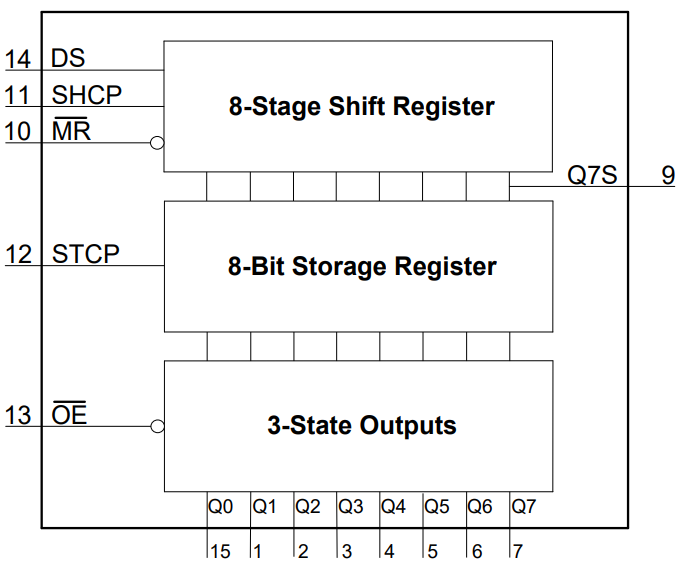
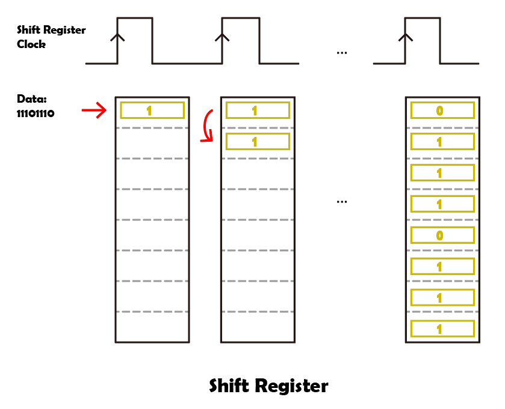
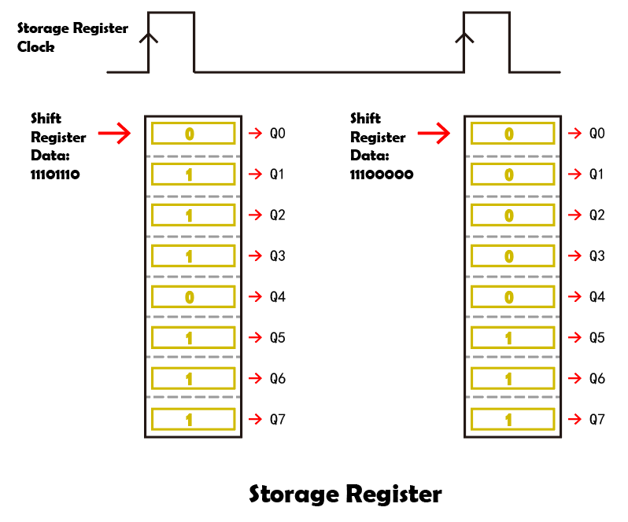

.. note::

    Bonjour, bienvenue dans la communauté des passionnés de SunFounder Raspberry Pi, Arduino et ESP32 sur Facebook ! Plongez plus profondément dans l'univers du Raspberry Pi, Arduino et ESP32 avec d'autres passionnés.

    **Pourquoi nous rejoindre ?**

    - **Support d'experts** : Résolvez les problèmes après-vente et les défis techniques avec l'aide de notre communauté et de notre équipe.
    - **Apprendre et partager** : Échangez des conseils et des tutoriels pour améliorer vos compétences.
    - **Aperçus exclusifs** : Bénéficiez d'un accès anticipé aux annonces de nouveaux produits et aux avant-premières.
    - **Réductions spéciales** : Profitez de réductions exclusives sur nos derniers produits.
    - **Promotions festives et cadeaux** : Participez à des concours et promotions de vacances.

    👉 Prêt à explorer et créer avec nous ? Cliquez sur [|link_sf_facebook|] et rejoignez-nous dès aujourd'hui !

.. _cpn_74hc595:

74HC595
===========

.. image:: img/74HC595.png

Avez-vous déjà souhaité contrôler de nombreuses LED ou simplement avoir besoin de plus de broches I/O pour gérer des boutons, des capteurs et des servos en même temps ? Vous pouvez connecter quelques capteurs aux broches de l'Arduino, mais vous manquerez rapidement de broches disponibles.

La solution consiste à utiliser des "registres à décalage". Les registres à décalage vous permettent d'augmenter le nombre de broches I/O utilisables sur l'Arduino (ou tout autre microcontrôleur). Le registre à décalage 74HC595 est l'un des plus célèbres.

Le 74HC595 contrôle essentiellement huit broches de sortie indépendantes en n'utilisant que trois broches d'entrée. Si vous avez besoin de plus de huit lignes I/O supplémentaires, vous pouvez facilement cascader plusieurs registres à décalage et créer un grand nombre de lignes I/O. Tout cela est fait par ce qu'on appelle le décalage.

**Caractéristiques**

* Registre à décalage série-entrée, parallèle-sortie 8 bits
* Large plage de tension de fonctionnement de 2 V à 6 V
* Les sorties à courant élevé à 3 états peuvent piloter jusqu'à 15 charges LSTTL
* Faible consommation d'énergie, 80 µA max ICC
* tPD typique = 14 ns
* Pilotage de sortie de ±6 mA à 5 V
* Faible courant d'entrée de 1 µA max
* Le registre à décalage dispose d'une remise à zéro directe

**Broches du 74HC595 et leurs fonctions :**

.. image:: img/74hc595_pin.png
    :width: 600

* **Q0-Q7** : Broches de sortie de données parallèles 8 bits, capables de contrôler directement 8 LED ou 8 broches d'affichage 7 segments.
* **Q7'** : Broche de sortie série, connectée à DS d'un autre 74HC595 pour connecter plusieurs 74HC595 en série
* **MR** : Broche de réinitialisation, active au niveau bas ;
* **SHcp** : Entrée de séquence temporelle du registre à décalage. Sur le front montant, les données du registre à décalage se déplacent successivement d'un bit, c'est-à-dire que les données de Q1 passent à Q2, et ainsi de suite. Sur le front descendant, les données du registre à décalage restent inchangées.
* **STcp** : Entrée de séquence temporelle du registre de stockage. Sur le front montant, les données du registre à décalage passent dans le registre de stockage.
* **CE** : Broche d'activation de sortie, active au niveau bas.
* **DS** : Broche d'entrée de données série
* **VCC** : Tension d'alimentation positive.
* **GND** : Masse.

**Schéma fonctionnel**

**Principe de fonctionnement**

Lorsque MR (broche 10) est au niveau haut et OE (broche 13) est au niveau bas,
les données sont entrées sur le front montant de SHcp et vont au registre de stockage par le front montant de STcp.

* Registre à décalage

    * Supposons que nous voulions entrer les données binaires 1110 1110 dans le registre à décalage du 74HC595.
    * Les données sont entrées à partir du bit 0 du registre à décalage.
    * Chaque fois que l'horloge du registre à décalage a un front montant, les bits dans le registre à décalage sont décalés d'un pas. Par exemple, le bit 7 accepte la valeur précédente du bit 6, le bit 6 obtient la valeur du bit 5, etc.

* Registre de stockage

    * Lorsque le registre de stockage est en état de front montant, les données du registre à décalage seront transférées au registre de stockage.
    * Le registre de stockage est directement connecté aux 8 broches de sortie, Q0 ~ Q7 pourront recevoir un octet de données.
    * Le soi-disant registre de stockage signifie que les données peuvent exister dans ce registre et ne disparaîtront pas avec une seule sortie.
    * Les données resteront valides et inchangées tant que le 74HC595 est alimenté en continu.
    * Lorsque de nouvelles données arrivent, les données dans le registre de stockage seront écrasées et mises à jour.

**Exemple**

* :ref:`ar_74hc595` (Projet Arduino)
* :ref:`ar_7_segment` (Projet Arduino)
* :ref:`ar_dice` (Projet Arduino)
* :ref:`py_74hc595` (Projet MicroPython)
* :ref:`py_7_segment` (Projet MicroPython)
* :ref:`py_dice` (Projet MicroPython)
