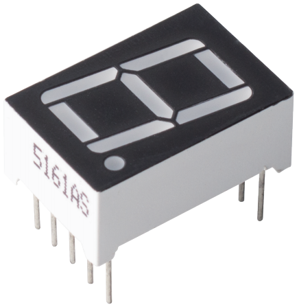
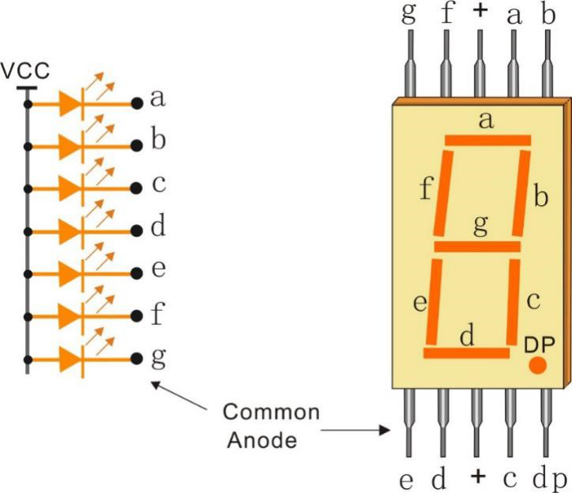
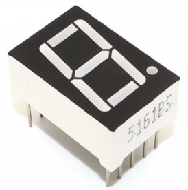
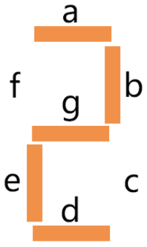

.. _cpn_7_segment:

7-segment Display
======================

A 7-segment display is an 8-shaped component which packages 7 LEDs. Each LED is called a segment - when energized, one segment forms part of a numeral to be displayed.

* Each of the LEDs in the display is given a positional segment with one of its connection pins led out from the rectangular plastic package.
* These LED pins are labeled from "a" through to "g" representing each individual LED.
* The other LED pins are connected together forming a common pin.
* So by forward biasing the appropriate pins of the LED segments in a particular order, some segments will brighten and others stay dim, thus showing the corresponding character on the display. 

**Features**

* Size: 19 x 12.7 x 13.8mm(LxWxH, include the pin)
* Screen: 0.56''
* Color: red
* Common Cathode
* Forward Voltage: 1.8V
* 10 pins
* Pitch: standard 0.1" (2.54mm)

**Common Cathode (CC) or Common Anode (CA)**

There are two types of pin connection: Common Cathode (CC) and Common Anode (CA). 
As the name suggests, a CC display has all the cathodes of the 7 LEDs connected when a CA display has all the anodes of the 7 segments connected.

* Common Cathode 7-Segment Display

.. image:: img/segment_cathode.png
    :width: 500

* Common Anode 7-Segment Display

**How to Know CC or CA?**

Usually there will be label on the side of the 7-segment display, xxxAx or xxxBx. Generally speaking xxxAx stands for common cathode and xxxBx stands for common anode.

You can also use a multimeter to check the 7-segment display if there is no label. Set the multimeter to diode test mode and connect the black lead to the middle pin of the 7-segment display, and the red lead to any other pin except the middle one. The 7-segment display is common cathode if a segment lights up.

You swap the red and black meter heads if there is no segment lit. When a segment is lit, it indicates a common anode.

.. image:: img/7_segment_test.JPG
    :width: 600

**Display Codes** 

To help you get to know how 7-segment displays(Common Cathode) display Numbers, we have drawn the following table. 
Numbers are the number 0-F displayed on the 7-segment display; (DP) GFEDCBA refers to the corresponding LED set to 0 or 1.

.. image:: img/segment_code.png

For example, 01011011 means that DP, F and C are set to 0, while others are set to 1. Therefore, the number 2 is displayed on the 7-segment display.

**Example**

* :ref:`ar_7_segment` (Arduino Project)
* :ref:`ar_dice` (Arduino Project)
* :ref:`py_7_segment` (MicroPython Project)
* :ref:`py_dice` (MicroPython Project)
