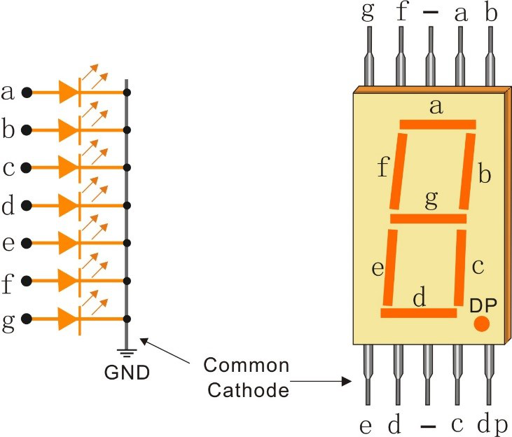

.. note::

    こんにちは、SunFounderのRaspberry Pi & Arduino & ESP32愛好家コミュニティへようこそ！Facebook上でRaspberry Pi、Arduino、ESP32についてもっと深く掘り下げ、他の愛好家と交流しましょう。

    **参加する理由は？**

    - **エキスパートサポート**：コミュニティやチームの助けを借りて、販売後の問題や技術的な課題を解決します。
    - **学び＆共有**：ヒントやチュートリアルを交換してスキルを向上させましょう。
    - **独占的なプレビュー**：新製品の発表や先行プレビューに早期アクセスしましょう。
    - **特別割引**：最新製品の独占割引をお楽しみください。
    - **祭りのプロモーションとギフト**：ギフトや祝日のプロモーションに参加しましょう。

    👉 私たちと一緒に探索し、創造する準備はできていますか？[|link_sf_facebook|]をクリックして今すぐ参加しましょう！

.. _cpn_7_segment:

7セグメントディスプレイ
=========================

.. image:: img/7_segment.png
    :width: 200
    :align: center

7セグメントディスプレイは、7つのLEDをパッケージングした8の形をした部品です。各LEDはセグメントと呼ばれ、エネルギーを供給すると表示する数字の一部となります。

* ディスプレイ内の各LEDには位置セグメントが割り当てられ、その接続ピンの一つが長方形のプラスチックパッケージから引き出されています。
* これらのLEDピンは"a"から"g"までラベルが付けられ、各LEDを表しています。
* 他のLEDピンは共通ピンを形成するために接続されています。
* したがって、特定の順序でLEDセグメントの適切なピンに順方向のバイアスをかけると、一部のセグメントが明るくなり、他のセグメントは暗くなり、ディスプレイに対応する文字が表示されます。

**特徴**

* サイズ: 19 x 12.7 x 13.8mm（LxWxH、ピンを含む）
* スクリーン: 0.56''
* 色: 赤
* 共通カソード
* 順方向電圧: 1.8V
* 10ピン
* ピッチ: 標準0.1" (2.54mm)

**共通カソード（CC）または共通アノード（CA）**

ピンの接続には2つのタイプがあります：共通カソード（CC）と共通アノード（CA）。
名前が示すように、CCディスプレイは7つのLEDのカソードが接続されているのに対し、CAディスプレイは7セグメントのアノードがすべて接続されています。

* 共通カソード7セグメントディスプレイ

* 共通アノード7セグメントディスプレイ

.. image:: img/segment_anode.png
    :width: 500

**CCかCAかを知る方法は？**

通常、7セグメントディスプレイの側面には、xxxAxまたはxxxBxというラベルがあります。一般的に、xxxAxは共通カソードを示し、xxxBxは共通アノードを示しています。

.. image:: img/7_segment.png
    :width: 250

ラベルがない場合、マルチメータを使用して7セグメントディスプレイをチェックすることもできます。マルチメータをダイオードテストモードに設定し、ブラックリードを7セグメントディスプレイの中央ピンに接続し、赤いリードを中央以外の任意のピンに接続します。セグメントが点灯すると、7セグメントディスプレイは共通カソードです。

セグメントが点灯していない場合は、赤と黒のメーターヘッドを交換します。セグメントが点灯すると、共通アノードを示しています。

.. image:: img/7_segment_test.JPG
    :width: 600

**表示コード**

7セグメントディスプレイ（共通カソード）が数字をどのように表示するかを知るために、次の表を描きました。
数字は7セグメントディスプレイ上に表示される数字0-Fです。 (DP) GFEDCBAは、対応するLEDを0または1に設定します。

.. image:: img/segment_code.png

例えば、01011011は、DP、F、Cが0に設定され、他は1に設定されていることを意味します。したがって、数字2が7セグメントディスプレイに表示されます。

.. image:: img/7segment_2.png

**例**

* :ref:`ar_7_segment` (Arduinoプロジェクト)
* :ref:`ar_dice` (Arduinoプロジェクト)
* :ref:`py_7_segment` (MicroPythonプロジェクト)
* :ref:`py_dice` (MicroPythonプロジェクト)

