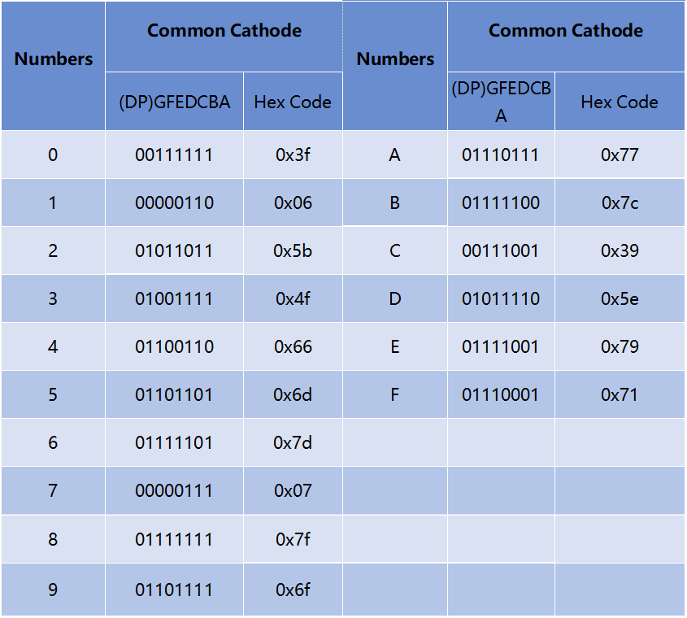

.. _cpn_7_segment:

display de 7 Segmentos
=========================

.. image:: img/7_segment.png
    :width: 200
    :align: center

Un display de 7 segmentos es un componente con forma de 8 que contiene 7 LED. Cada LED se llama segmento; cuando se energiza, un segmento forma parte de un numeral a ser mostrado.

* Cada uno de los LED en el display tiene un segmento posicional con uno de sus pines de conexión saliendo del paquete plástico rectangular.
* Estos pines LED están etiquetados de "a" a "g" representando cada LED individual.
* Los otros pines LED están conectados juntos formando un pin común.
* Así que al polarizar hacia adelante los pines apropiados de los segmentos LED en un orden particular, algunos segmentos se iluminarán y otros permanecerán tenues, mostrando así el carácter correspondiente en el display.

**Características**

* Tamaño: 19 x 12.7 x 13.8 mm (LxWxH, incluyendo el pin)
* Pantalla: 0.56''
* Color: rojo
* Cátodo Común
* Voltaje Directo: 1.8V
* 10 pines
* Paso: estándar 0.1" (2.54mm)

**Cátodo Común (CC) o Ánodo Común (CA)**

Existen dos tipos de conexión de pines: Cátodo Común (CC) y Ánodo Común (CA).
Como su nombre indica, un display CC tiene todos los cátodos de los 7 LEDs conectados cuando un display CA tiene todos los ánodos de los 7 segmentos conectados.

* Display de 7 Segmentos con Cátodo Común

.. image:: img/segment_cathode.png
    :width: 500

* Display de 7 Segmentos con Ánodo Común

**Cómo Saber si es CC o CA?**

Por lo general, habrá una etiqueta en el lateral del display de 7 segmentos, xxxAx o xxxBx. En general, xxxAx representa cátodo común y xxxBx representa ánodo común.

.. image:: img/7_segment.png
    :width: 250

.. image:: img/7_segment_bs.png

También puedes usar un multímetro para verificar el display de 7 segmentos si no hay etiqueta. Configura el multímetro en modo de prueba de diodo y conecta el cable negro al pin central del display de 7 segmentos, y el cable rojo a cualquier otro pin excepto el central. El display de 7 segmentos es de cátodo común si un segmento se ilumina.

Intercambia los cables rojo y negro si no hay ningún segmento iluminado. Cuando un segmento está iluminado, indica un ánodo común.

.. image:: img/7_segment_test.JPG
    :width: 600

**Códigos de Visualización**

Para ayudarte a entender cómo los displays de 7 segmentos (Cátodo Común) muestran números, hemos elaborado la siguiente tabla.
Los números son el número 0-F mostrado en el display de 7 segmentos; (DP) GFEDCBA se refiere al conjunto LED correspondiente a 0 o 1.

Por ejemplo, 01011011 significa que DP, F y C están configurados en 0, mientras que los otros están configurados en 1. Por lo tanto, el número 2 se muestra en el display de 7 segmentos.

.. image:: img/7segment_2.png

**Ejemplo**

* :ref:`ar_7_segment` (Proyecto Arduino)
* :ref:`ar_dice` (Proyecto Arduino)
* :ref:`py_7_segment` (Proyecto MicroPython)
* :ref:`py_dice` (Proyecto MicroPython)

