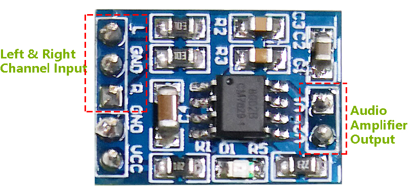

.. _cpn_audio_speaker:

オーディオモジュールとスピーカー
================================

**オーディオアンプモジュール**

オーディオアンプモジュールには、HXJ8002オーディオパワーアンプチップが含まれています。このチップは低電源のパワーアンプで、5V DC電源から3Ω BTL負荷に対して平均3Wのオーディオパワーを低調波歪（1KHzでの歪みのしきい値が10%未満）で提供することができます。このチップは、結合キャパシタやブートストラップキャパシタを使用せずにオーディオ信号を増幅することができます。

このモジュールは、2.0Vから5.5V DCの電源で供給され、10mAの動作電流（典型的なスタンバイ電流は0.6uA）を使用して、3Ω、4Ω、8Ωのインピーダンスを持つスピーカーにパワフルな増幅音を生成することができます。このモジュールには、電源のオン/オフ時の遷移ノイズを大幅に減少させるための改良されたポップとクリック回路があります。その小さなサイズと高効率、低電源供給は、広範なポータブルおよび電池駆動プロジェクトやマイクロコントローラでの利用を可能にします。

* **IC**: HXJ8002
* **入力電圧**: 2V ~ 5.5V
* **スタンバイモード電流**: 0.6uA（典型値）
* **出力電力**: 3W (3Ω 負荷), 2.5W (4Ω 負荷), 1.5W (8Ω 負荷)
* **出力スピーカーインピーダンス**: 3Ω, 4Ω, 8Ω
* **サイズ**: 19.8mm x 14.2mm

**スピーカー**

.. image:: img/speaker_pic.png
    :width: 300
    :align: center

* **サイズ**: 20x30x7mm
* **インピーダンス**：8ohm
* **定格入力電力**: 1.5W 
* **最大入力電力**: 2.0W
* **ワイヤ長**: 10cm

.. image:: img/2030_speaker.png

以下はサイズチャートです：

* :download:`2030 Speaker Datasheet <https://github.com/sunfounder/sf-pdf/raw/master/datasheet/2030-speaker-datasheet.pdf>`

**例**

* :ref:`ar_mp3_player_sd` (Arduinoプロジェクト)
* :ref:`bluetooth_audio_player` (Arduinoプロジェクト)
