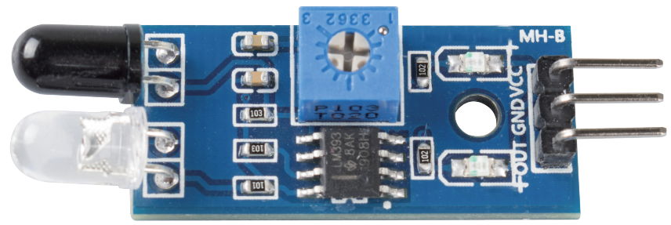

.. _cpn_avoid:

Modul zur Hindernisvermeidung
===========================================

* **VCC**: Stromversorgung, 3,3 ~ 5V DC.
* **GND**: Masse
* **OUT**: Signalpin, normalerweise auf hohem Pegel, und auf niedrigem Pegel, wenn ein Hindernis erkannt wird.

Das IR-Hindernisvermeidungsmodul passt sich gut an die Umgebungslichtverhältnisse an und verfügt über ein Paar Infrarot-Sendungs- und Empfangsröhren.

Die Sendungsröhre strahlt Infrarotfrequenz aus, wenn in der Erkennungsrichtung ein Hindernis auftritt, wird die Infrarotstrahlung von der Empfangsröhre aufgenommen. 
Nach der Verarbeitung durch den Komparatorschaltkreis leuchtet die Anzeige auf und gibt ein Niedrigpegelsignal aus.

Die Erkennungsdistanz kann mittels eines Potentiometers eingestellt werden, der wirksame Distanzbereich liegt bei 2-30cm.

.. image:: img/IR_module.png
    :width: 600
    :align: center

**Beispiel**

* :ref:`ar_ir_obstacle` (Arduino-Projekt)
* :ref:`py_ir_obstacle` (MicroPython-Projekt)
* :ref:`sh_shooting` (Scratch-Projekt)
* :ref:`sh_tap_tile` (Scratch-Projekt)
