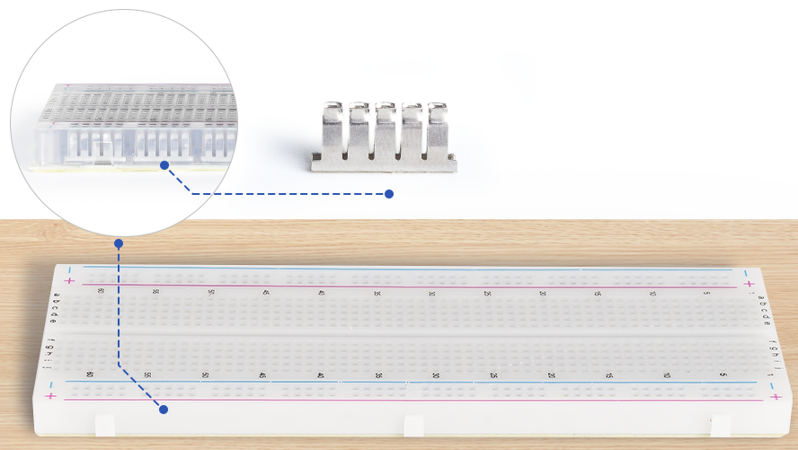
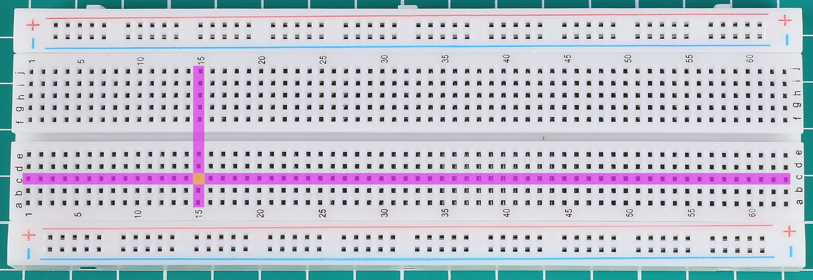
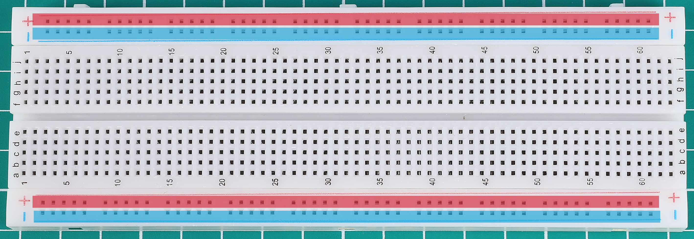
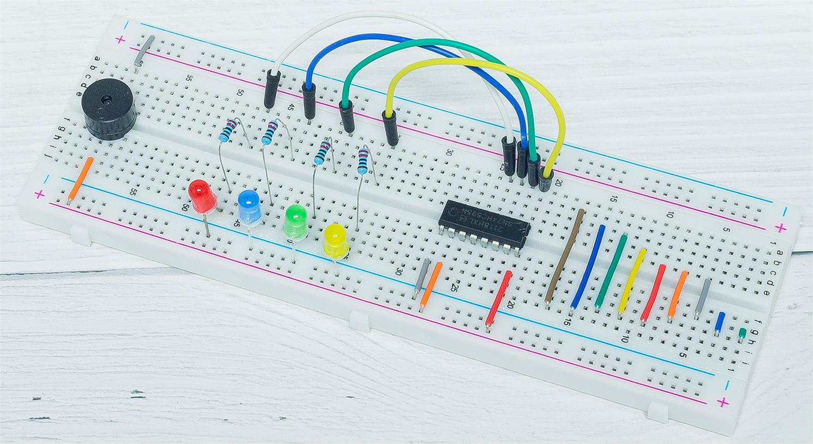

.. note::

    Bonjour, bienvenue dans la communauté des passionnés de SunFounder Raspberry Pi, Arduino et ESP32 sur Facebook ! Plongez plus profondément dans l'univers du Raspberry Pi, Arduino et ESP32 avec d'autres passionnés.

    **Pourquoi nous rejoindre ?**

    - **Support d'experts** : Résolvez les problèmes après-vente et les défis techniques avec l'aide de notre communauté et de notre équipe.
    - **Apprendre et partager** : Échangez des conseils et des tutoriels pour améliorer vos compétences.
    - **Aperçus exclusifs** : Bénéficiez d'un accès anticipé aux annonces de nouveaux produits et aux avant-premières.
    - **Réductions spéciales** : Profitez de réductions exclusives sur nos derniers produits.
    - **Promotions festives et cadeaux** : Participez à des concours et promotions de vacances.

    👉 Prêt à explorer et créer avec nous ? Cliquez sur [|link_sf_facebook|] et rejoignez-nous dès aujourd'hui !

.. _cpn_breadboard:

Plaque d'essai
==================

**Qu'est-ce qu'une plaque d'essai sans soudure ?**

.. image:: img/breadboard.png
    :width: 600
    :align: center

Une plaque d'essai est une planche rectangulaire en plastique avec de nombreux petits trous. Ces petits trous vous permettent d'insérer facilement des composants électroniques pour construire des circuits. Techniquement parlant, ces plaques d'essai sont appelées plaques d'essai sans soudure car elles ne nécessitent pas de soudure pour établir des connexions.

**Caractéristiques**

* Taille : 163 x 54 x 8 mm
* Plaque d'essai de 830 points de connexion : 630 points de connexion pour les circuits intégrés plus 2x100 points de connexion pour les bandes de distribution fournissant 4 rails d'alimentation.
* Taille de fil : Convient pour les fils de 20-29 AWG.
* Matériau : Panneau en plastique ABS, feuille de contact en bronze phosphoreux étamé.
* Tension / Courant : 300V/3-5A.
* Avec bande adhésive au dos

**Que contient la plaque d'essai ?**

L'intérieur de la plaque d'essai est composé de rangées de petits clips métalliques. Lorsque vous insérez les broches d'un composant dans les trous de la plaque d'essai, l'un des clips les attrape. Certaines plaques d'essai sont en plastique transparent, vous pouvez donc voir les clips à l'intérieur.

**Que signifient les lettres et les chiffres sur une plaque d'essai ?**

La plupart des plaques d'essai ont des chiffres, des lettres et des signes plus et moins. Bien que les étiquettes varient d'une plaque d'essai à l'autre, la fonction est essentiellement la même. Ces étiquettes vous permettent de trouver plus rapidement les trous correspondants lors de la construction de votre circuit.

Les numéros de rangée et les lettres de colonne vous aident à localiser précisément les trous sur la plaque d'essai, par exemple, le trou "C12" se trouve à l'intersection de la colonne C et de la rangée 12.

**Que signifient les lignes colorées et les signes plus et moins ?**

Les côtés de la plaque d'essai sont généralement distingués par des couleurs rouges et bleues (ou d'autres couleurs), ainsi que par des signes plus et moins, et sont généralement utilisés pour se connecter à l'alimentation, appelés bus d'alimentation.

Lors de la construction d'un circuit, il est courant de connecter la borne négative à la colonne bleue (-) et la borne positive à la colonne rouge (+).

**Comment les trous sont-ils connectés ?**

.. image:: img/breadboard_internal4.png
    :width: 500
    :align: center

Comme le montre le diagramme, chaque ensemble de cinq trous dans la section médiane, colonnes A-E ou F-J, est électriquement connecté. Cela signifie, par exemple, que le trou A1 est électriquement connecté aux trous B1, C1, D1 et E1.

Il n'est pas connecté au trou A2 car ce trou est dans une rangée différente avec un ensemble de clips métalliques distinct. Il n'est pas non plus connecté aux trous F1, G1, H1, I1 ou J1 car ils sont situés dans l'autre "moitié" de la plaque d'essai - les clips ne sont pas connectés à travers l'espace central.

Contrairement à la section médiane, qui est regroupée par cinq trous, les bus sur les côtés sont électriquement connectés séparément. Par exemple, la colonne marquée en bleu (-) est électriquement connectée dans son ensemble, et la colonne marquée en rouge (+) est également électriquement connectée.

**Quels composants électroniques sont compatibles avec les plaques d'essai ?**

De nombreux composants électroniques ont de longues pattes métalliques appelées broches. Presque tous les composants avec des broches fonctionneront avec une plaque d'essai. Les composants tels que les résistances, les condensateurs, les interrupteurs, les diodes, etc. peuvent être insérés dans n'importe quelle rangée, mais les CI doivent être disposés de part et d'autre de l'espace central.
