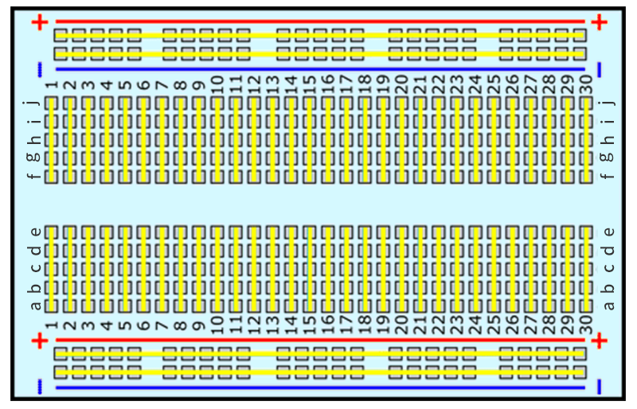

.. note::

    Ciao, benvenuto nella community di appassionati di SunFounder Raspberry Pi & Arduino & ESP32 su Facebook! Approfondisci le tue conoscenze su Raspberry Pi, Arduino ed ESP32 insieme ad altri appassionati.

    **Perché unirti?**

    - **Supporto esperto**: Risolvi i problemi post-vendita e le sfide tecniche con l'aiuto della nostra comunità e del nostro team.
    - **Impara e condividi**: Scambia consigli e tutorial per migliorare le tue competenze.
    - **Anteprime esclusive**: Accedi in anteprima agli annunci di nuovi prodotti e alle anticipazioni.
    - **Sconti speciali**: Approfitta di sconti esclusivi sui nostri prodotti più recenti.
    - **Promozioni e omaggi festivi**: Partecipa a promozioni e omaggi durante le festività.

    👉 Sei pronto a esplorare e creare con noi? Clicca su [|link_sf_facebook|] e unisciti oggi stesso!

.. _cpn_breadboard:

Breadboard
==============

**Cos'è una breadboard "senza saldature"?**

.. image:: img/breadboard.png
    :width: 600
    :align: center

Una breadboard è una scheda rettangolare di plastica con molti piccoli fori. Questi piccoli fori ti permettono di inserire facilmente componenti elettronici per costruire circuiti. Tecnicamente, queste breadboard sono conosciute come breadboard senza saldature perché non richiedono la saldatura per fare le connessioni.

**Caratteristiche**

* Dimensioni: 163 x 54 x 8 mm
* 830 punti di collegamento: 630 punti per circuiti IC più 2x100 strisce di distribuzione fornendo 4 binari di alimentazione.
* Dimensione del filo: Adatta per fili da 20-29 AWG.
* Materiale: Pannello in plastica ABS, lamina di contatto in bronzo fosforoso stagnato.
* Tensione/Corrente: 300V/3-5A.
* Con nastro autoadesivo sul retro.

**Cosa c'è dentro la breadboard?**

.. image:: img/breadboard_internal.png
    :width: 600
    :align: center

L'interno della breadboard è composto da file di piccole clip di metallo. Quando inserisci i terminali di un componente nei fori della breadboard, una delle clip lo cattura. Alcune breadboard sono realizzate in plastica trasparente, quindi puoi vedere le clip all'interno.

**Cosa significano le lettere e i numeri su una breadboard?**

.. image:: img/breadboard_internal2.png
    :width: 500
    :align: center

La maggior parte delle breadboard ha alcuni numeri, lettere e segni più e meno su di esse. Anche se le etichette variano da breadboard a breadboard, la funzione è fondamentalmente la stessa. Queste etichette ti permettono di trovare i fori corrispondenti più rapidamente durante la costruzione del circuito.

I numeri delle righe e le lettere delle colonne ti aiutano a localizzare con precisione i fori sulla breadboard, ad esempio, il foro "C12" si trova dove la colonna C interseca la riga 12.

**Cosa significano le linee colorate e i segni più e meno?**

.. image:: img/breadboard_internal3.png
    :width: 500
    :align: center

I lati della breadboard sono solitamente distinti da rosso e blu (o altri colori), oltre a segni più e meno, e vengono solitamente utilizzati per collegarsi all'alimentazione, noti come binari di alimentazione.

Durante la costruzione di un circuito, è comune collegare il terminale negativo alla colonna blu (-) e il terminale positivo alla colonna rossa (+).

**Come sono collegati i fori?**

Come mostrato nel diagramma, ogni gruppo di cinque fori nella sezione centrale, colonne A-E o F-J, è elettricamente collegato. Questo significa, ad esempio, che il foro A1 è elettricamente collegato ai fori B1, C1, D1 ed E1.

Non è collegato al foro A2 perché quel foro si trova in una fila diversa con un insieme separato di clip di metallo. Non è inoltre collegato ai fori F1, G1, H1, I1 o J1 perché si trovano nell'altra "metà" della breadboard - le clip non sono collegate attraverso la fessura centrale.

A differenza della sezione centrale, che è raggruppata per cinque fori, i bus sui lati sono collegati elettricamente separatamente. Ad esempio, la colonna contrassegnata in blu (-) è collegata elettricamente come un tutt'uno, e la colonna contrassegnata in rosso (+) è anch'essa collegata elettricamente.

**Quali componenti elettronici sono compatibili con le breadboard?**

.. image:: img/breadboard_pins.jpg
    :width: 600
    :align: center

Molti componenti elettronici hanno lunghe gambe metalliche chiamate pin. Quasi tutti i componenti con pin funzioneranno con una breadboard. Componenti come resistori, condensatori, interruttori, diodi, ecc. possono essere inseriti in una qualsiasi delle righe, ma gli IC devono essere disposti attraverso la fessura centrale.
