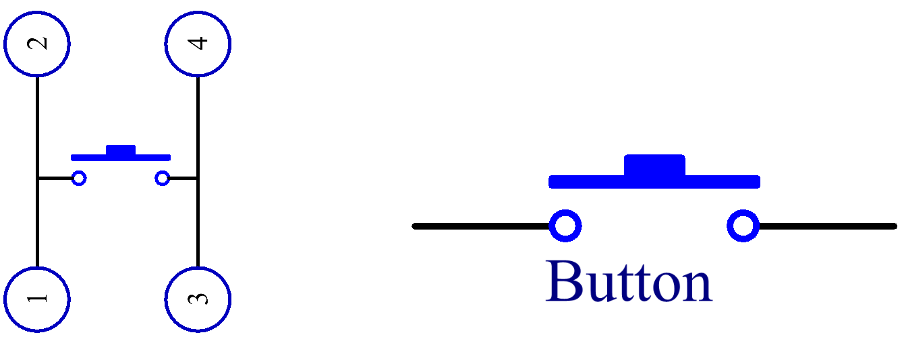
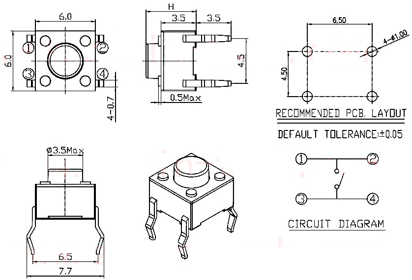

.. _cpn_button:

Botón
==========

.. image:: img/button.png
    :width: 400
    :align: center

Los botones son componentes comunes utilizados para controlar dispositivos electrónicos. Usualmente se utilizan como interruptores para conectar o interrumpir circuitos. Aunque los botones vienen en una variedad de tamaños y formas, el que se usa aquí es un mini botón de 6 mm como se muestra en las siguientes imágenes.
El pin 1 está conectado al pin 2 y el pin 3 al pin 4. Por lo tanto, solo necesitas conectar cualquiera de los pines 1 y 2 al pin 3 o al pin 4.

La siguiente es la estructura interna de un botón. El símbolo en la parte inferior derecha se utiliza generalmente para representar un botón en los circuitos. 

Dado que el pin 1 está conectado al pin 2, y el pin 3 al pin 4, cuando se presiona el botón, los 4 pines están conectados, cerrando así el circuito.

**Ejemplo**

* :ref:`ar_button` (Proyecto Arduino)
* :ref:`py_button` (Proyecto MicroPython)
* :ref:`sh_doorbell` (Proyecto Scratch)
* :ref:`sh_eat_apple` (Proyecto Scratch)
* :ref:`sh_fishing` (Proyecto Scratch)

