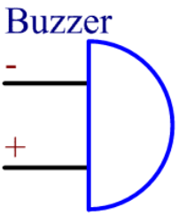

.. note::

    Ciao, benvenuto nella community di appassionati di SunFounder Raspberry Pi & Arduino & ESP32 su Facebook! Approfondisci le tue conoscenze su Raspberry Pi, Arduino ed ESP32 insieme ad altri appassionati.

    **Perché unirti?**

    - **Supporto esperto**: Risolvi i problemi post-vendita e le sfide tecniche con l'aiuto della nostra comunità e del nostro team.
    - **Impara e condividi**: Scambia consigli e tutorial per migliorare le tue competenze.
    - **Anteprime esclusive**: Accedi in anteprima agli annunci di nuovi prodotti e alle anticipazioni.
    - **Sconti speciali**: Approfitta di sconti esclusivi sui nostri prodotti più recenti.
    - **Promozioni e omaggi festivi**: Partecipa a promozioni e omaggi durante le festività.

    👉 Sei pronto a esplorare e creare con noi? Clicca su [|link_sf_facebook|] e unisciti oggi stesso!

.. _cpn_buzzer:

Cicalino (Buzzer)
===================

.. image:: img/buzzer.png
    :width: 600

Il cicalino, un tipo di dispositivo elettronico con una struttura integrata, alimentato da corrente continua, è ampiamente utilizzato in computer, stampanti, fotocopiatrici, allarmi, giocattoli elettronici, dispositivi elettronici automobilistici, telefoni, timer e altri prodotti elettronici o dispositivi vocali.

I cicalini possono essere classificati in attivi e passivi (vedi l'immagine seguente). Girando il cicalino in modo che i pin siano rivolti verso l'alto, il cicalino con una scheda verde è un cicalino passivo, mentre quello avvolto con nastro nero è un cicalino attivo.

La differenza tra un cicalino attivo e un cicalino passivo:

Un cicalino attivo ha una sorgente oscillante incorporata, quindi emette suoni quando è alimentato. Un cicalino passivo, invece, non dispone di tale sorgente, quindi non emette suoni se si utilizzano segnali DC; è necessario utilizzare onde quadre con una frequenza compresa tra 2K e 5K per farlo funzionare. Il cicalino attivo è spesso più costoso di quello passivo a causa dei circuiti oscillanti interni.

Di seguito è riportato il simbolo elettrico di un cicalino. Ha due pin con poli positivo e negativo. Il simbolo "+" sulla superficie indica l'anodo, mentre l'altro è il catodo.

È possibile controllare i pin del cicalino: quello più lungo è l'anodo e quello più corto è il catodo. Assicurati di non confonderli durante il collegamento, altrimenti il cicalino non emetterà suoni.

`Buzzer - Wikipedia <https://en.wikipedia.org/wiki/Buzzer>`_

**Esempio**

* :ref:`ar_ac_buz` (Progetto Arduino)
* :ref:`ar_pa_buz` (Progetto Arduino)
* :ref:`ar_reversing_aid` (Progetto Arduino)
* :ref:`py_pa_buz` (Progetto MicroPython)
* :ref:`py_ac_buz` (Progetto MicroPython)
* :ref:`py_reversing_aid` (Progetto MicroPython)
