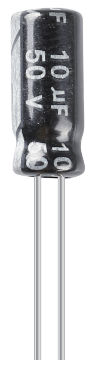

.. note::

    Ciao, benvenuto nella community di appassionati di SunFounder Raspberry Pi & Arduino & ESP32 su Facebook! Approfondisci le tue conoscenze su Raspberry Pi, Arduino ed ESP32 insieme ad altri appassionati.

    **Perché unirti?**

    - **Supporto esperto**: Risolvi i problemi post-vendita e le sfide tecniche con l'aiuto della nostra comunità e del nostro team.
    - **Impara e condividi**: Scambia consigli e tutorial per migliorare le tue competenze.
    - **Anteprime esclusive**: Accedi in anteprima agli annunci di nuovi prodotti e alle anticipazioni.
    - **Sconti speciali**: Approfitta di sconti esclusivi sui nostri prodotti più recenti.
    - **Promozioni e omaggi festivi**: Partecipa a promozioni e omaggi durante le festività.

    👉 Sei pronto a esplorare e creare con noi? Clicca su [|link_sf_facebook|] e unisciti oggi stesso!

.. _cpn_capacitor:

Condensatore
================

.. image:: img/103_capacitor.png

Il condensatore rappresenta la quantità di carica accumulata sotto una data differenza di potenziale, indicata come C, e l'unità internazionale è il farad (F).
In generale, le cariche elettriche si muovono sotto forza in un campo elettrico. Quando c'è un mezzo tra i conduttori, il movimento delle cariche è ostacolato e queste si accumulano sui conduttori, risultando in un accumulo di cariche.

La quantità di carica accumulata è chiamata capacità. Poiché i condensatori sono tra i componenti elettronici più utilizzati nelle apparecchiature elettroniche, sono ampiamente impiegati nell'isolamento dalla corrente continua, nel disaccoppiamento, nel bypass, nel filtraggio, nei circuiti di sintonizzazione, nella conversione di energia e nei circuiti di controllo. I condensatori si dividono in condensatori elettrolitici, condensatori solidi, ecc.

Secondo le caratteristiche del materiale, i condensatori possono essere classificati in: condensatori elettrolitici in alluminio, condensatori a film, condensatori al tantalio, condensatori ceramici, supercondensatori, ecc.

In questo kit vengono utilizzati condensatori ceramici ed elettrolitici.

* `Ceramic Capacitor - Wikipedia <https://en.wikipedia.org/wiki/Ceramic_capacitor>`_

* `Electrolytic Capacitor - Wikipedia <https://en.wikipedia.org/wiki/Electrolytic_capacitor>`_

Sui condensatori ceramici è presente l'etichetta 103 o 104, che rappresenta il valore della capacità, 103=10x10^3pF, 104=10x10^4pF

**Conversione delle unità**

    1F=10^3mF=10^6uF=10^9nF=10^12pF
