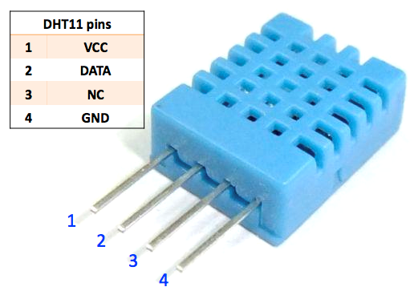

.. note::

    Hallo und willkommen in der SunFounder Raspberry Pi & Arduino & ESP32 Enthusiasten-Gemeinschaft auf Facebook! Tauchen Sie tiefer ein in die Welt von Raspberry Pi, Arduino und ESP32 mit anderen Enthusiasten.

    **Warum beitreten?**

    - **Expertenunterstützung**: Lösen Sie Nachverkaufsprobleme und technische Herausforderungen mit Hilfe unserer Gemeinschaft und unseres Teams.
    - **Lernen & Teilen**: Tauschen Sie Tipps und Anleitungen aus, um Ihre Fähigkeiten zu verbessern.
    - **Exklusive Vorschauen**: Erhalten Sie frühzeitigen Zugang zu neuen Produktankündigungen und exklusiven Einblicken.
    - **Spezialrabatte**: Genießen Sie exklusive Rabatte auf unsere neuesten Produkte.
    - **Festliche Aktionen und Gewinnspiele**: Nehmen Sie an Gewinnspielen und Feiertagsaktionen teil.

    👉 Sind Sie bereit, mit uns zu erkunden und zu erschaffen? Klicken Sie auf [|link_sf_facebook|] und treten Sie heute bei!

.. _cpn_dht11:

DHT11 Feuchtigkeits- und Temperatursensor
=============================================

Der digitale Temperatur- und Feuchtigkeitssensor DHT11 ist ein zusammengesetzter Sensor, der einen kalibrierten digitalen Signaloutput für Temperatur und Feuchtigkeit enthält.
Die Technologie spezialisierter digitaler Module sowie die Temperatur- und Feuchtigkeitssensorik werden eingesetzt, um hohe Zuverlässigkeit und exzellente Langzeitstabilität des Produkts zu gewährleisten.

Der Sensor umfasst einen resistiven Feuchtigkeitssensor und ein NTC-Temperaturmessgerät, verbunden mit einem leistungsfähigen 8-Bit-Mikrocontroller.

Nur drei Pins stehen zur Verfügung: VCC, GND und DATA. 
Der Kommunikationsprozess beginnt damit, dass die DATA-Leitung Startsignale an DHT11 sendet. DHT11 empfängt diese Signale und sendet ein Antwortsignal zurück. 
Anschließend empfängt der Host das Antwortsignal und beginnt, 40 Bit Feuchtigkeits- und Temperaturdaten zu empfangen (8 Bit Feuchtigkeit ganz, 8 Bit Feuchtigkeit Dezimal, 8 Bit Temperatur ganz, 8 Bit Temperatur Dezimal, 8 Bit Prüfsumme).

**Eigenschaften**

    #. Feuchtigkeitsmessbereich: 20 - 90% RH
    #. Temperaturmessbereich: 0 - 60℃
    #. Ausgabe digitaler Signale für Temperatur und Feuchtigkeit
    #. Betriebsspannung: DC 5V; PCB-Größe: 2,0 x 2,0 cm
    #. Genauigkeit der Feuchtigkeitsmessung: ±5% RH
    #. Genauigkeit der Temperaturmessung: ±2℃

* `DHT11 Datenblatt <http://wiki.sunfounder.cc/images/c/c7/DHT11_datasheet.pdf>`_

**Beispiele**

* :ref:`ar_dht11` (Arduino-Projekt)
* :ref:`ar_plant_monitor` (Arduino-Projekt)
* :ref:`ar_adafruit_io` (Arduino-Projekt)
* :ref:`py_dht11` (MicroPython-Projekt)
* :ref:`py_plant_monitor` (MicroPython-Projekt)
