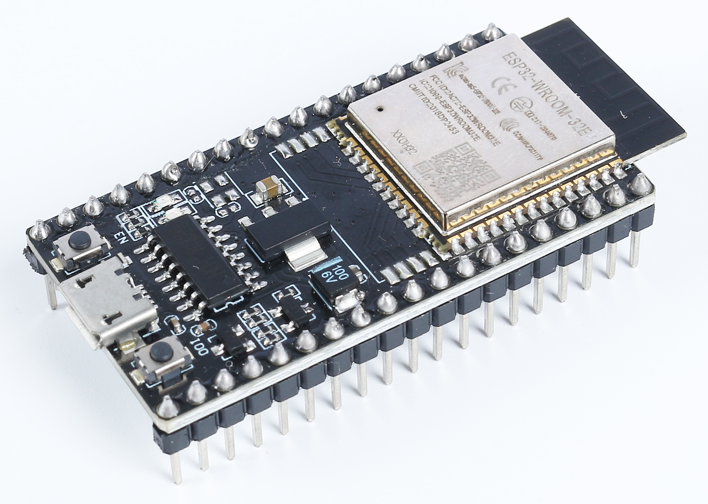
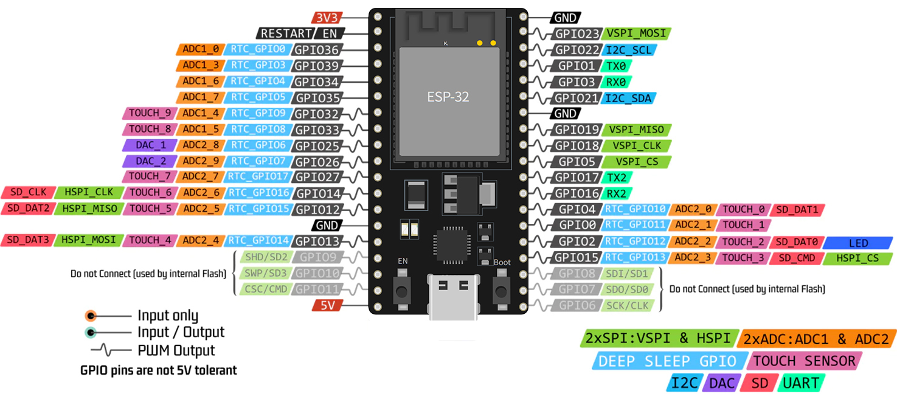
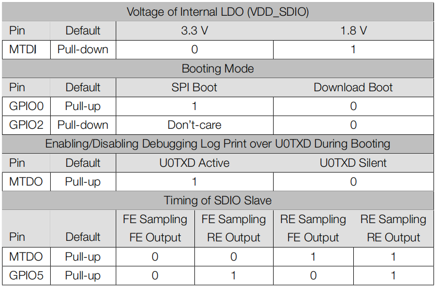
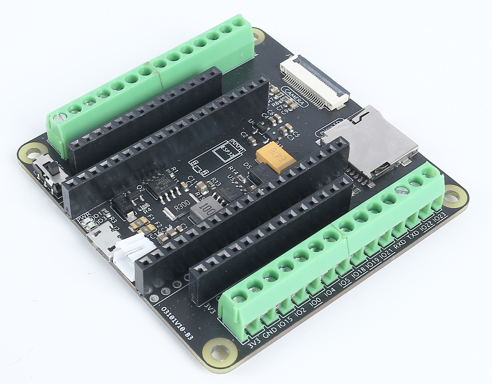
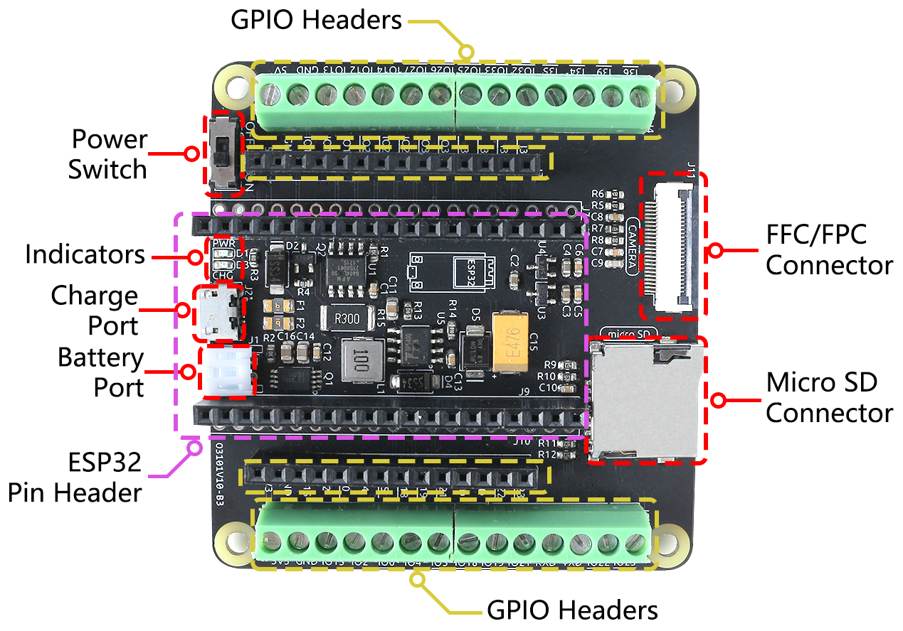

.. note::

    Hallo und willkommen in der SunFounder Raspberry Pi & Arduino & ESP32 Enthusiasten-Gemeinschaft auf Facebook! Tauchen Sie tiefer ein in die Welt von Raspberry Pi, Arduino und ESP32 mit anderen Enthusiasten.

    **Warum beitreten?**

    - **Expertenunterstützung**: Lösen Sie Nachverkaufsprobleme und technische Herausforderungen mit Hilfe unserer Gemeinschaft und unseres Teams.
    - **Lernen & Teilen**: Tauschen Sie Tipps und Anleitungen aus, um Ihre Fähigkeiten zu verbessern.
    - **Exklusive Vorschauen**: Erhalten Sie frühzeitigen Zugang zu neuen Produktankündigungen und exklusiven Einblicken.
    - **Spezialrabatte**: Genießen Sie exklusive Rabatte auf unsere neuesten Produkte.
    - **Festliche Aktionen und Gewinnspiele**: Nehmen Sie an Gewinnspielen und Feiertagsaktionen teil.

    👉 Sind Sie bereit, mit uns zu erkunden und zu erschaffen? Klicken Sie auf [|link_sf_facebook|] und treten Sie heute bei!

.. _cpn_esp32_wroom_32e:

ESP32 WROOM 32E
=================

Der ESP32 WROOM-32E ist ein vielseitiges und leistungsstarkes Modul, basierend auf dem ESP32-Chipsatz von Espressif. Es bietet Dual-Core-Verarbeitung, integrierte Wi-Fi- und Bluetooth-Konnektivität und verfügt über eine breite Palette an Schnittstellen für Peripheriegeräte. Bekannt für seinen geringen Stromverbrauch, ist das Modul ideal für IoT-Anwendungen, da es intelligente Konnektivität und robuste Leistung in kompakten Formfaktoren ermöglicht.

Wesentliche Merkmale:

* **Verarbeitungsleistung**: Ausgestattet mit einem Dual-Core Xtensa® 32-Bit LX6-Mikroprozessor, bietet es Skalierbarkeit und Flexibilität.
* **Drahtlose Fähigkeiten**: Mit integriertem 2,4 GHz Wi-Fi und Dual-Mode-Bluetooth eignet es sich hervorragend für Anwendungen, die stabile drahtlose Kommunikation erfordern.
* **Speicher & Lagerung**: Es kommt mit reichlich SRAM und leistungsfähigem Flash-Speicher, um den Bedürfnissen von Benutzerprogrammen und Datenspeicherung gerecht zu werden.
* **GPIO**: Mit bis zu 34 GPIO-Pins unterstützt es eine Vielzahl externer Geräte und Sensoren.
* **Geringer Stromverbrauch**: Verschiedene Stromsparmodi sind verfügbar, was es ideal für batteriebetriebene oder energieeffiziente Szenarien macht.
* **Sicherheit**: Integrierte Verschlüsselungs- und Sicherheitsfunktionen gewährleisten den Schutz von Benutzerdaten und Privatsphäre.
* **Vielseitigkeit**: Vom einfachen Haushaltsgerät bis hin zu komplexer Industriemaschinerie bietet der WROOM-32E durchgehend konsistente, effiziente Leistung.

Zusammenfassend bietet der ESP32 WROOM-32E nicht nur robuste Verarbeitungskapazitäten und vielfältige Konnektivitätsoptionen, sondern zeichnet sich auch durch eine Reihe von Merkmalen aus, die ihn zu einer bevorzugten Wahl im IoT- und Smart-Device-Sektor machen.

* |link_esp32_datasheet|

.. _esp32_pinout:

Pinbelegungsdiagramm
-------------------------

Der ESP32 hat einige Einschränkungen bei der Pin-Nutzung aufgrund der gemeinsamen Nutzung bestimmter Pins für verschiedene Funktionen. Bei der Projektgestaltung ist es ratsam, die Pin-Nutzung sorgfältig zu planen und auf potenzielle Konflikte zu überprüfen, um eine ordnungsgemäße Funktion zu gewährleisten und Probleme zu vermeiden.

Hier sind einige der wichtigsten Einschränkungen und Überlegungen:

* **ADC1 und ADC2**: ADC2 kann nicht verwendet werden, wenn WiFi oder Bluetooth aktiv sind. ADC1 kann jedoch ohne Einschränkungen genutzt werden.
* **Bootstrap-Pins**: GPIO0, GPIO2, GPIO5, GPIO12 und GPIO15 werden während des Bootvorgangs für das Bootstrapping verwendet. Es sollte darauf geachtet werden, keine externen Komponenten anzuschließen, die den Bootvorgang auf diesen Pins stören könnten.
* **JTAG-Pins**: GPIO12, GPIO13, GPIO14 und GPIO15 können als JTAG-Pins für Debugging-Zwecke verwendet werden. Sind JTAG-Debugging-Funktionen nicht erforderlich, können diese Pins als reguläre GPIOs genutzt werden.
* **Touch-Pins**: Einige Pins unterstützen Touch-Funktionalitäten. Diese Pins sollten vorsichtig verwendet werden, wenn sie für die Touch-Erkennung genutzt werden sollen.
* **Strom-Pins**: Einige Pins sind für strombezogene Funktionen reserviert und sollten entsprechend verwendet werden. Beispielsweise sollte vermieden werden, übermäßigen Strom von Versorgungspins wie 3V3 und GND zu ziehen.
* **Nur-Eingangs-Pins**: Einige Pins sind ausschließlich Eingänge und sollten nicht als Ausgänge verwendet werden.

.. _esp32_strapping:

**Strapping-Pins**
--------------------------

Der ESP32 verfügt über fünf Strapping-Pins:

.. list-table::
    :widths: 5 15
    :header-rows: 1

    *   - Strapping-Pins
        - Beschreibung
    *   - IO5
        - Standardmäßig auf Pull-up eingestellt, das Spannungsniveau von IO5 und IO15 beeinflusst das Timing des SDIO-Slave.
    *   - IO0
        - Standardmäßig auf Pull-up eingestellt, wenn auf Low gezogen, tritt der Downloadmodus ein.
    *   - IO2
        - Standardmäßig auf Pull-down eingestellt, IO0 und IO2 bringen den ESP32 in den Downloadmodus.
    *   - IO12(MTDI)
        - Standardmäßig auf Pull-down eingestellt, wenn auf High gezogen, startet der ESP32 nicht normal.
    *   - IO15(MTDO)
        - Standardmäßig auf Pull-up eingestellt, wenn auf Low gezogen, ist das Debug-Log nicht sichtbar. Zusätzlich beeinflusst das Spannungsniveau von IO5 und IO15 das Timing des SDIO-Slave.

Software kann die Werte dieser fünf Bits aus dem Register "GPIO_STRAPPING" auslesen.
Während des System-Resets des Chips (Power-on-Reset, RTC-Watchdog-Reset und Brownout-Reset) nehmen die Latches der
Strapping-Pins die Spannungsebene als Strapping-Bits von "0" oder "1" auf und halten diese Bits, bis der Chip
abgeschaltet oder heruntergefahren wird. Die Strapping-Bits konfigurieren den Boot-Modus des Geräts, die Betriebsspannung von
VDD_SDIO und andere anfängliche Systemeinstellungen.

Jeder Strapping-Pin ist während des Chip-Resets mit seinem internen Pull-up/Pull-down verbunden. Folglich bestimmt der interne schwache
Pull-up/Pull-down das Standard-Eingangsniveau der Strapping-Pins, wenn ein Strapping-Pin unverbunden ist oder der verbundene externe Stromkreis eine hohe Impedanz aufweist.

Um die Strapping-Bit-Werte zu ändern, können Benutzer externe Pull-down/Pull-up-Widerstände anwenden oder die GPIOs des Host-MCUs verwenden, um das Spannungsniveau dieser Pins beim Einschalten des ESP32 zu steuern.

Nach dem Reset-Release arbeiten die Strapping-Pins als Pins mit normaler Funktion.
Die folgende Tabelle gibt detaillierte Informationen zur Boot-Modus-Konfiguration durch Strapping-Pins.

* FE: fallende Flanke, RE: steigende Flanke
* Die Firmware kann Registereinstellungen konfigurieren, um die Einstellungen von "Spannung des internen LDO (VDD_SDIO)" und "Timing des SDIO-Slaves" nach dem Booten zu ändern.
* Das Modul integriert einen 3,3 V SPI-Flash, daher kann der Pin MTDI beim Einschalten des Moduls nicht auf 1 gesetzt werden.

.. _cpn_esp32_camera_extension:

ESP32-Kameraerweiterung
--------------------------

Wir haben ein Erweiterungsboard entworfen, das Ihnen ermöglicht, die Kamera- und SD-Karten-Funktionen des ESP32 WROOM 32E vollständig zu nutzen. Mit der Kombination aus der OV2640-Kamera, Micro-SD und ESP32 WROOM 32E erhalten Sie ein All-in-One-Erweiterungsboard.

Das Board bietet zwei Arten von GPIO-Headern – einen mit weiblichen Headern, perfekt für schnelle Prototyping-Projekte. Der andere Typ verfügt über Schraubklemmen, die stabile Drahtverbindungen gewährleisten und sich somit für IoT-Projekte eignen.

Zusätzlich können Sie Ihr Projekt mit einer einzelnen 3,7V 18650-Batterie betreiben. Wenn die Batterie leer ist, können Sie sie bequem aufladen, indem Sie einfach ein 5V Micro-USB-Kabel anschließen. Dies macht es zu einem großartigen Werkzeug für Outdoor-Projekte und Fernanwendungen.

Schnittstellen-Einführung
-----------------------------

* **Power Switch**
    * Steuert das Ein- und Ausschalten der Batteriestromversorgung.

* **Charging Port**
    * Beim Anschließen eines 5V Micro-USB-Kabels kann die Batterie aufgeladen werden.

* **Battery Port**
    * Verfügt über eine PH2.0-2P-Schnittstelle, kompatibel mit 3,7V 18650 Lithium-Batterien.
    * Versorgt sowohl das ESP32 WROOM 32E als auch die ESP32-Kameraerweiterung mit Strom.

* **ESP32 Pin Headers**
    * Bestimmt für das ESP32 WROOM 32E-Modul. Achten Sie auf die korrekte Orientierung; stellen Sie sicher, dass beide Micro-USB-Ports auf dieselbe Seite zeigen, um eine falsche Platzierung zu vermeiden.

* **GPIO Headers**
    * **Weibliche Header**: Zum Anschließen verschiedener Komponenten an das ESP32, perfekt für schnelle Prototyping-Projekte.
    * **Schraubklemme**: 3,5mm-Pitch 14pin-Schraubklemme, gewährleistet stabile Drahtverbindungen und eignet sich für IoT-Projekte.

* **Indicator Lights**
    * **PWR**: Leuchtet auf, wenn die Batterie eingeschaltet ist oder wenn ein Micro-USB direkt an das ESP32 angeschlossen ist.
    * **CHG**: Leuchtet auf, wenn ein Micro-USB an den Ladeanschluss der Platine angeschlossen wird, was den Beginn des Ladevorgangs anzeigt. Es erlischt, sobald die Batterie vollständig aufgeladen ist.

* **Micro SD Connector**
    * Federbeladener Steckplatz für einfaches Einsetzen und Entnehmen der Micro-SD-Karte.

* **24-pin 0.5mm FFC / FPC connector**
    * Entwickelt für die OV2640-Kamera, geeignet für verschiedene vision-bezogene Projekte.

ESP32 Kameraerweiterung Anschlussplan
-------------------------------------

Der Anschlussplan des ESP32 WROOM 32E ist unter :ref:`esp32_pinout` zu finden.

Wenn der ESP32 WROOM 32E jedoch auf das Erweiterungsboard gesteckt wird, können einige seiner Pins auch zur Steuerung der Micro SD-Karte oder einer Kamera verwendet werden.

Daher wurden diesen Pins Pull-up- oder Pull-down-Widerstände hinzugefügt. Wenn Sie diese Pins als Eingänge verwenden, ist es entscheidend, diese Widerstände zu berücksichtigen, da sie die Eingangspegel beeinflussen können.

Hier ist die Pinbelegung für die rechte Seite:

    .. image:: img/esp32_extension_pinout1.jpg
        :width: 100%
        :align: center

Und hier die Pinbelegung für die linke Seite:

    .. image:: img/esp32_extension_pinout2.jpg
        :width: 100%
        :align: center

    .. note::

        Es gibt einige spezifische Einschränkungen:

        * **IO33** ist mit einem 4,7K Pull-up-Widerstand und einem Filterkondensator verbunden, was verhindert, dass er den WS2812 RGB-Streifen ansteuert.

Anleitung zum Einsetzen der Schnittstellen
-------------------------------------------

**Code hochladen**

    Um Code auf den ESP32 WROOM 32E zu laden, verbinden Sie ihn über ein Micro USB-Kabel mit Ihrem Computer.

    .. image:: ../img/plugin_esp32.png
        :width: 600
        :align: center

**Einsetzen der Micro SD-Karte**

    Drücken Sie die Micro SD-Karte vorsichtig hinein, um sie zu sichern. Ein weiteres Drücken wird sie auswerfen.

    .. image:: ../img/insert_sd.png
        :width: 600
        :align: center

**Anschließen der Kamera**

    Beim Anschließen der Kamera achten Sie darauf, dass der schwarze Streifen des FPC-Kabels nach oben zeigt und vollständig in den Stecker eingeführt ist.

    .. raw:: html

        <video loop autoplay muted style = "max-width:100%">
            <source src="../_static/video/plugin_camera.mp4" type="video/mp4">
            Ihr Browser unterstützt das Video-Tag nicht.
        </video>

**Batteriebetrieb und Aufladen**

    Stecken Sie das Batteriekabel vorsichtig in den Batterieanschluss, um zu vermeiden, dass Sie zu viel Kraft aufwenden und das Batterieterminal nach oben drücken. Wenn das Terminal nach oben gedrückt wird, ist es in Ordnung, solange die Stifte nicht gebrochen sind; Sie können es einfach wieder in Position drücken.

    .. image:: ../img/plugin_battery.png
        :width: 600
        :align: center

    Wenn die Batterie entladen ist, schließen Sie ein 5V Micro USB-Kabel an, um sie aufzuladen.

    .. image:: ../img/battery_charge.png
        :width: 600
        :align: center

