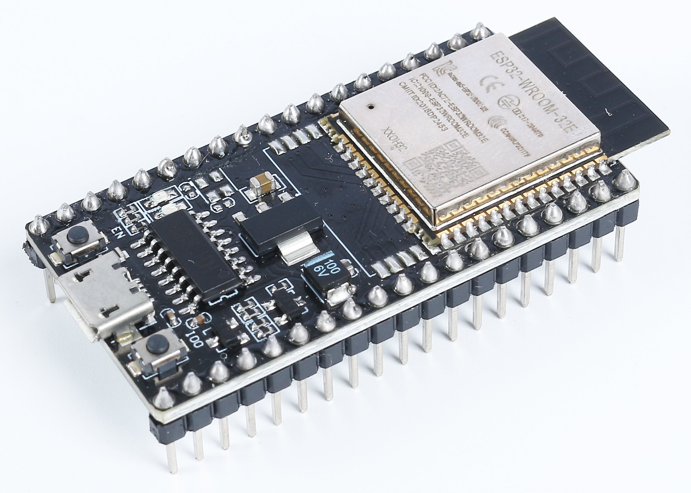

.. note::

    Bonjour, bienvenue dans la communauté des passionnés de SunFounder Raspberry Pi, Arduino et ESP32 sur Facebook ! Plongez plus profondément dans l'univers du Raspberry Pi, Arduino et ESP32 avec d'autres passionnés.

    **Pourquoi nous rejoindre ?**

    - **Support d'experts** : Résolvez les problèmes après-vente et les défis techniques avec l'aide de notre communauté et de notre équipe.
    - **Apprendre et partager** : Échangez des conseils et des tutoriels pour améliorer vos compétences.
    - **Aperçus exclusifs** : Bénéficiez d'un accès anticipé aux annonces de nouveaux produits et aux avant-premières.
    - **Réductions spéciales** : Profitez de réductions exclusives sur nos derniers produits.
    - **Promotions festives et cadeaux** : Participez à des concours et des promotions de vacances.

    👉 Prêt à explorer et créer avec nous ? Cliquez sur [|link_sf_facebook|] et rejoignez-nous dès aujourd'hui !

.. _cpn_esp32_wroom_32e:

ESP32 WROOM 32E
=================

L'ESP32 WROOM-32E est un module polyvalent et puissant basé sur le chipset ESP32 d'Espressif. Il offre un traitement double cœur, une connectivité Wi-Fi et Bluetooth intégrée, et dispose d'un large éventail d'interfaces périphériques. Connu pour sa faible consommation d'énergie, le module est idéal pour les applications IoT, permettant une connectivité intelligente et des performances robustes dans des formats compacts.

Les principales caractéristiques incluent :

* **Puissance de traitement** : Il est équipé d'un microprocesseur Xtensa® 32 bits LX6 double cœur, offrant évolutivité et flexibilité.
* **Capacités sans fil** : Avec le Wi-Fi 2,4 GHz et le Bluetooth dual-mode intégrés, il est parfaitement adapté aux applications nécessitant une communication sans fil stable.
* **Mémoire et stockage** : Il est doté de SRAM suffisante et d'un stockage flash haute performance, répondant aux besoins des programmes et du stockage des données des utilisateurs.
* **GPIO** : Offrant jusqu'à 38 broches GPIO, il prend en charge une variété de dispositifs et capteurs externes.
* **Faible consommation d'énergie** : Plusieurs modes d'économie d'énergie sont disponibles, le rendant idéal pour les scénarios alimentés par batterie ou économes en énergie.
* **Sécurité** : Les fonctionnalités de cryptage et de sécurité intégrées assurent la protection des données et de la confidentialité des utilisateurs.
* **Polyvalence** : Des simples appareils ménagers aux machines industrielles complexes, le WROOM-32E offre des performances constantes et efficaces.

En résumé, l'ESP32 WROOM-32E offre non seulement des capacités de traitement robustes et des options de connectivité diversifiées, mais il dispose également d'une gamme de fonctionnalités en faisant un choix privilégié dans les secteurs de l'IoT et des dispositifs intelligents.

* |link_esp32_datasheet|

.. _esp32_pinout:

Schéma des broches
-------------------------

L'ESP32 a des limitations d'utilisation des broches en raison de diverses 
fonctionnalités partageant certaines broches. Lors de la conception d'un projet, 
il est bon de planifier soigneusement l'utilisation des broches et de vérifier les 
conflits potentiels pour assurer le bon fonctionnement et éviter les problèmes.

.. image:: img/esp32_pinout.jpg
    :width: 800
    :align: center

Voici quelques-unes des principales restrictions et considérations :

* **ADC1 et ADC2** : ADC2 ne peut pas être utilisé lorsque le Wi-Fi ou le Bluetooth est actif. Cependant, ADC1 peut être utilisé sans aucune restriction.
* **Broches de bootstrap** : GPIO0, GPIO2, GPIO5, GPIO12 et GPIO15 sont utilisés pour le bootstrap lors du processus de démarrage. Il faut veiller à ne pas connecter de composants externes qui pourraient interférer avec le processus de démarrage sur ces broches.
* **Broches JTAG** : GPIO12, GPIO13, GPIO14 et GPIO15 peuvent être utilisés comme broches JTAG pour le débogage. Si le débogage JTAG n'est pas requis, ces broches peuvent être utilisées comme GPIO ordinaires.
* **Broches tactiles** : Certaines broches prennent en charge les fonctionnalités tactiles. Elles doivent être utilisées avec précaution si vous avez l'intention de les utiliser pour la détection tactile.
* **Broches d'alimentation** : Certaines broches sont réservées aux fonctions liées à l'alimentation et doivent être utilisées en conséquence. Par exemple, évitez de tirer un courant excessif des broches d'alimentation comme 3V3 et GND.
* **Broches en entrée uniquement** : Certaines broches sont uniquement en entrée et ne doivent pas être utilisées comme sorties.

.. _esp32_strapping:

**Broches de Strapping**
--------------------------

L'ESP32 a cinq broches de strapping :

.. list-table::
    :widths: 5 15
    :header-rows: 1

    *   - Broches de Strapping
        - Description
    *   - IO5
        - Par défaut en pull-up, le niveau de tension de IO5 et IO15 affecte le Timing du SDIO Slave.
    *   - IO0
        - Par défaut en pull-up, si tiré vers le bas, il entre en mode téléchargement.
    *   - IO2
        - Par défaut en pull-down, IO0 et IO2 feront entrer l'ESP32 en mode téléchargement.
    *   - IO12 (MTDI)
        - Par défaut en pull-down, si tiré vers le haut, l'ESP32 ne démarrera pas correctement.
    *   - IO15 (MTDO)
        - Par défaut en pull-up, si tiré vers le bas, le journal de débogage ne sera pas visible. De plus, le niveau de tension de IO5 et IO15 affecte le Timing du SDIO Slave.

Le logiciel peut lire les valeurs de ces cinq bits à partir du registre "GPIO_STRAPPING".
Lors de la libération de la réinitialisation du système de la puce (power-on-reset, 
réinitialisation de la surveillance RTC et réinitialisation brownout), les loquets des 
broches de strapping échantillonnent le niveau de tension en tant que bits de strapping 
"0" ou "1" et maintiennent ces bits jusqu'à ce que la puce soit éteinte. ou arrêté. Les 
bits de strapping configurent le mode de démarrage du dispositif, la tension de 
fonctionnement de VDD_SDIO et d'autres paramètres système initiaux.

Chaque broche de strapping est connectée à son pull-up/pull-down interne pendant la réinitialisation de la puce. Par conséquent, si une broche de strapping est non connectée ou si le circuit externe connecté est à haute impédance, le pull-up/pull-down interne faible déterminera le niveau d'entrée par défaut des broches de strapping.

Pour changer les valeurs des bits de strapping, les utilisateurs peuvent appliquer les résistances externes pull-down/pull-up ou utiliser les GPIO de l'hôte MCU pour contrôler le niveau de tension de ces broches lors de la mise sous tension de l'ESP32.

Après la libération de la réinitialisation, les broches de strapping fonctionnent comme des broches normales.
Consultez le tableau suivant pour une configuration détaillée du mode de démarrage par broches de strapping.

.. image:: img/esp32_strapping.png

* FE : front descendant, RE : front montant
* Le firmware peut configurer des bits de registre pour modifier les paramètres de "Tension de l'oscillateur interne (VDD_SDIO)" et "Timing de l'esclave SDIO", après le démarrage.
* Le module intègre une flash SPI 3,3 V, donc la broche MTDI ne peut pas être réglée sur 1 lorsque le module est alimenté.

.. _cpn_esp32_camera_extension:

Extension de caméra ESP32
-------------------------------

Nous avons conçu une carte d'extension qui vous permet de profiter pleinement des fonctionnalités de la caméra et de la carte SD de l'ESP32 WROOM 32E. En combinant la caméra OV2640, une Micro SD et l'ESP32 WROOM 32E, vous obtenez une carte d'extension tout-en-un.

La carte propose deux types de connecteurs GPIO - l'un avec des connecteurs femelles, parfait pour les projets de prototypage rapide. L'autre type dispose de bornes à vis, assurant des connexions de fils stables et la rendant adaptée aux projets IoT.

De plus, vous pouvez alimenter votre projet avec une seule batterie 3,7V 18650. Si la batterie est faible, vous pouvez la charger simplement en branchant un câble USB 5V. Cela en fait un excellent outil pour les projets en extérieur et les applications à distance.

.. image:: img/esp32_camera_extension.jpg
    :width: 600
    :align: center

Présentation de l'interface
--------------------------------

.. image:: img/esp32_camera_extension_pinout.jpg
    :width: 800
    :align: center

* **Interrupteur d'alimentation**
    * Contrôle l'alimentation de la batterie, permettant de l'allumer et de l'éteindre.

* **Port de charge**
    * Lorsqu'un câble USB 5V est connecté, la batterie peut être chargée.

* **Port de la batterie**
    * Dispose d'une interface PH2.0-2P, compatible avec les batteries lithium 3.7V 18650.
    * Fournit de l'énergie à la fois à l'ESP32 WROOM 32E et à l'extension de caméra ESP32.

* **Broches d'en-tête ESP32**
    * Conçues pour le module ESP32 WROOM 32E. Faites attention à son orientation ; assurez-vous que les deux ports USB soient du même côté pour éviter une mauvaise installation.

* **Broches GPIO**
    * **Connecteurs femelles** : Utilisés pour connecter divers composants à l'ESP32, parfaits pour les projets de prototypage rapide.
    * **Borne à vis** : Borne à vis 14 broches de 3,5 mm de pas, assurant des connexions de fils stables et la rendant adaptée aux projets IoT.

* **Voyants indicateurs**
    * **PWR** : S'allume lorsque la batterie est alimentée ou lorsqu'un USB est directement branché à l'ESP32.
    * **CHG** : S'illumine lors de la connexion d'un USB au port de charge de la carte, signifiant le début de la charge. Il s'éteindra une fois la batterie entièrement chargée.

* **Connecteur Micro SD**
    * Fente à ressort pour une insertion et un retrait faciles de la carte Micro SD.

* **Connecteur FFC / FPC 24 broches 0,5 mm**
    * Conçu pour la caméra OV2640, la rendant adaptée à divers projets liés à la vision.

Schéma des broches de l'extension de caméra ESP32
------------------------------------------------------

Le schéma des broches de l'ESP32 WROOM 32E peut être trouvé dans :ref:`esp32_pinout`.

Cependant, lorsque l'ESP32 WROOM 32E est inséré dans la carte d'extension, certaines de ses broches peuvent également être utilisées pour piloter la carte Micro SD ou une caméra.

Par conséquent, des résistances pull-up ou pull-down ont été ajoutées à ces broches. Si vous utilisez ces broches comme entrées, il est crucial de tenir compte de ces résistances car elles peuvent affecter les niveaux d'entrée.

Voici le tableau des broches du côté droit :

    .. image:: img/esp32_extension_pinout1.jpg
        :width: 100%
        :align: center

Voici le tableau des broches du côté gauche :

    .. image:: img/esp32_extension_pinout2.jpg
        :width: 100%
        :align: center

    .. note::

        Il y a certaines contraintes spécifiques :

        * **IO33** est connecté à une résistance pull-up de 4,7K et un condensateur de filtrage, ce qui l'empêche de piloter la bande RGB WS2812.

Guide d'insertion de l'interface
-------------------------------------

**Téléverser le code**

    Lorsque vous devez téléverser du code sur l'ESP32 WROOM 32E, connectez-le à votre ordinateur à l'aide d'un câble USB.

    .. image:: ../img/plugin_esp32.png
        :width: 600
        :align: center

**Insertion de la carte Micro SD**

    Poussez doucement la carte Micro SD pour la sécuriser en place. La pousser à nouveau la fera sortir.

    .. image:: ../img/insert_sd.png
        :width: 600
        :align: center

**Fixation de la caméra**

    Lors de la connexion de la caméra, assurez-vous que la bande noire du câble FPC soit orientée vers le haut et entièrement insérée dans le connecteur.

    .. raw:: html

        <video loop autoplay muted style = "max-width:100%">
            <source src="../_static/video/plugin_camera.mp4" type="video/mp4">
            Your browser does not support the video tag.
        </video>

**Alimentation et charge de la batterie**

    Insérez soigneusement le câble de la batterie dans le port de la batterie, en évitant d'appliquer trop de force pour ne pas pousser la borne de la batterie vers le haut. Si la borne est poussée vers le haut, ce n'est pas grave tant que les broches ne sont pas cassées ; vous pouvez simplement la remettre en place.

    .. image:: ../img/plugin_battery.png
        :width: 600
        :align: center

    Si la batterie est épuisée, branchez un USB 5V pour la charger.

    .. image:: ../img/battery_charge.png
        :width: 600
        :align: center
