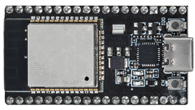
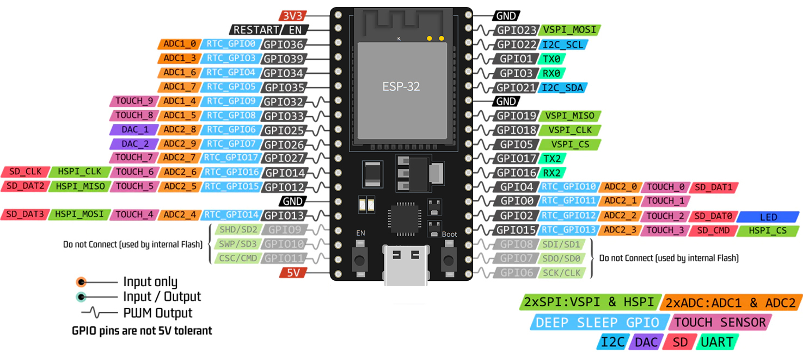
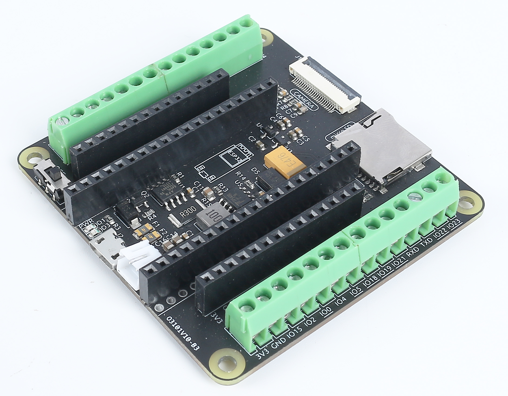
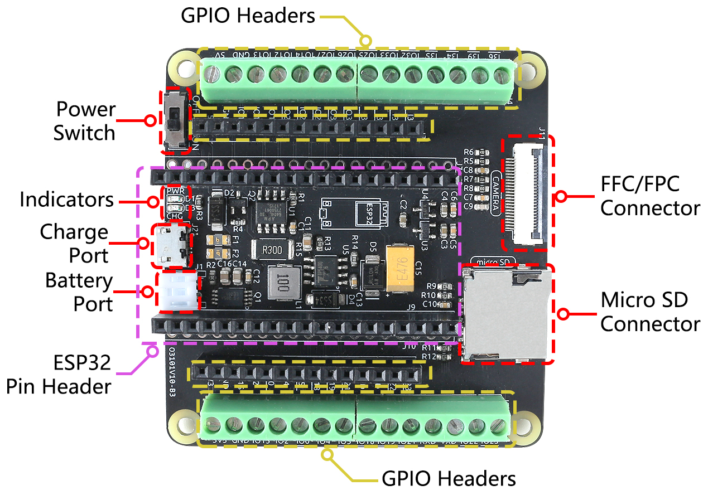

.. note::

    Ciao, benvenuto nella community di appassionati di SunFounder Raspberry Pi & Arduino & ESP32 su Facebook! Approfondisci le tue conoscenze su Raspberry Pi, Arduino ed ESP32 insieme ad altri appassionati.

    **Perché unirti?**

    - **Supporto esperto**: Risolvi i problemi post-vendita e le sfide tecniche con l'aiuto della nostra comunità e del nostro team.
    - **Impara e condividi**: Scambia consigli e tutorial per migliorare le tue competenze.
    - **Anteprime esclusive**: Accedi in anteprima agli annunci di nuovi prodotti e alle anticipazioni.
    - **Sconti speciali**: Approfitta di sconti esclusivi sui nostri prodotti più recenti.
    - **Promozioni e omaggi festivi**: Partecipa a promozioni e omaggi durante le festività.

    👉 Sei pronto a esplorare e creare con noi? Clicca su [|link_sf_facebook|] e unisciti oggi stesso!

.. _cpn_esp32_wroom_32e:

ESP32 Scheda
=====================

L'ESP32 scheda è un modulo versatile e potente basato sul chipset ESP32 di Espressif. Offre un'elaborazione a doppio core, connettività Wi-Fi e Bluetooth integrata, e vanta un'ampia gamma di interfacce periferiche. Conosciuto per il suo basso consumo energetico, il modulo è ideale per applicazioni IoT, abilitando connettività intelligente e prestazioni robuste in formati compatti.

Caratteristiche principali:

* **Potenza di elaborazione**: È dotato di un microprocessore Xtensa® 32-bit LX6 dual-core, che offre scalabilità e flessibilità.
* **Capacità wireless**: Con Wi-Fi integrato a 2,4 GHz e Bluetooth a doppia modalità, è perfetto per applicazioni che richiedono una comunicazione wireless stabile.
* **Memoria e archiviazione**: Dispone di abbondante SRAM e memoria flash ad alte prestazioni, soddisfacendo le esigenze di programmi utente e archiviazione dati.
* **GPIO**: Con fino a 38 pin GPIO, supporta una varietà di dispositivi esterni e sensori.
* **Basso consumo energetico**: Sono disponibili diverse modalità di risparmio energetico, che lo rendono ideale per scenari a batteria o ad alta efficienza energetica.
* **Sicurezza**: Le funzionalità di crittografia e sicurezza integrate garantiscono la protezione dei dati e della privacy degli utenti.
* **Versatilità**: Dai semplici elettrodomestici alle complesse macchine industriali, il ESP32 scheda offre prestazioni costanti ed efficienti.

In sintesi, l'ESP32 scheda non solo offre robuste capacità di elaborazione e opzioni di connettività diversificate, ma vanta anche una serie di caratteristiche che lo rendono una scelta preferita nei settori IoT e dei dispositivi intelligenti.

.. * |link_esp32_datasheet|

.. _esp32_pinout:

Schema dei Pin
-------------------------

L'ESP32 ha alcune limitazioni nell'uso dei pin a causa di diverse funzionalità che condividono determinati pin. Quando si progetta un progetto, è buona pratica pianificare attentamente l'uso dei pin e verificare eventuali conflitti 
per garantire un corretto funzionamento ed evitare problemi.

Ecco alcune delle principali restrizioni e considerazioni:

* **ADC1 e ADC2**: L'ADC2 non può essere utilizzato quando Wi-Fi o Bluetooth sono attivi. Tuttavia, l'ADC1 può essere utilizzato senza restrizioni.
* **Pin di bootstrapping**: GPIO0, GPIO2, GPIO5, GPIO12 e GPIO15 sono utilizzati per il bootstrapping durante il processo di avvio. È importante non collegare componenti esterni che potrebbero interferire con il processo di avvio su questi pin.
* **Pin JTAG**: GPIO12, GPIO13, GPIO14 e GPIO15 possono essere utilizzati come pin JTAG per scopi di debug. Se il debugging JTAG non è necessario, questi pin possono essere utilizzati come GPIO normali.
* **Pin Touch**: Alcuni pin supportano funzionalità touch. Questi pin dovrebbero essere utilizzati con attenzione se si intende utilizzarli per il rilevamento touch.
* **Pin di alimentazione**: Alcuni pin sono riservati per funzioni relative all'alimentazione e dovrebbero essere usati di conseguenza. Ad esempio, evitare di prelevare troppa corrente dai pin di alimentazione come 3V3 e GND.
* **Pin solo ingresso**: Alcuni pin sono solo ingresso e non devono essere usati come uscite.

.. _esp32_strapping:

**Pin di Strapping**
--------------------------

L'ESP32 ha cinque pin di strapping:

.. list-table::
    :widths: 5 15
    :header-rows: 1

    *   - Pin di Strapping
        - Descrizione
    *   - IO5
        - Di default è in pull-up, il livello di tensione di IO5 e IO15 influenza il Timing dello Slave SDIO.
    *   - IO0
        - Di default è in pull-up, se tirato basso, entra in modalità download.
    *   - IO2
        - Di default è in pull-down, IO0 e IO2 faranno entrare l'ESP32 in modalità download.
    *   - IO12(MTDI)
        - Di default è in pull-down, se tirato alto, l'ESP32 non si avvierà normalmente.
    *   - IO15(MTDO)
        - Di default è in pull-up, se tirato basso, il log di debug non sarà visibile. Inoltre, il livello di tensione di IO5 e IO15 influenza il Timing dello Slave SDIO.

Il software può leggere i valori di questi cinque bit dal registro "GPIO_STRAPPING".
Durante il rilascio del reset del sistema del chip (power-on-reset, reset del watchdog RTC e reset da brownout), i latch dei
pin di strapping campionano il livello di tensione come bit di strapping di "0" o "1", e mantengono questi bit fino a quando il chip non viene
spento. I bit di strapping configurano la modalità di avvio del dispositivo, la tensione operativa di
VDD_SDIO e altre impostazioni iniziali del sistema.

Ogni pin di strapping è collegato al suo pull-up/pull-down interno durante il reset del chip. Di conseguenza, se un
pin di strapping non è collegato o il circuito esterno collegato è ad alta impedenza, il debole
pull-up/pull-down interno determinerà il livello di ingresso predefinito dei pin di strapping.

Per cambiare i valori dei bit di strapping, gli utenti possono applicare le resistenze esterne di pull-down/pull-up, o utilizzare i GPIO dell'MCU host per controllare il livello di tensione di questi pin durante l'accensione dell'ESP32.

Dopo il rilascio del reset, i pin di strapping funzionano come pin di normale funzione.
Consultare la seguente tabella per una configurazione dettagliata della modalità di avvio tramite pin di strapping.

.. image:: img/esp32_strapping.png

* FE: edge discendente, RE: edge ascendente
* Il firmware può configurare i bit del registro per modificare le impostazioni di "Tensione del LDO interno (VDD_SDIO)" e "Timing dello Slave SDIO" dopo l'avvio.
* Il modulo integra una flash SPI da 3,3 V, quindi il pin MTDI non può essere impostato su 1 quando il modulo è acceso.

.. _cpn_esp32_camera_extension:

Estensione Fotocamera ESP32
-------------------------------

Abbiamo progettato una scheda di espansione che ti consente di sfruttare appieno le funzionalità della fotocamera e della scheda SD dell'ESP32 scheda. Combinando la fotocamera OV2640, la Micro SD e l'ESP32 scheda, ottieni una scheda di espansione tutto-in-uno.

La scheda offre due tipi di intestazioni GPIO - uno con intestazioni femmina, perfetto per progetti di prototipazione rapida. L'altro tipo presenta terminali a vite, garantendo connessioni stabili e rendendolo adatto per progetti IoT.

Inoltre, puoi alimentare il tuo progetto utilizzando una singola batteria 18650 da 3,7V. Se la batteria si scarica, puoi comodamente ricaricarla semplicemente collegando un cavo USB da 5V. Questo lo rende uno strumento ideale per progetti all'aperto e applicazioni remote.

Introduzione alle Interfacce
---------------------------------

* **Interruttore di Alimentazione**
    * Controlla l'alimentazione della batteria, accendendola e spegnendola.

* **Porta di Ricarica**
    * Collegando un cavo USB da 5V, la batteria può essere ricaricata.

* **Porta della Batteria**
    * Presenta un'interfaccia PH2.0-2P, compatibile con batteria al litio da 3,7V 18650.
    * Fornisce energia sia all'ESP32 scheda che all'Estensione Fotocamera ESP32.

* **Intestazioni Pin ESP32**
    * Destinate al modulo ESP32 scheda. Presta molta attenzione al suo orientamento; assicurati che entrambe le porte USB siano rivolte dallo stesso lato per evitare un posizionamento errato.

* **Intestazioni GPIO**
    * **Intestazioni Femmina**: Utilizzate per collegare vari componenti all'ESP32, perfette per progetti di prototipazione rapida.
    * **Terminale a Vite**: Terminale a vite da 14 pin con passo di 3,5mm, garantendo connessioni stabili e rendendolo adatto per progetti IoT.

* **Indicatori Luminosi**
    * **PWR**: Si illumina quando la batteria è alimentata o quando un USB è direttamente collegato all'ESP32.
    * **CHG**: Si illumina quando si collega un USB alla porta di ricarica della scheda, segnalando l'inizio della carica. Si spegnerà una volta che la batteria sarà completamente carica.

* **Connettore Micro SD**
    * Slot a molla per l'inserimento e l'espulsione facile della scheda Micro SD.

* **Connettore FFC / FPC da 24 pin 0,5mm**
    * Progettato per la fotocamera OV2640, rendendolo adatto a vari progetti legati alla visione.

Pinout Estensione Fotocamera ESP32
----------------------------------------

Il diagramma dei pin dell'ESP32 scheda può essere trovato in :ref:`esp32_pinout`. 

Tuttavia, quando l'ESP32 scheda è inserito nella scheda di estensione, alcuni dei suoi pin possono anche essere utilizzati per pilotare la scheda Micro SD o una fotocamera. 

Di conseguenza, sono state aggiunte resistenze di pull-up o pull-down a questi pin. Se stai usando questi pin come ingressi, è cruciale tenere conto di queste resistenze poiché possono influenzare i livelli di ingresso.

Ecco la tabella dei pin per i pin sul lato destro:

    .. image:: img/esp32_extension_pinout1.jpg
        :width: 100%
        :align: center

Ecco la tabella dei pin per i pin sul lato sinistro:

    .. image:: img/esp32_extension_pinout2.jpg
        :width: 100%
        :align: center

    .. note::

        Ci sono alcune restrizioni specifiche:

        * **IO33** è collegato a una resistenza di pull-up da 4,7K e a un condensatore di filtraggio, il che impedisce di pilotare la Striscia RGB WS2812.

Guida all'Inserimento delle Interfacce
-------------------------------------------

**Caricamento del Codice**

    Quando hai bisogno di caricare il codice sull'ESP32 scheda, collegalo al tuo computer utilizzando un cavo USB.

    .. image:: ../img/plugin_esp32.png
        :width: 600
        :align: center

**Inserimento della Scheda Micro SD**

    Inserisci delicatamente la scheda Micro SD per fissarla in posizione. Premendola nuovamente, verrà espulsa.

    .. image:: ../img/insert_sd.png
        :width: 600
        :align: center

**Collegamento della Fotocamera**

    Quando colleghi la fotocamera, assicurati che la striscia nera del cavo FPC sia rivolta verso l'alto e sia completamente inserita 
    nel connettore.

    .. raw:: html

        <video loop autoplay muted style = "max-width:100%">
            <source src="../_static/video/plugin_camera.mp4" type="video/mp4">
            Your browser does not support the video tag.
        </video>

**Alimentazione e Ricarica della Batteria**

    Inserisci con cura il cavo della batteria nella porta della batteria, evitando di esercitare troppa forza per non spingere verso l'alto il terminale della batteria. Se il terminale viene spinto verso l'alto, va bene purché i pin non si rompano; puoi semplicemente premerlo di nuovo in posizione.

    .. image:: ../img/plugin_battery.png
        :width: 600
        :align: center

    Se la batteria è scarica, collega un cavo USB da 5V per ricaricarla.

    .. image:: ../img/battery_charge.png
        :width: 600
        :align: center

