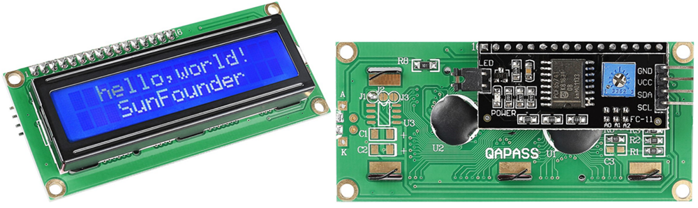
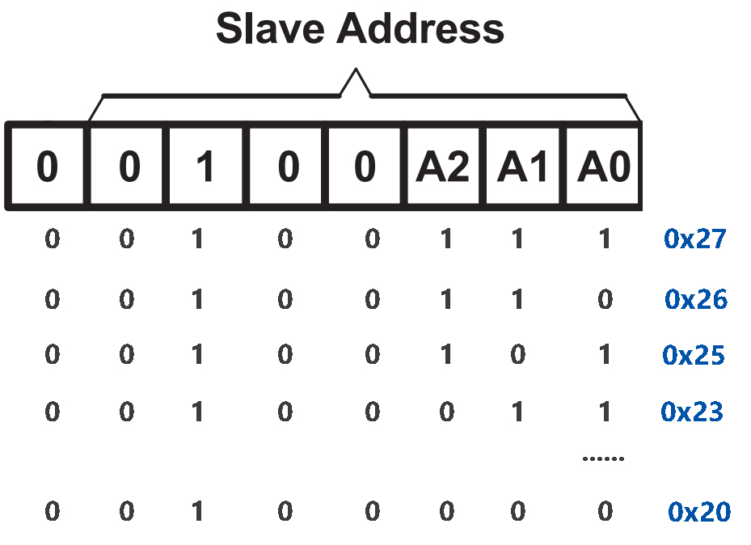

.. note::

    Ciao, benvenuto nella community di appassionati di SunFounder Raspberry Pi & Arduino & ESP32 su Facebook! Approfondisci le tue conoscenze su Raspberry Pi, Arduino ed ESP32 insieme ad altri appassionati.

    **Perché unirti?**

    - **Supporto esperto**: Risolvi i problemi post-vendita e le sfide tecniche con l'aiuto della nostra comunità e del nostro team.
    - **Impara e condividi**: Scambia consigli e tutorial per migliorare le tue competenze.
    - **Anteprime esclusive**: Accedi in anteprima agli annunci di nuovi prodotti e alle anticipazioni.
    - **Sconti speciali**: Approfitta di sconti esclusivi sui nostri prodotti più recenti.
    - **Promozioni e omaggi festivi**: Partecipa a promozioni e omaggi durante le festività.

    👉 Sei pronto a esplorare e creare con noi? Clicca su [|link_sf_facebook|] e unisciti oggi stesso!

.. _cpn_lcd:

I2C LCD1602
================

* **GND**: Massa
* **VCC**: Alimentazione, 5V.
* **SDA**: Linea dati seriale. Collegare a VCC tramite una resistenza di pull-up.
* **SCL**: Linea di clock seriale. Collegare a VCC tramite una resistenza di pull-up.

Come sappiamo, sebbene l'LCD e altri display arricchiscano notevolmente l'interazione uomo-macchina, condividono una debolezza comune. Quando sono collegati a un controller, occupano più IO del controller, che potrebbe non avere così tante porte esterne. Ciò limita anche altre funzioni del controller.

Pertanto, l'LCD1602 con un modulo I2C è stato sviluppato per risolvere questo problema. Il modulo I2C ha un chip I2C PCF8574 integrato che converte i dati seriali I2C in dati paralleli per il display LCD.

* `PCF8574 Datasheet <https://www.ti.com/lit/ds/symlink/pcf8574.pdf?ts=1627006546204&ref_url=https%253A%252F%252Fwww.google.com%252F>`_

**Indirizzo I2C**

L'indirizzo predefinito è solitamente 0x27, in alcuni casi potrebbe essere 0x3F.

Prendendo come esempio l'indirizzo predefinito 0x27, l'indirizzo del dispositivo può essere modificato cortocircuitando i pad A0/A1/A2; nello stato predefinito, A0/A1/A2 è 1, e se il pad è cortocircuitato, A0/A1/A2 diventa 0.

**Retroilluminazione/Contrasto**

La retroilluminazione può essere abilitata tramite il cappuccio del ponticello, rimuovi il cappuccio per disabilitare la retroilluminazione. Il potenziometro blu sul retro viene utilizzato per regolare il contrasto (il rapporto di luminosità tra il bianco più brillante e il nero più scuro).

.. image:: img/back_lcd1602.jpg

* **Cappuccio di Cortocircuito**: La retroilluminazione può essere abilitata tramite questo cappuccio, rimuovilo per disabilitare la retroilluminazione.
* **Potenziometro**: Viene utilizzato per regolare il contrasto (la chiarezza del testo visualizzato), che aumenta in senso orario e diminuisce in senso antiorario.

**Esempio**

* :ref:`ar_lcd1602` (Progetto Arduino)
* :ref:`ar_guess_number` (Progetto Arduino)
* :ref:`py_lcd1602` (Progetto MicroPython)
* :ref:`py_guess_number` (Progetto MicroPython)

