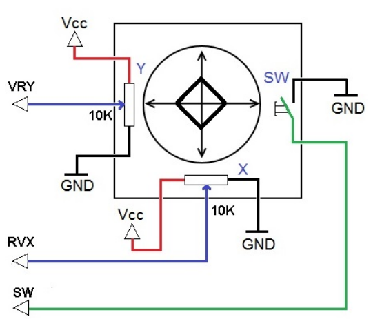

.. note::

    Hello, welcome to the SunFounder Raspberry Pi & Arduino & ESP32 Enthusiasts Community on Facebook! Dive deeper into Raspberry Pi, Arduino, and ESP32 with fellow enthusiasts.

    **Why Join?**

    - **Expert Support**: Solve post-sale issues and technical challenges with help from our community and team.
    - **Learn & Share**: Exchange tips and tutorials to enhance your skills.
    - **Exclusive Previews**: Get early access to new product announcements and sneak peeks.
    - **Special Discounts**: Enjoy exclusive discounts on our newest products.
    - **Festive Promotions and Giveaways**: Take part in giveaways and holiday promotions.

    👉 Ready to explore and create with us? Click [|link_sf_facebook|] and join today!

.. _cpn_joystick:

Joystick Module
=======================

.. image:: img/joystick_pic.png
    :align: center
    :width: 600

* **GND**: Ground.
* **+5V**: Power supply, accepts 3.3V to 5V.
* **VRX**: Analog output corresponding to the joystick's horizontal (X-axis) position.
* **VRY**: Analog output corresponding to the joystick's vertical (Y-axis) position.
* **SW**: Button switch output, activated when the joystick is pressed down. For proper operation, an external pull-up resistor is required. With the resistor in place, the SW pin outputs a high level when idle and goes low when the joystick is pressed.

The basic idea of a joystick is to translate the movement of a stick into electronic information that a computer can process.

In order to communicate a full range of motion to the computer, a joystick needs to measure the stick's position on two axes - the X-axis (left to right) and the Y-axis (up and down). Just as in basic geometry, the X-Y coordinates pinpoint the stick's position exactly.

To determine the location of the stick, the joystick control system simply monitors the position of each shaft. The conventional analog joystick design does this with two potentiometers, or variable resistors.

The joystick also has a digital input that is actuated when the joystick is pressed down.

	
**Example**

* :ref:`ar_joystick` (Arduino Project)
* :ref:`py_joystick` (MicroPython Project)
* :ref:`sh_star_crossed` (Scratch Project)
* :ref:`sh_dragon` (Scratch Project)