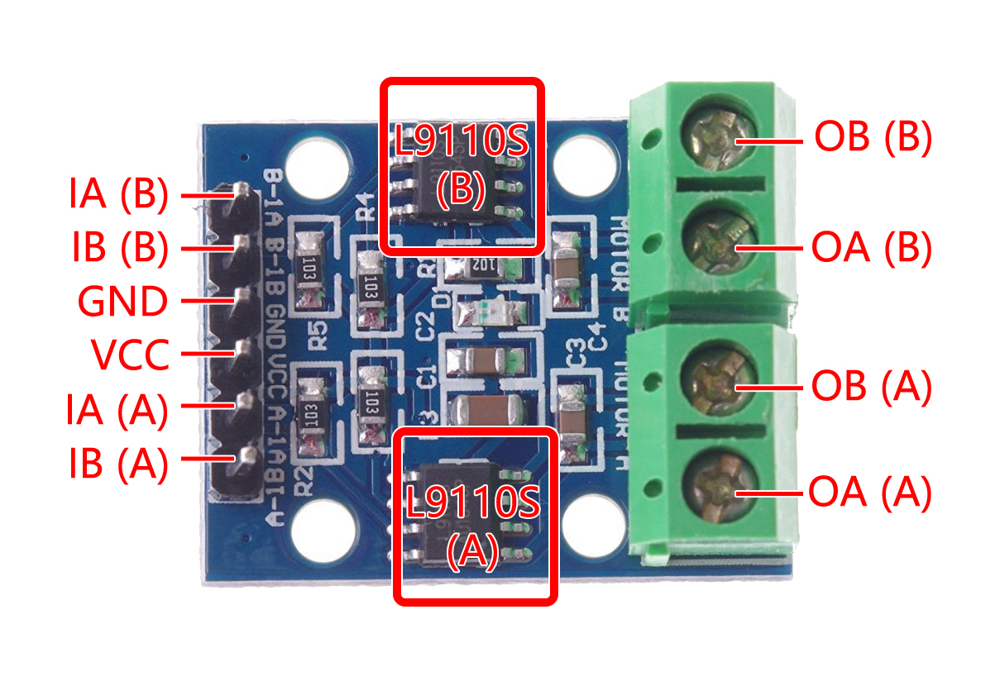

.. note::

    Hallo und willkommen in der SunFounder Raspberry Pi & Arduino & ESP32 Enthusiasten-Gemeinschaft auf Facebook! Tauchen Sie tiefer ein in die Welt von Raspberry Pi, Arduino und ESP32 mit anderen Enthusiasten.

    **Warum beitreten?**

    - **Expertenunterstützung**: Lösen Sie Nachverkaufsprobleme und technische Herausforderungen mit Hilfe unserer Gemeinschaft und unseres Teams.
    - **Lernen & Teilen**: Tauschen Sie Tipps und Anleitungen aus, um Ihre Fähigkeiten zu verbessern.
    - **Exklusive Vorschauen**: Erhalten Sie frühzeitigen Zugang zu neuen Produktankündigungen und exklusiven Einblicken.
    - **Spezialrabatte**: Genießen Sie exklusive Rabatte auf unsere neuesten Produkte.
    - **Festliche Aktionen und Gewinnspiele**: Nehmen Sie an Gewinnspielen und Feiertagsaktionen teil.

    👉 Sind Sie bereit, mit uns zu erkunden und zu erschaffen? Klicken Sie auf [|link_sf_facebook|] und treten Sie heute bei!

.. _cpn_l9110:

L9110 Motorsteuerungsmodul
=============================

Das L9110 Motorsteuerungsmodul eignet sich hervorragend zur gleichzeitigen Ansteuerung von zwei Motoren. Es beherbergt ein Paar unabhängiger L9110S-Treiberchips,
jeder Kanal bietet einen stabilen Stromausgang von bis zu 800mA.

Mit einer Spannungsreichweite von 2,5V bis 12V lässt sich das Modul problemlos mit 3,3V- und 5V-Mikrocontrollern kombinieren.

Als optimierte Lösung erleichtert das L9110 Motorsteuerungsmodul die Motorsteuerung in einem breiten Anwendungsspektrum.
Dank seiner Dual-Channel-Architektur ermöglicht es die unabhängige Steuerung von zwei Motoren – ideal für Projekte, bei denen die Steuerung von zwei Motoren entscheidend ist.

Aufgrund seines potenten kontinuierlichen Stromausgangs kann dieses Modul mit Leichtigkeit Motoren von klein bis mittelgroß antreiben,
was den Weg für vielfältige Robotik-, Automatisierungs- und motorzentrierte Projekte ebnet. Sein umfassender Spannungsbereich erhöht zudem die Anpassungsfähigkeit an verschiedene Stromversorgungskonfigurationen.

Mit dem Fokus auf Benutzerfreundlichkeit konzipiert, bietet das Modul intuitive Ein- und Ausgangsanschlüsse, die die Verbindung zu Mikrocontrollern
oder ähnlichen Steuergeräten vereinfachen. Zudem wird nicht an Sicherheitsfunktionen gespart – integrierte Überstrom- und Übertemperaturschutzmechanismen stärken das Vertrauen 
und die Sicherheit bei der Motorsteuerung.

* **B-1A & B-1B**: Eingangspins zur Steuerung der Drehrichtung von Motor B.
* **A-1A & A-1B**: Eingangspins zur Steuerung der Drehrichtung von Motor A.
* **0A & OB(A)**: Ausgangspins von Motor A.
* **0A & OB(B)**: Ausgangspins von Motor B.
* **VCC**: Stromversorgungspin (2.5V-12V).
* **GND**: Erdungspin.

**Merkmale**

* Onboard 2 L9110S Motorsteuerungschip
* Dual-Channel-Motorsteuerung.
* Unabhängige Steuerung der Drehrichtung der Motoren.
* Hoher Stromausgang (800mA pro Kanal).
* Breiter Spannungsbereich (2.5V-12V).
* Kompaktes Design.
* Praktische Ein- und Ausgangsanschlüsse.
* Integrierte Schutzfunktionen.
* Vielseitige Anwendungsmöglichkeiten.
* PCB-Größe: 29.2mm x 23mm
* Betriebstemperatur: -20°C ~ 80°C
* LED-Anzeige für Betriebszustand

**Funktionsprinzip**

Hier ist die Wahrheitstabelle von Motor B:

Diese Tabelle zeigt die verschiedenen Zustände von Motor B basierend auf den Werten der Eingangspins B-1A und B-1B. Sie gibt die Drehrichtung (im Uhrzeigersinn oder gegen den Uhrzeigersinn), Bremsen oder Anhalten von Motor B an.

.. list-table:: 
    :widths: 25 25 50
    :header-rows: 1

    * - B-1A
      - B-1B
      - Zustand von Motor B
    * - 1
      - 0
      - Drehen im Uhrzeigersinn
    * - 0
      - 1
      - Drehen gegen den Uhrzeigersinn
    * - 0
      - 0
      - Bremsen
    * - 1
      - 1
      - Anhalten

Hier ist die Wahrheitstabelle von Motor A:

Diese Tabelle zeigt die verschiedenen Zustände von Motor A basierend auf den Werten der Eingangspins A-1A und A-1B. Sie gibt die Drehrichtung (im Uhrzeigersinn oder gegen den Uhrzeigersinn), Bremsen oder Anhalten von Motor A an.

.. list-table:: 
    :widths: 25 25 50
    :header-rows: 1

    * - A-1A
      - A-1B
      - Zustand von Motor A
    * - 1
      - 0
      - Drehen im Uhrzeigersinn
    * - 0
      - 1
      - Drehen gegen den Uhrzeigersinn
    * - 0
      - 0
      - Bremsen
    * - 1
      - 1
      - Anhalten

**Beispiele**

* :ref:`ar_motor` (Arduino-Projekt)
* :ref:`ar_pump` (Arduino-Projekt)
* :ref:`py_motor` (MicroPython-Projekt)
* :ref:`py_pump` (MicroPython-Projekt)
* :ref:`sh_rotating_fan` (Scratch-Projekt)
