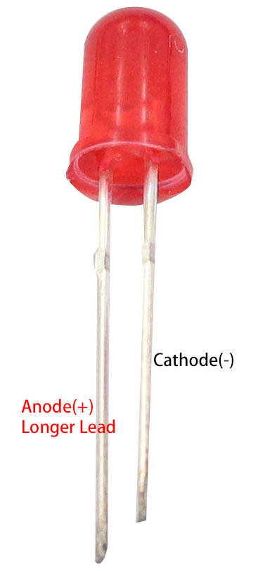
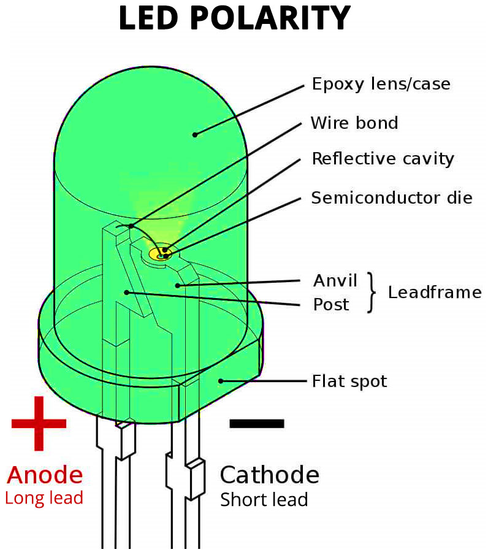
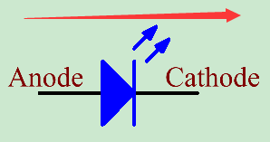
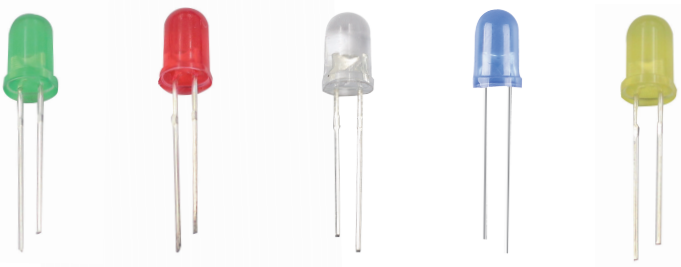
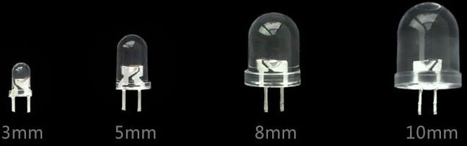
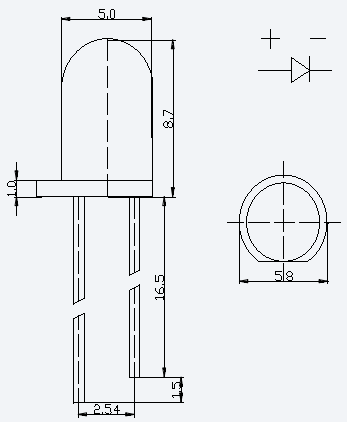
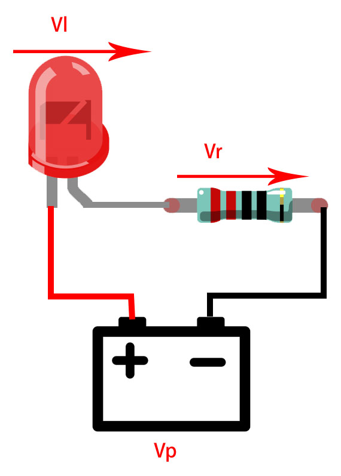
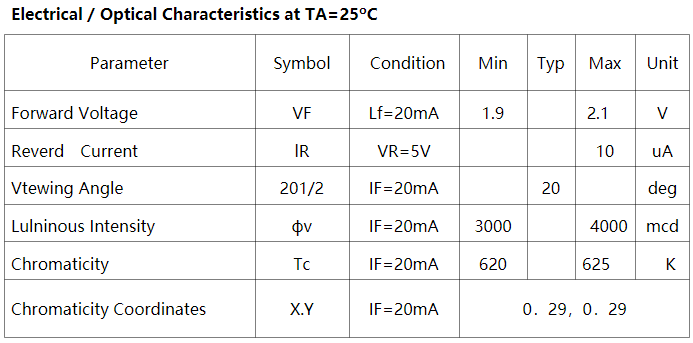

.. note::

    ¡Hola, bienvenido a la Comunidad de Aficionados a Raspberry Pi, Arduino y ESP32 de SunFounder en Facebook! Profundiza en Raspberry Pi, Arduino y ESP32 con otros entusiastas.

    **¿Por qué unirse?**

    - **Soporte de expertos**: Resuelve problemas posventa y desafíos técnicos con ayuda de nuestra comunidad y equipo.
    - **Aprender y compartir**: Intercambia consejos y tutoriales para mejorar tus habilidades.
    - **Vistas previas exclusivas**: Obtén acceso anticipado a anuncios de nuevos productos y avances.
    - **Descuentos especiales**: Disfruta de descuentos exclusivos en nuestros productos más nuevos.
    - **Promociones festivas y sorteos**: Participa en sorteos y promociones de fiestas.

    👉 ¿Listo para explorar y crear con nosotros? Haz clic en [|link_sf_facebook|] y únete hoy!

.. _cpn_led:

LED
==========

**¿Qué es un LED?**

Los LEDs son dispositivos electrónicos muy comunes que se pueden utilizar para decorar tu habitación durante las festividades, y también puedes usarlos como indicadores para varias cosas, como si la alimentación de tus electrodomésticos está encendida o apagada. Vienen en docenas de formas y tamaños diferentes, y los más comunes son los LEDs con LEDs de agujero pasante, que generalmente tienen cables largos y se pueden enchufar en una placa de pruebas.

El nombre completo de LED es diodo emisor de luz, por lo que tiene las características de un diodo, donde la corriente fluye en una dirección, desde el ánodo (positivo) hasta el cátodo (negativo).

Aquí están los símbolos eléctricos para los LEDs.

**Varios tamaños y colores**

Rojo, amarillo, azul, verde y blanco son los colores de LED más comunes, y la luz emitida suele ser del mismo color que el aspecto.

Raramente usamos LEDs que son transparentes o mate en apariencia, pero la luz emitida puede ser de un color que no sea blanco.

Los LEDs vienen en cuatro tamaños: 3mm, 5mm, 8mm y 10mm, siendo el tamaño más común el de 5mm.

A continuación se muestra el tamaño del LED de 5mm en mm.

**Voltaje Directo**

El Voltaje Directo es un parámetro muy importante para conocer al usar LEDs, ya que determina cuánta energía se utiliza y cuánto debe ser la resistencia limitadora de corriente.

El Voltaje Directo es el voltaje que el LED necesita para encenderse. Para la mayoría de los LEDs rojos, amarillos, naranjas y verdes claros, generalmente utilizan un voltaje entre 1.9V y 2.1V.

Según la ley de Ohm, la corriente a través de este circuito disminuye a medida que aumenta la resistencia, lo que hace que el LED se atenúe.

    I = (Vp-Vl)/R

Para que los LEDs se enciendan de manera segura y con el brillo adecuado, ¿cuánta resistencia deberíamos usar en el circuito?

Para el 99% de los LEDs de 5mm, la corriente recomendada es de 20mA, como se puede ver en la columna de Condiciones de su hoja de datos.

Ahora convertimos la fórmula anterior como se muestra a continuación.

    R = (Vp-Vl)/I

Si ``Vp`` es 5V, ``Vl`` (Voltaje Directo) es 2V y ``I`` es 20mA, entonces ``R`` es 150Ω.

Por lo tanto, podemos hacer que el LED sea más brillante al reducir la resistencia del resistor, pero no se recomienda bajar de 150Ω (esta resistencia puede no ser muy precisa, porque diferentes proveedores de LEDs tienen diferencias).

A continuación se muestran los voltajes directos y longitudes de onda de diferentes colores de LEDs que puedes usar como referencia.

.. list-table::
   :widths: 25 25 50
   :header-rows: 1

   * - Color del LED
     - Voltaje Directo
     - Longitud de Onda
   * - Rojo
     - 1.8V ~ 2.1V
     - 620 ~ 625
   * - Amarillo
     - 1.9V ~ 2.2V
     - 580 ~ 590
   * - Verde
     - 1.9V ~ 2.2V
     - 520 ~ 530
   * - Azul
     - 3.0V ~ 3.2V
     - 460 ~ 465
   * - Blanco
     - 3.0V ~ 3.2V
     - 8000 ~ 9000

**Ejemplo**

* :ref:`ar_blink` (Proyecto Arduino)
* :ref:`ar_fading` (Proyecto Arduino)
* :ref:`py_blink` (Proyecto MicroPython)
* :ref:`py_fading` (Proyecto MicroPython)
* :ref:`sh_breathing_led` (Proyecto Scratch)
* :ref:`sh_table_lamp` (Proyecto Scratch)

