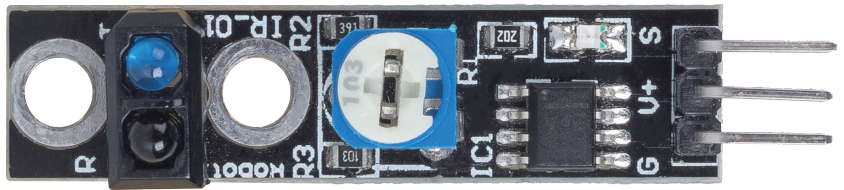
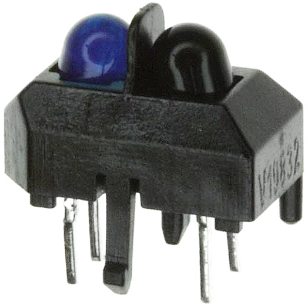

.. _cpn_line_track:

ライントラッキングモジュール
================================

* S: 通常は低レベルですが、黒い線が検出されると高レベルになります。
* V+：電源供給、3.3v〜5V
* G: グラウンド

このモジュールは1チャンネルのライントラッキングモジュールで、名前が示す通り、白い背景上の黒い線、または黒い背景に対する白い線を追跡します。

このモジュールは、TCRT5000赤外線センサーを使用しており、赤外線LED（青）と感光性トリプレット（黒）で構成されています。

* 青い赤外線LEDは、電源がオンのとき、人の目には見えない赤外線を放射します。
* 黒いフォトトランジスタは、赤外線を受信するために使用され、受信した赤外線の量に応じて内部抵抗が変動します。赤外線を多く受信すると、その抵抗は減少し、逆もまた然りです。

モジュールにはLM393コンパレータがあり、これはフォトトランジスタの電圧と設定電圧（ポテンショメータで調整）を比較するために使用されます。設定電圧よりも大きい場合、出力は1となり、そうでない場合は0となります。

したがって、赤外線発光管が黒い表面に照らされると、黒は光を吸収するため、感光性トランジスタは赤外線を少なく受け取り、その抵抗は増加します（電圧増加）。LM393コンパレータを通過すると、出力は高レベルとなります。

同様に、白い表面に照らされると、反射光が増え、感光性トランジスタの抵抗が減少します（電圧減少）。したがって、コンパレータは低レベルを出力し、インジケータLEDが点灯します。

* `TCRT5000 <https://www.vishay.com/docs/83760/tcrt5000.pdf>`_

**特長**

* 赤外線放射センサーTCRT5000を使用
* 検出距離: 1-8mm、焦点距離2.5mm
* コンパレータ出力信号はクリアで、波形が良好で、駆動容量は15mA以上
* 感度調整のためのポテンショメータを使用
* 動作電圧: 3.3V-5V
* デジタル出力: 0（白）および1（黒）
* 広い電圧のLM393コンパレータを使用。
* サイズ: 42mmx10mm

**例**

* :ref:`ar_line_track` (Arduinoプロジェクト)
* :ref:`py_line_track` (MicroPythonプロジェクト)
* :ref:`sh_protect_heart` (Scratchプロジェクト)
