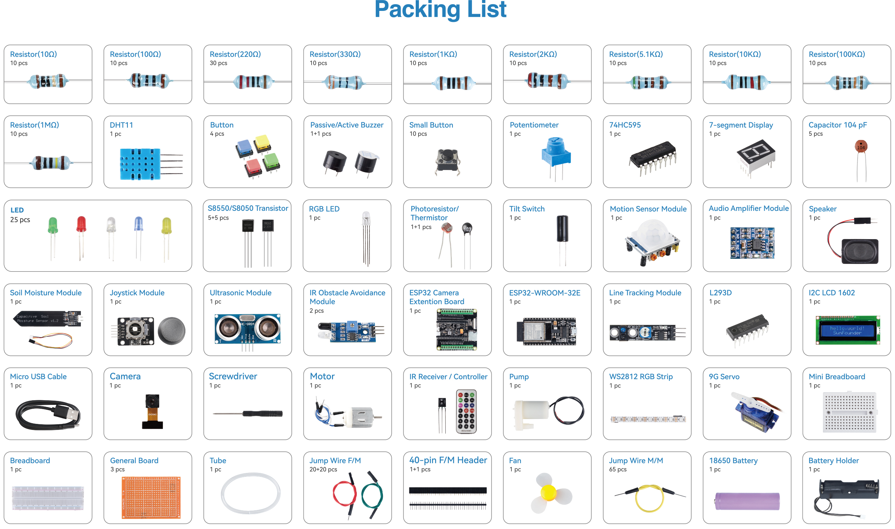

.. note::

    Hallo und willkommen in der SunFounder Raspberry Pi & Arduino & ESP32 Enthusiasten-Gemeinschaft auf Facebook! Tauchen Sie tiefer ein in die Welt von Raspberry Pi, Arduino und ESP32 mit anderen Enthusiasten.

    **Warum beitreten?**

    - **Expertenunterstützung**: Lösen Sie Nachverkaufsprobleme und technische Herausforderungen mit Hilfe unserer Gemeinschaft und unseres Teams.
    - **Lernen & Teilen**: Tauschen Sie Tipps und Anleitungen aus, um Ihre Fähigkeiten zu verbessern.
    - **Exklusive Vorschauen**: Erhalten Sie frühzeitigen Zugang zu neuen Produktankündigungen und exklusiven Einblicken.
    - **Spezialrabatte**: Genießen Sie exklusive Rabatte auf unsere neuesten Produkte.
    - **Festliche Aktionen und Gewinnspiele**: Nehmen Sie an Gewinnspielen und Feiertagsaktionen teil.

    👉 Sind Sie bereit, mit uns zu erkunden und zu erschaffen? Klicken Sie auf [|link_sf_facebook|] und treten Sie heute bei!

Lernen Sie die Komponenten in Ihrem Kit kennen
======================================================

Nach dem Öffnen des Pakets überprüfen Sie bitte, ob die Anzahl der Komponenten mit der Produktbeschreibung übereinstimmt und ob alle Komponenten in einwandfreiem Zustand sind.

    
Im Folgenden finden Sie eine Einführung in jede Komponente, einschließlich des Funktionsprinzips der Komponente und der entsprechenden Projekte.

**Steuerplatine**

.. toctree::
    :maxdepth: 1

    component_esp32_extension

**Grundlegendes**

.. toctree::
    :maxdepth: 1

    component_breadboard
    component_resistor
    component_capacitor
    component_wires
    component_transistor

**Chip**

.. toctree::
    :maxdepth: 1

    component_74hc595
    component_l293d

**Anzeige**

.. toctree::
    :maxdepth: 1

    component_led
    component_rgb_led
    component_7_segment
    component_i2c_lcd
    component_ws2812

**Klang**

.. toctree::
    :maxdepth: 1

    component_buzzer
    component_audio_speaker

**Treiber**

.. toctree::
    :maxdepth: 1

    component_motor
    component_servo
    component_pump

**Controller**

.. toctree::
    :maxdepth: 1

    component_button
    component_tilt_switch
    component_potentiometer
    component_joystick_module
    component_receiver

**Sensor**

.. toctree::
    :maxdepth: 1

    component_photoresistor
    component_thermistor
    component_dht11
    component_pir_module
    component_line_track_module
    component_moisture_module
    component_avoidance_module
    component_ultrasonic_module
