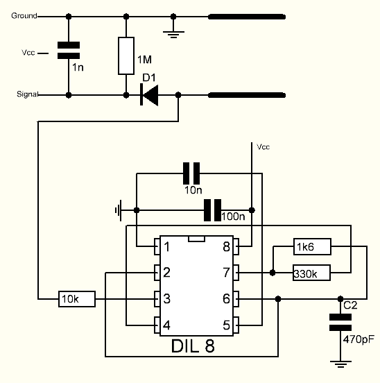

.. note::

    Hallo und willkommen in der SunFounder Raspberry Pi & Arduino & ESP32 Enthusiasten-Gemeinschaft auf Facebook! Tauchen Sie tiefer ein in die Welt von Raspberry Pi, Arduino und ESP32 mit anderen Enthusiasten.

    **Warum beitreten?**

    - **Expertenunterstützung**: Lösen Sie Nachverkaufsprobleme und technische Herausforderungen mit Hilfe unserer Gemeinschaft und unseres Teams.
    - **Lernen & Teilen**: Tauschen Sie Tipps und Anleitungen aus, um Ihre Fähigkeiten zu verbessern.
    - **Exklusive Vorschauen**: Erhalten Sie frühzeitigen Zugang zu neuen Produktankündigungen und exklusiven Einblicken.
    - **Spezialrabatte**: Genießen Sie exklusive Rabatte auf unsere neuesten Produkte.
    - **Festliche Aktionen und Gewinnspiele**: Nehmen Sie an Gewinnspielen und Feiertagsaktionen teil.

    👉 Sind Sie bereit, mit uns zu erkunden und zu erschaffen? Klicken Sie auf [|link_sf_facebook|] und treten Sie heute bei!

.. _cpn_soil_moisture:

Bodenfeuchtigkeitsmodul
================================

.. image:: img/soil_mositure.png

* GND: Masse
* VCC: Stromversorgung, 3.3V~5V
* AOUT: Gibt den Bodenfeuchtigkeitswert aus, je feuchter der Boden, desto kleiner der Wert.

Dieser kapazitive Bodenfeuchtigkeitssensor unterscheidet sich von den meisten auf dem Markt erhältlichen resistiven Sensoren. Er nutzt das Prinzip der kapazitiven Induktion zur Erkennung der Bodenfeuchtigkeit. Dadurch werden Probleme, wie die hohe Korrosionsanfälligkeit resistiver Sensoren, vermieden, was die Lebensdauer erheblich verlängert.

Er besteht aus korrosionsbeständigem Material und bietet eine hervorragende Lebensdauer. Einfach in den Boden rund um die Pflanzen stecken und Echtzeitdaten zur Bodenfeuchtigkeit überwachen. Das Modul enthält einen Spannungsregler an Bord, der es ihm ermöglicht, in einem Spannungsbereich von 3,3 ~ 5,5 V zu arbeiten. Es ist ideal für Mikrocontroller mit niedriger Spannung und Versorgungen von 3,3 V und 5 V.

Das Hardware-Schema des kapazitiven Bodenfeuchtigkeitssensors ist unten dargestellt.

Es gibt einen Festfrequenzoszillator, der mit einem 555-Timer-IC aufgebaut ist. Die erzeugte Rechteckwelle wird dann wie ein Kondensator an den Sensor geführt. Für das Rechteckwellensignal hat der Kondensator jedoch eine gewisse Reaktanz oder, um es einfach auszudrücken, einen Widerstand mit einem reinen ohmschen Widerstand (10k-Widerstand an Pin 3) bildet einen Spannungsteiler.

Je höher die Bodenfeuchtigkeit, desto höher die Kapazität des Sensors. Dementsprechend hat die Rechteckwelle weniger Reaktanz, was die Spannung auf der Signalleitung reduziert, und umso kleiner der Wert des analogen Eingangs durch den Mikrocontroller.

**Spezifikation**

* Betriebsspannung: 3,3 ~ 5,5 VDC
* Ausgangsspannung: 0 ~ 3,0VDC
* Betriebsstrom: 5mA
* Schnittstelle: PH2.0-3P
* Abmessungen: 98 x 23 mm (L x B)
* Gewicht: 15g

**Beispiele**

* :ref:`ar_moisture` (Arduino-Projekt)
* :ref:`ar_plant_monitor` (Arduino-Projekt)
* :ref:`py_moisture` (MicroPython-Projekt)
* :ref:`py_plant_monitor` (MicroPython-Projekt)
