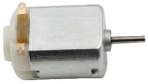
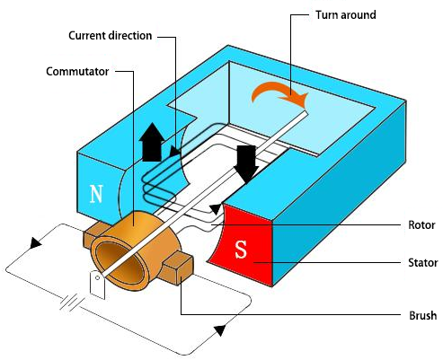

.. _cpn_motor:

DCモータ
===================

これは3VのDCモータです。2つの端子のそれぞれに高レベルと低レベルを供給すると、回転します。

* **長さ**: 25mm
* **直径**: 21mm
* **軸径**: 2mm
* **軸の長さ**: 8mm
* **電圧**: 3-6V
* **電流**: 0.35-0.4A
* **3V時の速度**: 19000 RPM（回転/分）
* **重量**: 約14g（一つの単位で）

直流（DC）モータは、電気エネルギーを機械エネルギーに変換する連続アクチュエータです。DCモータは、連続的な角回転を生成することにより、ロータリーポンプ、ファン、圧縮機、インペラーなどの装置を動作させます。

DCモータは、 **stator** と呼ばれるモータの固定部分と、モーションを生み出すために回転するモータの内部部分、すなわち **rotor** （またはDCモータの **アーマチュア** ）の2つの部分で構成されています。
モーションを生成する鍵は、永久磁石の磁場内（その場が北極から南極まで広がる）にアーマチュアを配置することです。この磁場と動く荷電粒子の相互作用（電流を流すワイヤが磁場を生成する）によってアーマチュアを回転させるトルクが生じます。

電流はバッテリーの正の端子から回路を通って、銅のブラシを通り、コミュテータを経てアーマチュアに流れます。
しかし、コミュテータには2つの隙間があるため、この流れは完全な回転の途中で逆転します。

この連続的な逆転は、バッテリーからのDC電源をACに変換することで、アーマチュアが回転を維持するための正しい方向と正しいタイミングでトルクを受け取ることができるようにします。

.. image:: img/motor_rotate.gif
    :align: center

**例**

* :ref:`ar_motor` (Arduinoプロジェクト)
* :ref:`py_motor` (MicroPythonプロジェクト)
* :ref:`sh_rotating_fan` (Scratchプロジェクト)
