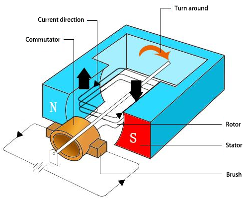
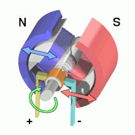

.. note::

    Bonjour, bienvenue dans la communauté des passionnés de SunFounder Raspberry Pi, Arduino et ESP32 sur Facebook ! Plongez au cœur de Raspberry Pi, Arduino et ESP32 avec d'autres passionnés.

    **Pourquoi nous rejoindre ?**

    - **Support d'experts** : Résolvez les problèmes après-vente et les défis techniques avec l'aide de notre communauté et de notre équipe.
    - **Apprendre et partager** : Échangez des astuces et des tutoriels pour améliorer vos compétences.
    - **Aperçus exclusifs** : Accédez en avant-première aux nouvelles annonces de produits et aux avant-premières.
    - **Réductions spéciales** : Profitez de réductions exclusives sur nos nouveaux produits.
    - **Promotions festives et cadeaux** : Participez à des concours et à des promotions spéciales pendant les fêtes.

    👉 Prêt à explorer et à créer avec nous ? Cliquez sur [|link_sf_facebook|] et rejoignez-nous dès aujourd'hui !

.. _cpn_motor:

Moteur DC
===================

.. image:: img/image114.jpeg
    :align: center

Ceci est un moteur à courant continu (DC) de 3V. Lorsque vous appliquez un niveau haut et un niveau bas à chacun des deux terminaux, il tourne.

* **Longueur** : 25mm
* **Diamètre** : 21mm
* **Diamètre de l'arbre** : 2mm
* **Longueur de l'arbre** : 8mm
* **Tension** : 3-6V
* **Courant** : 0.35-0.4A
* **Vitesse à 3V** : 19000 RPM (rotations par minute)
* **Poids** : Environ 14g (pour une unité)

Un moteur à courant continu (DC) est un actionneur continu qui convertit l'énergie électrique en énergie mécanique. Les moteurs DC font fonctionner des pompes rotatives, des ventilateurs, des compresseurs, des turbines et d'autres dispositifs en produisant une rotation angulaire continue.

Un moteur DC se compose de deux parties, la partie fixe du moteur appelée le **stator** et la partie interne du moteur appelée le **rotor** (ou **induit** d'un moteur DC) qui tourne pour produire le mouvement.
La clé de la génération de mouvement est de positionner l'induit dans le champ magnétique de l'aimant permanent (dont le champ s'étend du pôle nord au pôle sud). L'interaction du champ magnétique et des particules chargées en mouvement (le fil conducteur de courant génère le champ magnétique) produit le couple qui fait tourner l'induit.

Le courant circule de la borne positive du Power Pack à travers le circuit, à travers les balais de cuivre jusqu'au collecteur, puis à l'induit.
Mais en raison des deux lacunes dans le collecteur, ce flux s'inverse à mi-parcours de chaque rotation complète.

Cette inversion continue convertit essentiellement la puissance DC du Power Pack en AC, permettant à l'induit de subir un couple dans la bonne direction au bon moment pour maintenir la rotation.

**Exemple**

* :ref:`ar_motor` (Projet Arduino)
* :ref:`py_motor` (Projet MicroPython)
* :ref:`sh_rotating_fan` (Projet Scratch)
