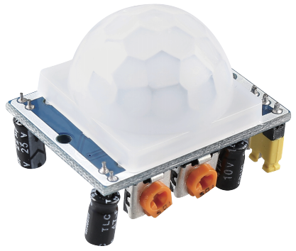

.. note::

    Hallo und willkommen in der SunFounder Raspberry Pi & Arduino & ESP32 Enthusiasten-Gemeinschaft auf Facebook! Tauchen Sie tiefer ein in die Welt von Raspberry Pi, Arduino und ESP32 mit anderen Enthusiasten.

    **Warum beitreten?**

    - **Expertenunterstützung**: Lösen Sie Nachverkaufsprobleme und technische Herausforderungen mit Hilfe unserer Gemeinschaft und unseres Teams.
    - **Lernen & Teilen**: Tauschen Sie Tipps und Anleitungen aus, um Ihre Fähigkeiten zu verbessern.
    - **Exklusive Vorschauen**: Erhalten Sie frühzeitigen Zugang zu neuen Produktankündigungen und exklusiven Einblicken.
    - **Spezialrabatte**: Genießen Sie exklusive Rabatte auf unsere neuesten Produkte.
    - **Festliche Aktionen und Gewinnspiele**: Nehmen Sie an Gewinnspielen und Feiertagsaktionen teil.

    👉 Sind Sie bereit, mit uns zu erkunden und zu erschaffen? Klicken Sie auf [|link_sf_facebook|] und treten Sie heute bei!

.. _cpn_pir:

PIR-Bewegungssensormodul
============================

Der PIR-Sensor erkennt infrarote Wärmestrahlung, die zur Detektion der Anwesenheit von Organismen verwendet werden kann, die infrarote Wärmestrahlung abgeben.

Der PIR-Sensor besteht aus zwei Schlitzen, die an einen Differenzverstärker angeschlossen sind. Wenn sich ein stationäres Objekt vor dem Sensor befindet, erhalten beide Schlitze dieselbe Menge an Strahlung und der Ausgang ist null. Bewegt sich jedoch ein Objekt vor dem Sensor, erhält einer der Schlitze mehr Strahlung als der andere, wodurch der Ausgang schwankt. Diese Änderung der Ausgangsspannung ist das Ergebnis der Bewegungserkennung.

.. image:: img/PIR_working_principle.jpg
    :width: 800

Nachdem das Sensormodul verkabelt ist, erfolgt eine einminütige Initialisierung. Während der Initialisierung gibt das Modul 0-3 mal in Intervallen aus. Anschließend ist das Modul im Standby-Modus. Bitte halten Sie Störungen durch Lichtquellen und andere Quellen von der Oberfläche des Moduls fern, um Fehlfunktionen durch Störsignale zu vermeiden. Am besten verwenden Sie das Modul ohne zu viel Wind, da auch dieser den Sensor stören kann.

.. image:: img/pir_back.png
    :width: 600
    :align: center

**Distanzeinstellung**

Drehen Sie den Knopf des Potentiometers zur Distanzeinstellung im Uhrzeigersinn, um den Bereich der Erfassungsdistanz zu erhöhen. Die maximale Erfassungsdistanz beträgt etwa 0-7 Meter. Drehen Sie ihn gegen den Uhrzeigersinn, verringert sich die Reichweite, und die minimale Erfassungsdistanz liegt bei etwa 0-3 Metern.

**Verzögerungseinstellung**

Drehen Sie den Knopf des Potentiometers zur Verzögerungseinstellung im Uhrzeigersinn, um die Sensing-Verzögerung zu erhöhen. Die maximale Verzögerung kann bis zu 300s betragen. Im Gegensatz dazu verkürzt sich die Verzögerung, wenn Sie es gegen den Uhrzeigersinn drehen, mit einem Minimum von 5s.

**Zwei Auslösemodi**

Wählen Sie unterschiedliche Modi mithilfe der Jumperkappe.

* **H**: Wiederholbarer Auslösemodus, nachdem der menschliche Körper erkannt wurde, gibt das Modul ein hohes Signal aus. Während des nachfolgenden Verzögerungszeitraums, wenn jemand den Erfassungsbereich betritt, bleibt das Signal auf hohem Niveau.

* **L**: Nicht wiederholbarer Auslösemodus, gibt ein hohes Signal aus, wenn es den menschlichen Körper erkennt. Nach der Verzögerung wechselt das Signal automatisch von hohem auf niedriges Niveau.

**Beispiele**

* :ref:`ar_pir` (Arduino-Projekt)
* :ref:`iot_telegram` (Arduino-Projekt)
* :ref:`py_pir` (MicroPython-Projekt)

