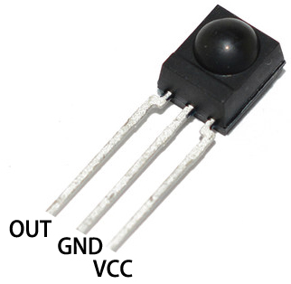

.. _cpn_receiver:

IR レシーバー
===========================

**IR レシーバー**

* OUT: 信号出力
* GND：GND
* VCC: 電源供給, 3.3v~5V

赤外線レシーバーは、赤外線信号を受信する部品で、独立して赤外線を受信し、TTLレベルと互換性のある信号を出力することができます。サイズは通常のプラスチックパッケージのトランジスタと似ており、あらゆる種類の赤外線リモートコントロールや赤外線伝送に適しています。

赤外線、またはIR、通信は、低コストで使いやすい無線通信技術として人気があります。赤外線は可視光よりもやや波長が長いため、人の目には見えない - 無線通信には理想的です。赤外線通信の一般的な変調方式は、38KHzの変調です。

* `HS0038B <https://pdf1.alldatasheet.com/datasheet-pdf/view/103034/VISHAY/HS0038B.html>`_ IR レシーバーセンサーを採用、高感度
* リモートコントロールに使用可能
* 電源供給: 5V
* インターフェース: デジタル
* 変調周波数: 38Khz
* ピン定義: (1) 出力 (2) Vcc (3) GND
* サイズ: 23.5mm x 21.5mm

**リモートコントロール**

.. image:: img/image186.jpeg
    :width: 400

これは、21の機能ボタンと最大8メートルの送信距離を持つミニ薄型赤外線ワイヤレスリモートコントロールで、子供の部屋のさまざまなデバイスを操作するのに適しています。

* サイズ: 85x39x6mm
* リモートコントロール範囲: 8-10m
* バッテリー: 3V ボタン型リチウムマンガン電池
* 赤外線キャリア周波数: 38KHz
* 表面貼り材料: 0.125mm PET
* 有効寿命: 20,000回以上

**例**

* :ref:`ar_receiver` (Arduinoプロジェクト)
* :ref:`ar_guess_number` (Arduinoプロジェクト)
* :ref:`py_receiver` (MicroPythonプロジェクト)
* :ref:`py_guess_number` (MicroPythonプロジェクト)

