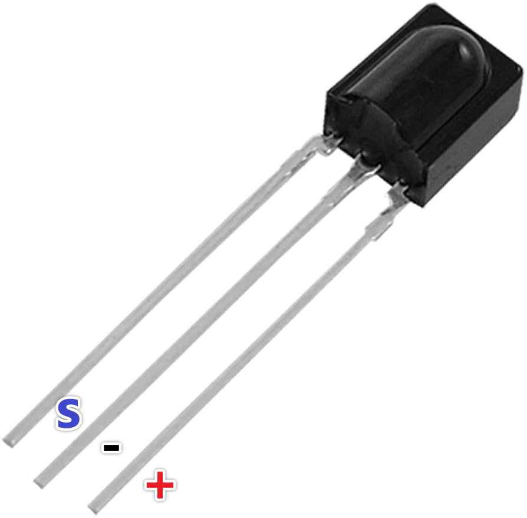

.. note::

    Bonjour, bienvenue dans la communauté SunFounder Raspberry Pi & Arduino & ESP32 Enthusiasts sur Facebook ! Plongez plus profondément dans Raspberry Pi, Arduino et ESP32 avec d'autres passionnés.

    **Pourquoi nous rejoindre ?**

    - **Support d'experts** : Résolvez les problèmes après-vente et les défis techniques avec l'aide de notre communauté et de notre équipe.
    - **Apprendre et partager** : Échangez des conseils et des tutoriels pour améliorer vos compétences.
    - **Aperçus exclusifs** : Accédez en avant-première aux annonces de nouveaux produits et aux exclusivités.
    - **Réductions spéciales** : Profitez de réductions exclusives sur nos derniers produits.
    - **Promotions festives et cadeaux** : Participez à des concours et promotions de saison.

    👉 Prêt à explorer et créer avec nous ? Cliquez sur [|link_sf_facebook|] et rejoignez-nous dès aujourd'hui !

.. _cpn_receiver:

Récepteur IR
===========================

**Récepteur IR**

* **OUT**: Sortie du signal
* **GND**: Masse
* **VCC**: Alimentation, 3.3v~5V

Le récepteur infrarouge SL838 est un composant qui reçoit les signaux infrarouges et peut indépendamment recevoir les rayons infrarouges et émettre des signaux compatibles avec le niveau TTL. Il est similaire à un transistor encapsulé en plastique en termes de taille et convient à tous types de télécommandes infrarouges et de transmissions infrarouges.

La communication infrarouge, ou IR, est une technologie de communication sans fil populaire, peu coûteuse et facile à utiliser. La lumière infrarouge a une longueur d'onde légèrement plus longue que la lumière visible, elle est donc imperceptible à l'œil humain - idéale pour la communication sans fil. Un schéma de modulation courant pour la communication infrarouge est la modulation à 38KHz.

* Peut être utilisé pour la télécommande
* Large plage de tension de fonctionnement : 2.7~5V
* Filtre interne pour la fréquence PCM
* Compatibilité TTL et CMOS
* Forte capacité anti-interférence
* Conforme RoHS

**Télécommande**

.. image:: img/image186.jpeg
    :width: 400

Il s'agit d'une télécommande infrarouge sans fil mince et mini avec 21 boutons fonctionnels et une distance de transmission pouvant atteindre 8 mètres, ce qui est idéal pour le fonctionnement d'une large gamme d'appareils dans une chambre d'enfant.

* Taille : 85x39x6mm
* Portée de la télécommande : 8-10m
* Pile : pile bouton au lithium manganèse 3V
* Fréquence porteuse infrarouge : 38KHz
* Matériau de la surface : PET de 0.125mm
* Durée de vie effective : plus de 20 000 utilisations

**Exemple**

* :ref:`ar_receiver` (Projet Arduino)
* :ref:`ar_guess_number` (Projet Arduino)
* :ref:`py_receiver` (Projet MicroPython)
* :ref:`py_guess_number` (Projet MicroPython)

