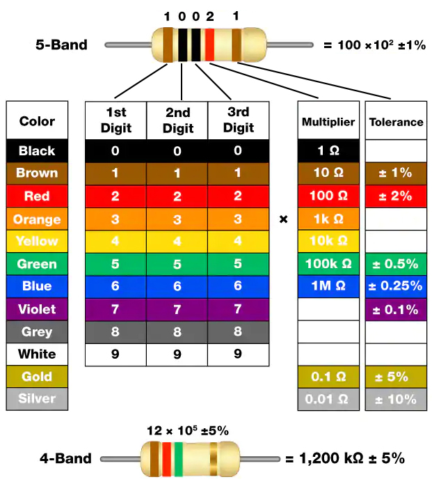

.. _cpn_resistor:

Resistor
============

.. image:: img/resistor.png
    :width: 300

El resistor es un elemento electrónico que puede limitar la corriente de rama.
Un resistor fijo es un tipo de resistor cuya resistencia no puede ser cambiada, mientras que la de un potenciómetro o un resistor variable puede ser ajustada.

Existen dos símbolos de circuito generalmente utilizados para representar un resistor. Normalmente, la resistencia está marcada en él. Por lo tanto, si ves estos símbolos en un circuito, representan un resistor.

.. image:: img/resistor_symbol.png
    :width: 400

**Ω** es la unidad de resistencia y las unidades más grandes incluyen KΩ, MΩ, etc.
Su relación se puede mostrar de la siguiente manera: 1 MΩ = 1000 KΩ, 1 KΩ = 1000 Ω. Normalmente, el valor de la resistencia está marcado en él.

Al usar un resistor, primero necesitamos conocer su resistencia. Aquí hay dos métodos: puedes observar las bandas en el resistor, o usar un multímetro para medir la resistencia. Se recomienda utilizar el primer método ya que es más conveniente y rápido.

Como se muestra en la tarjeta, cada color representa un número.

.. list-table::

   * - Negro
     - Marrón
     - Rojo
     - Naranja
     - Amarillo
     - Verde
     - Azul
     - Violeta
     - Gris
     - Blanco
     - Oro
     - Plata
   * - 0
     - 1
     - 2
     - 3
     - 4
     - 5
     - 6
     - 7
     - 8
     - 9
     - 0.1
     - 0.01

Los resistores de 4 y 5 bandas son frecuentemente utilizados, en los cuales hay 4 y 5 bandas cromáticas.

Normalmente, cuando obtienes un resistor, puede resultar difícil decidir por qué extremo comenzar a leer el color.
El truco es que el espacio entre la 4ª y la 5ª banda será relativamente más grande.

Por lo tanto, puedes observar el espacio entre las dos bandas cromáticas en un extremo del resistor;
si es más grande que cualquier otro espacio entre bandas, entonces puedes leer desde el lado opuesto.

Veamos cómo leer el valor de resistencia de un resistor de 5 bandas como se muestra a continuación.

.. image:: img/220ohm.jpg
    :width: 500

Así que para este resistor, la resistencia debe leerse de izquierda a derecha.
El valor debe estar en este formato: 1ª Banda 2ª Banda 3ª Banda x 10^Multiplicador (Ω) y el error permitido es ± Tolerancia%.
Por lo tanto, el valor de resistencia de este resistor es 2(rojo) 2(rojo) 0(negro) x 10^0(negro) Ω = 220 Ω,
y el error permitido es ± 1% (marrón).

.. list-table:: Bandas de color comunes de resistores
    :header-rows: 1

    * - Resistencia 
      - Banda de Color  
    * - 10Ω   
      - marrón negro negro plata marrón
    * - 100Ω   
      - marrón negro negro negro marrón
    * - 220Ω 
      - rojo rojo negro negro marrón
    * - 330Ω 
      - naranja naranja negro negro marrón
    * - 1kΩ 
      - marrón negro negro marrón marrón
    * - 2kΩ 
      - rojo negro negro marrón marrón
    * - 5.1kΩ 
      - verde marrón negro marrón marrón
    * - 10kΩ 
      - marrón negro negro rojo marrón 
    * - 100kΩ 
      - marrón negro negro naranja marrón 
    * - 1MΩ 
      - marrón negro negro verde marrón 

Puedes aprender más sobre los resistores en Wikipedia: `Resistor - Wikipedia <https://en.wikipedia.org/wiki/Resistor>`_.

