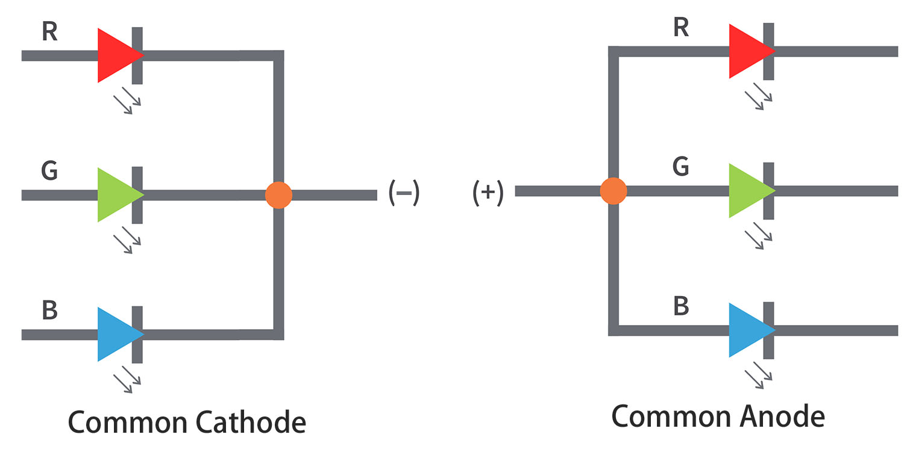
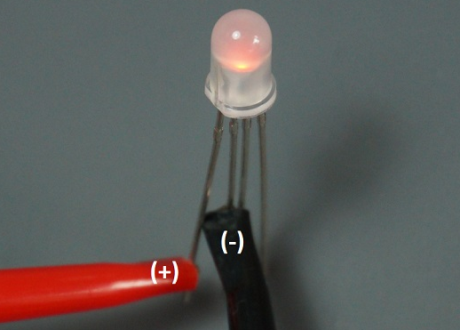
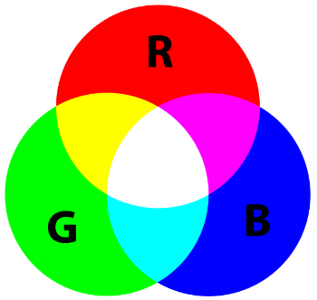

.. _cpn_rgb:

RGB LED
=================

.. image:: img/rgb_led.png
    :width: 200
    :align: center

RGB-LEDs erzeugen Licht in verschiedenen Farben. Eine RGB-LED kombiniert drei LEDs in den Farben Rot, Grün und Blau in einer durchsichtigen oder halbdurchsichtigen Kunststoffhülle. Durch das Verändern der Eingangsspannung an den drei Pins und deren Überlagerung können verschiedenste Farben erzeugt werden, was laut Statistik bis zu 16.777.216 unterschiedliche Farbtöne ermöglicht.

**Merkmale**

* Farbe: Dreifarbig (Rot/Grün/Blau)
* Gemeinsame Kathode
* 5mm klare, runde Linse
* Vorwärtsspannung: Rot: DC 2,0 - 2,2V; Blau&Grün: DC 3,0 - 3,2V (IF=20mA)
* 0,06 Watt DIP RGB LED
* Luminanz bis zu +20% heller
* Betrachtungswinkel: 30°

**Gemeinsame Anode und gemeinsame Kathode**

RGB-LEDs können in solche mit gemeinsamer Anode und gemeinsamer Kathode unterteilt werden.

* Bei einer RGB-LED mit gemeinsamer Kathode teilen sich alle drei LEDs eine negative Verbindung (Kathode).
* Bei einer RGB-LED mit gemeinsamer Anode teilen sich alle drei LEDs eine positive Verbindung (Anode).

.. note::
    Wir verwenden die mit gemeinsamer Kathode.

**Pins einer RGB-LED**

Eine RGB-LED hat 4 Pins: der längste ist GND; die anderen sind Rot, Grün und Blau. Positionieren Sie die RGB-LEDs wie gezeigt, sodass der längste Pin zweiter von links ist. Dann sollten die Pinnummern der RGB-LEDs Rot, GND, Grün und Blau sein.

.. image:: img/rgb_pin.jpg
    :width: 200

Sie können auch das Multimeter im Diodentestmodus verwenden und wie unten gezeigt verbinden, um die Farbe jedes Pins zu messen.

**Farben mischen**

Um zusätzliche Farben zu erzeugen, können Sie die drei Farben in unterschiedlichen Intensitäten kombinieren. Um die Intensität jeder LED anzupassen, können Sie ein PWM-Signal verwenden.

Da die LEDs so nah beieinander liegen, nehmen unsere Augen das Ergebnis der Farbkombination wahr, anstatt der drei einzelnen Farben.

Schauen Sie sich die Tabelle unten an, um zu sehen, wie die Farben kombiniert werden. Sie gibt Ihnen eine Vorstellung davon, wie die Farbmischtabelle funktioniert und wie verschiedene Farben produziert werden.

**Beispiele**

* :ref:`ar_rgb` (Arduino-Projekt)
* :ref:`ar_color_gradient` (Arduino-Projekt)
* :ref:`py_rgb` (MicroPython-Projekt)
* :ref:`sh_colorful_ball` (Scratch-Projekt)

