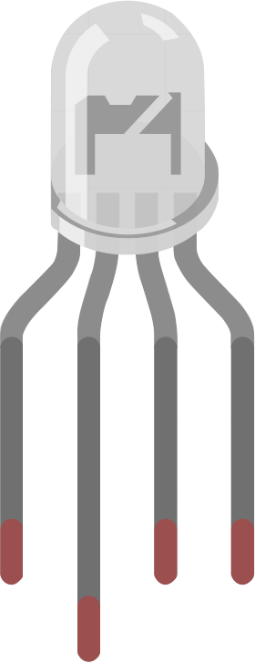

.. _cpn_rgb:

LED RGB
=================

Los LED RGB emiten luz en varios colores. Un LED RGB combina tres LED de color rojo, verde y azul en una carcasa transparente o semitransparente de plástico. Puede mostrar varios colores cambiando el voltaje de entrada de los tres pines y superponiéndolos, lo que, según estadísticas, puede crear 16,777,216 colores diferentes.

**Características**

* Color: Tricolor (Rojo/Verde/Azul)
* Cátodo Común
* Lente Redonda Clara de 5mm
* Voltaje Directo: Rojo: DC 2.0 - 2.2V; Azul y Verde: DC 3.0 - 3.2V (IF=20mA)
* LED RGB DIP de 0.06 Watts
* Luminancia Más Brillante Hasta +20%
* Ángulo de Visión: 30°

**Ánodo Común y Cátodo Común**

Los LED RGB se pueden categorizar en LED con ánodo común y cátodo común.

* En un LED RGB con cátodo común, los tres LED comparten una conexión negativa (cátodo).
* En un LED RGB con ánodo común, los tres LED comparten una conexión positiva (ánodo).

.. image:: img/rgb_cc_ca.jpg

.. note::
    Utilizamos el LED RGB con cátodo común.

**Pines del LED RGB**

Un LED RGB tiene 4 pines: el más largo es GND; los otros son Rojo, Verde y Azul. Coloca los LED RGB como se muestra, de modo que el plomo más largo esté segundo desde la izquierda. Entonces los números de pin de los LED RGB deberían ser Rojo, GND, Verde y Azul.

.. image:: img/rgb_pin.jpg
    :width: 200

También puedes usar el multímetro para seleccionar el modo de Prueba de Diodo, y luego conectar como se muestra a continuación para medir el color de cada pin.

.. image:: img/rgb_test.png

**Mezcla de colores**

Para generar colores adicionales, puedes combinar los tres colores a diferentes intensidades. Para ajustar la intensidad de cada LED, puedes usar una señal PWM.

Debido a que los LED están tan cerca entre sí, nuestros ojos ven el resultado de la combinación de colores en lugar de los tres colores individualmente.

Consulta la tabla a continuación para ver cómo se combinan los colores. Te dará una idea de cómo funciona el gráfico de mezcla de colores y cómo se producen diferentes colores.

.. image:: img/rgb_mix.png

**Ejemplo**

* :ref:`ar_rgb` (Proyecto Arduino)
* :ref:`ar_color_gradient` (Proyecto Arduino)
* :ref:`py_rgb` (Proyecto MicroPython)
* :ref:`sh_colorful_ball` (Proyecto Scratch)

