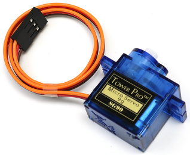
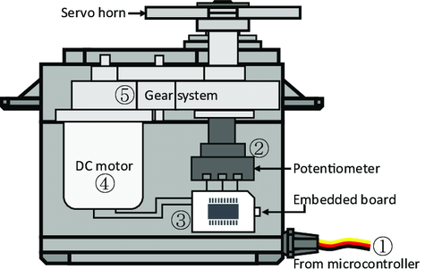

.. note::

    Bonjour, bienvenue dans la communauté des passionnés de SunFounder Raspberry Pi & Arduino & ESP32 sur Facebook ! Plongez plus profondément dans Raspberry Pi, Arduino et ESP32 avec d'autres passionnés.

    **Pourquoi nous rejoindre ?**

    - **Support d'experts** : Résolvez les problèmes après-vente et les défis techniques avec l'aide de notre communauté et de notre équipe.
    - **Apprendre et partager** : Échangez des conseils et des tutoriels pour améliorer vos compétences.
    - **Aperçus exclusifs** : Accédez en avant-première aux annonces de nouveaux produits et aux exclusivités.
    - **Réductions spéciales** : Profitez de réductions exclusives sur nos derniers produits.
    - **Promotions festives et cadeaux** : Participez à des concours et promotions de saison.

    👉 Prêt à explorer et créer avec nous ? Cliquez sur [|link_sf_facebook|] et rejoignez-nous dès aujourd'hui !

.. _cpn_servo:

Servo
===========

Un servo est généralement composé des éléments suivants : boîtier, axe, système d'engrenages, potentiomètre, moteur DC et carte embarquée.  

Son fonctionnement est le suivant : Le microcontrôleur envoie des signaux PWM au servo, puis la carte embarquée dans le servo reçoit les signaux par la broche de signal et contrôle le moteur à l'intérieur pour tourner. En conséquence, le moteur entraîne le système d'engrenages qui motive ensuite l'axe après décélération. L'axe et le potentiomètre du servo sont connectés ensemble. Lorsque l'axe tourne, il entraîne le potentiomètre, qui envoie alors un signal de tension à la carte embarquée. Ensuite, la carte détermine la direction et la vitesse de rotation en fonction de la position actuelle, ce qui permet de s'arrêter exactement à la position définie et de s'y maintenir.

L'angle est déterminé par la durée d'une impulsion appliquée au fil de contrôle. C'est ce qu'on appelle la modulation de largeur d'impulsion (PWM). Le servo s'attend à recevoir une impulsion toutes les 20 ms. La longueur de l'impulsion déterminera la distance de rotation du moteur. Par exemple, une impulsion de 1,5 ms fera tourner le moteur à la position de 90 degrés (position neutre). 
Lorsqu'une impulsion est envoyée à un servo et qu'elle est inférieure à 1,5 ms, le servo tourne vers une position et maintient son axe de sortie à un certain nombre de degrés dans le sens antihoraire par rapport au point neutre. Lorsque l'impulsion est supérieure à 1,5 ms, l'effet inverse se produit. La largeur minimale et maximale de l'impulsion qui commande au servo de tourner à une position valide est propre à chaque servo. En général, l'impulsion minimale sera d'environ 0,5 ms et l'impulsion maximale sera de 2,5 ms.

.. image:: img/servo_duty.png
    :width: 600
    :align: center

**Exemple**

* :ref:`ar_servo` (Projet Arduino)
* :ref:`py_servo` (Projet MicroPython)
