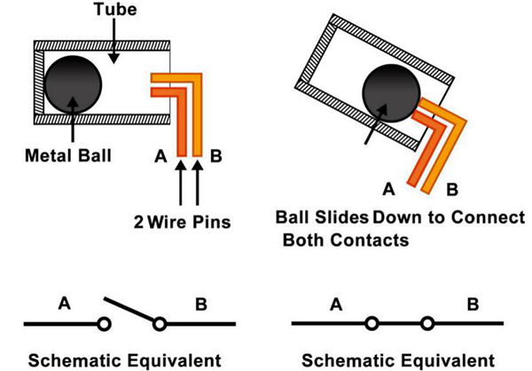

.. note::

    Hallo und willkommen in der SunFounder Raspberry Pi & Arduino & ESP32 Enthusiasten-Gemeinschaft auf Facebook! Tauchen Sie tiefer ein in die Welt von Raspberry Pi, Arduino und ESP32 mit anderen Enthusiasten.

    **Warum beitreten?**

    - **Expertenunterstützung**: Lösen Sie Nachverkaufsprobleme und technische Herausforderungen mit Hilfe unserer Gemeinschaft und unseres Teams.
    - **Lernen & Teilen**: Tauschen Sie Tipps und Anleitungen aus, um Ihre Fähigkeiten zu verbessern.
    - **Exklusive Vorschauen**: Erhalten Sie frühzeitigen Zugang zu neuen Produktankündigungen und exklusiven Einblicken.
    - **Spezialrabatte**: Genießen Sie exklusive Rabatte auf unsere neuesten Produkte.
    - **Festliche Aktionen und Gewinnspiele**: Nehmen Sie an Gewinnspielen und Feiertagsaktionen teil.

    👉 Sind Sie bereit, mit uns zu erkunden und zu erschaffen? Klicken Sie auf [|link_sf_facebook|] und treten Sie heute bei!

.. _cpn_tilt:

Neigungsschalter
=============================

.. image:: img/tilt_switch.png
    :width: 80
    :align: center

Der hier verwendete Neigungsschalter ist ein Kugeltyp mit einer Metallkugel im Inneren. Er wird eingesetzt, um Neigungen in kleinem Winkel zu erkennen.

Das Prinzip ist sehr einfach. Wird der Schalter in einem bestimmten Winkel geneigt, rollt die Kugel nach unten und berührt die beiden Kontakte, die mit den äußeren Pins verbunden sind, und löst dadurch Schaltvorgänge aus. Andernfalls bleibt die Kugel von den Kontakten entfernt und unterbricht somit den Stromkreis.

* `SW520D Neigungsschalter-Datenblatt <https://www.tme.com/Document/f1e6cedd8cb7feeb250b353b6213ec6c/SW-520D.pdf>`_

**Beispiele**

* :ref:`ar_tilt` (Arduino-Projekt)
* :ref:`py_tilt` (MicroPython-Projekt)

